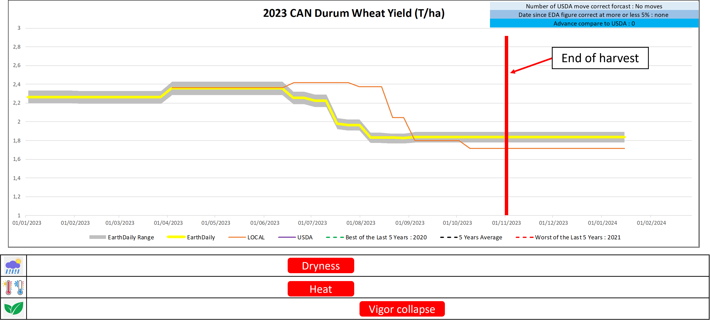
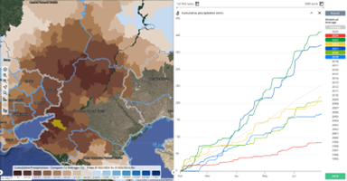
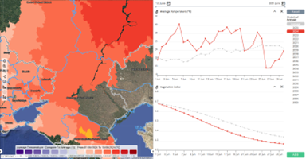

## 🎯 Success Cases 

Below are a few recent examples where EarthDaily data and analysis have led to a much earlier understanding of production concerns and adjustments in forecasted yields by market drivers.

### 2022 Brazil Soybeans Case Study

**Drought in Center-South and Average Yields in Center-North Lead to Lower Production**

2022 saw varied results in Brazilian Soybeans depending on where you looked.  The Center-North of the country, where the bulk of the crop is grown, received satisfactory precipitation and produced an average crop as shown in our vegetation chart

The Center-South unfortunately experienced the lowest precipitation levels in years starting at the begining of the growing cycle.  This lack of rainfall clearly limited the vegetation development to a level below the previously lowest producing year of 2012.

EarthDaily decreased Yield Forecasts in December well before CONAB and USDA reached the same levels near the end of the season.  Our clear view of this crop failure in the Center-South allowed our customers to anticipate these eventual drops in production by the USDA and CONAB.

### 2023 Canadian Durum Wheat Case Study

**Early Season Heat and Dryness Shortens the Growing Season**

The start of the 2023 Canadian Wheat season started out very similar to the 2021 season.  2021 was a poor year for Canada and this made us adopt a pessimistic position from the beginning. Staring in July, the high temperature and low moisture began to effect NDVI, much like 2021. 

**Forecasted Yield Starts to Drop Two Months Earlier Than STATCAN**

Seeing these trends early allowed us to point out a crop failure well in advance compared to USDA and STATCAN.

### 2024 Russian Winter Wheat Case Study

**Extremely wet start of the cycle**

**Record dry conditions in the following months**

**Strong late cold snap in May**

**Warm waves at the end of the cycle negatively rushing the grain maturation**

Weather insights and some analogies with the very poor 2012 crop vigor allowed us to forecast very disappointing winter wheat yields 11 weeks before USDA did!

--8<-- "snippets/contact-footer.md"

