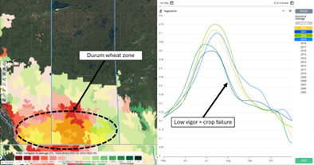
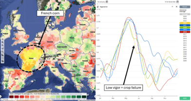

# Commodities Intelligence 🌾

## Introduction

> In volatile agricultural markets, success depends on real-time data. EarthDaily gives you that edge. We combine Earth Observation (EO) analytics with AI-powered forecasts, providing real-time visibility into global and local crop conditions.
>
> Continuous satellite monitoring, historical data, and predictive intelligence help you optimize procurement, improve trade strategies, and make confident market decisions.
>
> Multiple delivery channels ensure that EarthDaily Crop Intelligence is available in the format best suited for your business needs.

## Target Audience 👥

EarthDaily has designed this product for organizations that need timely, accurate, and scalable crop intelligence:

- **Commodity Traders & Analysts** - Monitor the current vegetation and weather trends in key areas of the world which drive change in the market. Anticipate the market and the changes made by the USDA and other Government Agencies prior to the release of their reports.

- **Food & Beverage Corporates** - Enhance supply chain transparency, understand import/export constraints from global partners, and improve seasonal planning and procurement.

- **Insurance & Risk Management Firms** - Accurately assess crop exposure, monitor seasonal progression, and model risk with spatially consistent datasets.

- **Governments & Policy Institutions** - Support national food security assessments, subsidy programs, and environmental monitoring efforts.

## Data & Analytics Coverage 📊

Access a complete list of Regional Monitoring Analytics and their aggregation levels at this [link](https://sway.cloud.microsoft/tQAQAVQ9BTuMwEJo?ref=Link).

## Yield Elaboration Method 🌾

Key Questions:

- Where to look?
- When to look?
- Vegetation and Weather Monitoring
- Historical Analog Detection
- Historical Dataset Comparison

## Success Cases 🔗

Over time we will create pages for key success cases and our most recent "accuracy" stats

### Planned Case Studies:
- 2023 and 2024 Accuracy Docs
- 2022 Brazil Soybeans
- 2023 Canada Wheat
- 2024 Russian winter wheat

### 2024 Russian Winter Wheat Case Study

**Extremely wet start of the cycle**

**Record dry conditions in the following months**

**Strong late cold snap in May**

**Warm waves at the end of the cycle negatively rushing the grain maturation**

Weather insights and some analogies with the very poor 2012 crop vigor allowed us to forecast very disappointing winter wheat yields 11 weeks before USDA did!

### Additional Screenshots

**Screenshot 1**

**Screenshot 2**

**Screenshot 3**

**Screenshot 4**

**Screenshot 5**

---

*Documentation source: [EarthDaily Commodities Intelligence](https://earthdaily.github.io/earthdaily-documentation/Agro/Commodities_intelligence/commodities_product/)*