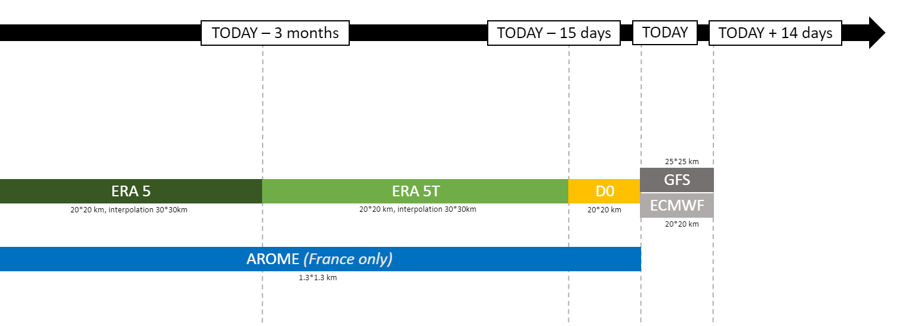
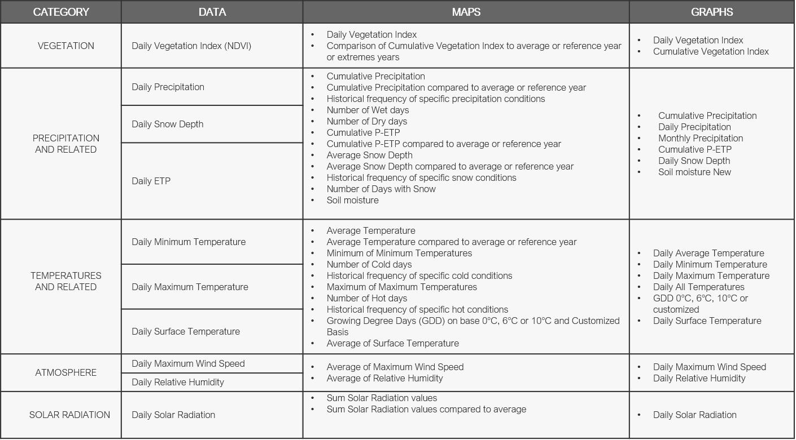
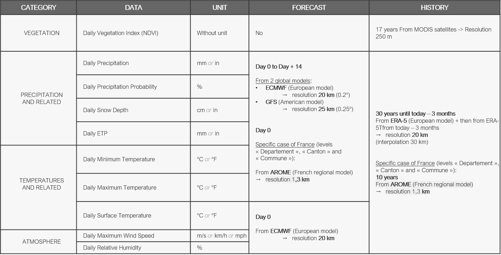
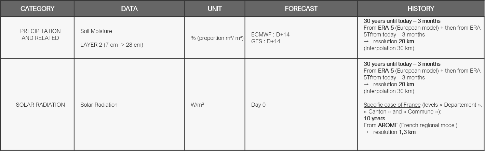
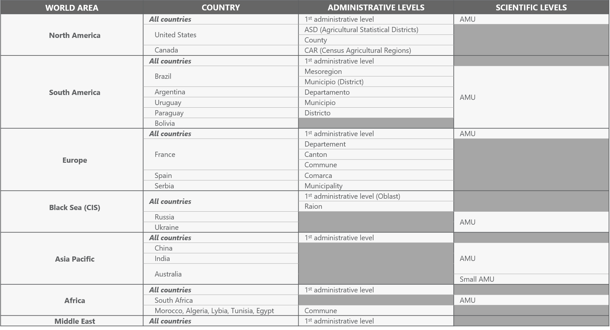

# Geosys Regional Monitoring Data Catalogue

## What's included in the weather chain

**FORECAST WEATHER MODELS**

- ENS model (ECMWF\*, probabilistic, 20km resolution, forecast D+14)
- GFS model (NOAA-NCEP\*\*, determinist, 25km resolution, forecast D+14)

**HISTORICAL DATA**

- Historical data depth from 1990 to 2019 (today less 15 days)

**SLIDING REPROCESSING D - 3 MONTHS, THEN D - 15 DAYS**

- ERA-5\*\*\* (ECMWF) historical data integrated every beginning of the month with Current Month minus 3 months data (on the 31st of July, the 30th of April data is the last available data = 3 months)
- ERA-5T\*\*\* (ECMWF) historical data integrated day by day at D-15 days.
- ENS (ECMWF) D0 values (pseudo-analysis) stored from D0 to last ERA-5T historical available data ( D-15 days )

!!! note "Data source references"
    - \*European Center for Weather Forecasts (ECMWF), based in Reading, UK.
    - \*\*National Oceanic and Atmospheric Administration - National Center for Environmental Prediction (USA).
    - \*\*\*The data assimilation system

*Figure 1 - Link between providers, time of delivery and reprocessing of the data*

## Parameters, related maps and graphs

*Figure 2 - Different data parameters and corresponding maps and curves*

## Data technical description

*Figure 3 - List of data types and their units (1)*

*Figure 4 - List of data types and their units (2)*

## Available levels of aggregation

*Figure 5 - Available regions and level of aggregation*

---

--8<-- "snippets/contact-footer.md"
