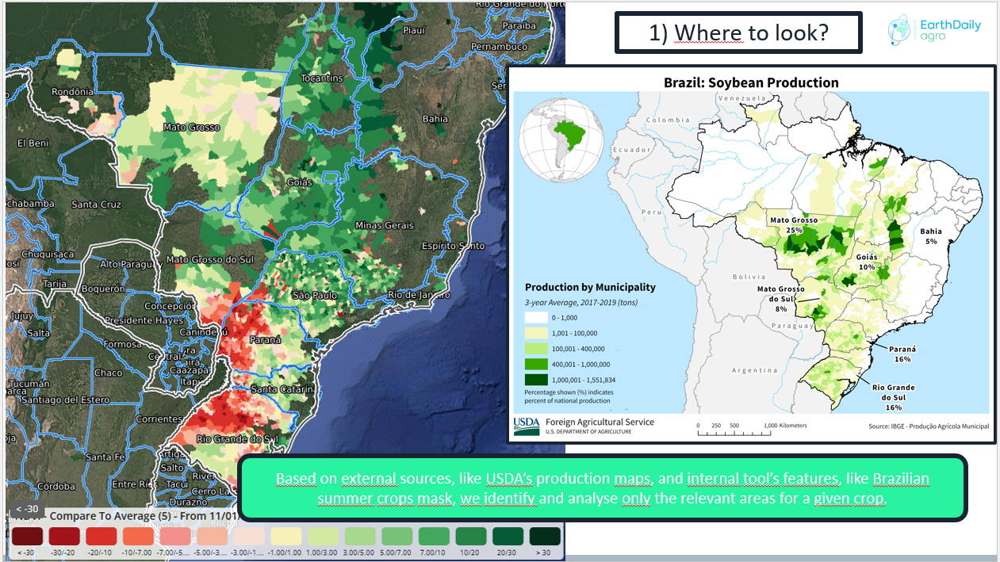
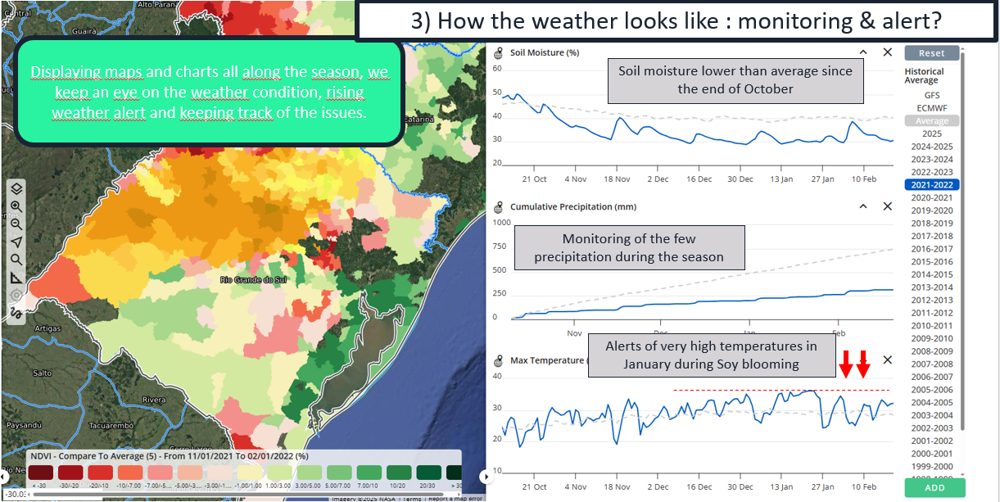

## 🌾 Yield Elaboration Method

EarthDaily's Yield Elaboration Method starts with answering these key questions and quandaries:

- Where to look?

 
- When to look?

- Vegetation and Weather Monitoring

- Historical Analog Detection

- Historical Dataset Comparisons

--8<-- "snippets/contact-footer.md"
