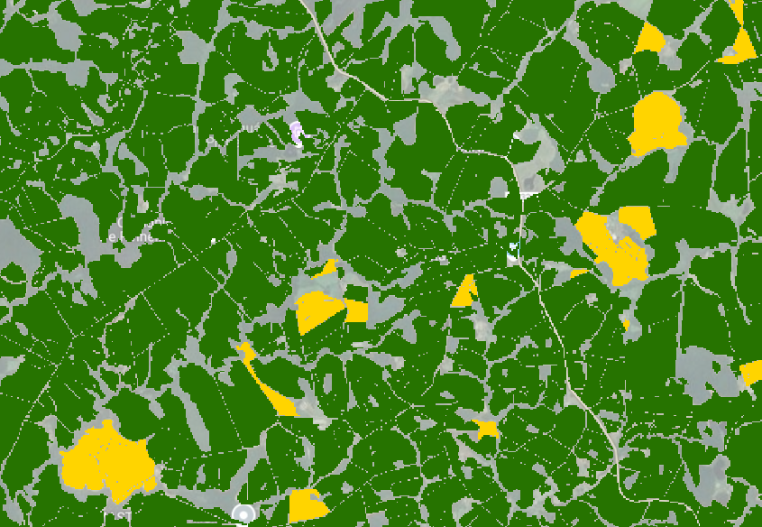
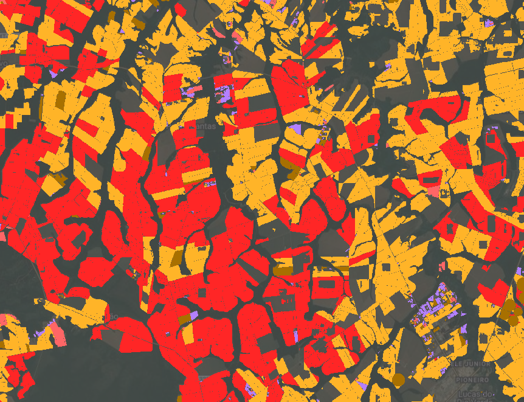

<meta property="og:title" content="Discover EarthDaily's scalable crop classification solution for Brazil leveraging remote crops monitoring and AI. Real-time crop maps, Safrinha crops mapping, and seamless API delivery for agriculture.">

#  Available Across Brazil’s Major Agricultural Zones

EarthDaily Crop Identification product delivers accurate, in-season crop classification at national scale, covering Brazil’s agricultural regions.
From **Mato Grosso to Paraná**, and spanning both **Safra** and **Safrinha** cycles, the product provides near real-time visibility into what’s growing—supporting critical decisions in one of the world’s largest and most dynamic agricultural economies.

**Covered crops include:**  
- **Safra Season:** Soybean, First Corn, Sugarcane, Cotton, and Rice  
- **Safrinha Season:** Second Corn, Sugarcane, Cotton, and Winter Wheat  

Additional crops can be supported upon request or as part of our product roadmap.

- 
- 

---

## ⌛ In-Season Deliveries

To support timely decisions throughout the growing season, crop classification layers are delivered in **two stages per cropping cycle**. This phased approach provides progressively refined insights as new satellite and weather data become available.

**Delivery schedule:**  
- **Safra Season:** Early March and Early June  
- **Safrinha Season:** Early June and Early August  

Each delivery reflects the most recent satellite imagery and model outputs, ensuring increasing accuracy as the season progresses.

---

## 🎯 Model Performance

Our AI models deliver **high accuracy** for major row crops. Below are the typical **F1 score ranges** achieved under operational conditions:

- **Soybean:** > 0.95  
- **1st Corn (Safra):** 0.85 – 0.90  
- **2nd Corn (Safrinha):** 0.90 – 0.95  
- **Sugarcane:** 0.80 – 0.85  
- **Rice:** 0.85 – 0.90  
- **Cotton:** 0.60 – 0.70  
- **Wheat:** 0.85 – 0.90  

---

## 📅 Historical Layers

Historical crop classification layers are available starting from **2019**. These datasets support model training, historical crop rotation analysis, and robust year-over-year comparisons—enabling more informed long-term planning.

---

## 🔧 Flexible Delivery Options

Our Crop Identification product is designed for seamless integration into your existing systems, with two delivery options via API:

- **Crop Mask API (STAC):** Access spatially indexed, pre-processed crop maps in standard geospatial formats such as GeoTIFF—ideal for large-area analysis.  
- **Field-Level API:** Retrieve crop type predictions linked to known field boundaries for precision use at the farm or parcel level.

Both options are scalable, reliable, and built to fit directly into your data pipeline.  
Explore full technical specifications in our [API Documentation](../Library/FieldLevel_CropMask_API_v11092025.md/).

---

## ❓ FAQ  

!!! tip "What crops are covered in EarthDaily’s Brazil crop identification product?"

    Soybean, Corn (Safra and Safrinha), Sugarcane, Cotton, Wheat, and Rice.

**** 
!!! tip "How accurate is the model?"

    F1 scores range from 0.60 (cotton) to >0.95 (soybean), based on validated in-season performance.

**** 
!!! tip "How often is the data updated?"

    Twice per cropping season, with progressive refinement as more satellite imagery is collected.

**** 
!!! tip "Can I access data for past seasons?"

    Yes, historical data is available from 2019 onward.

**** 
!!! tip "What regions of Brazil are supported?"

    Key agricultural zones including Mato Grosso, Paraná, Goiás, Bahia, and others.

**** 

---

👉 **Ready to get started?** [Contact us](https://earthdaily.com/contact) to request API access or schedule a demo.

