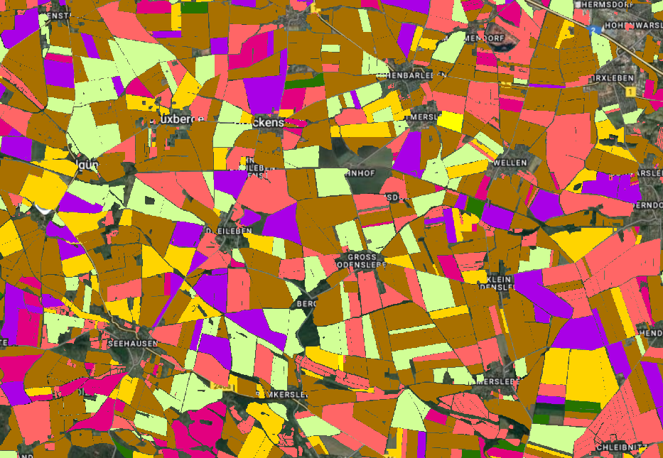

<meta property="og:title" content="Discover EarthDaily's scalable crop classification solution for Western Europe leveraging remote crops monitoring and AI. Real-time crop maps, and seamless API delivery for agriculture.">

## 🌍 Available across France & Germany

The EarthDaily Crop Identification product is fully operational across both **France and Germany**, providing in-season crop classification at national scale. From the Beauce plains to Bavaria, the solution delivers timely, consistent, and high-resolution insights into crop distribution—supporting decision-making in two of Europe’s largest and most diverse agricultural producers.

**Covered crops are as follows:**

| France | Germany |
|--------|---------|
| Winter Wheat | Winter Wheat |
| Barley | Barley |
| Oil Seed Rape | Oil Seed Rape |
| Corn | Corn |
| Sunflower |  |
| Sugar Beet | Sugar Beet |

Additional crops can be supported upon request or as part of our product roadmap.

- 
-  

---

## ⌛ In-Season Deliveries

Crop classification layers are delivered during the growing season, providing a good evaluation of winter crops and an early assessment of spring crops.  

**Delivery schedule:**

* Mid-June  

Additional delivery dates can be added upon request. These in-season deliveries enable monitoring of planted areas, detection of acreage variations, and dynamic adjustment of supply and production forecasts.

---

## 🎯 Model Performance

Our AI models deliver high accuracy across major crops in both France and Germany. Typical F1 score ranges under operational conditions are:

| France | Germany |
|--------|---------|
| Winter Wheat: 0.85-0.90 | Winter Wheat: 0.75-0.80 |
| Barley: 0.85-0.90 | Barley: 0.70-0.75 |
| Oil Seed Rape: >0.95 | Oil Seed Rape: 0.90-0.95 |
| Corn: 0.80-0.85 | Corn: 0.60-0.65 |
| Sunflower: 0.45-0.50 |  |
| Sugar Beet: 0.70-0.75 |  |

*Note: Spring crop detection such as sunflower is limited due to the earliness of the prediction.*

---

## 📅 Historical Layers

To support long-term analysis, we provide historical crop classification layers starting from **2019**, leveraging public EU datasets. Centralizing all layers simplifies the analysis of crop rotations, land-use patterns, and annual changes, eliminating the need to integrate multiple data sources.

---

## 🔧 Flexible Delivery Options

Our product is designed for easy integration into your workflows, with two API-based delivery mechanisms:  

- **Crop Mask API (STAC):** Access spatially indexed, pre-processed crop maps in standard geospatial formats (GeoTIFF). Ideal for national or regional-scale analysis.  
- **Field-Level API:** Retrieve crop type predictions linked to known field boundaries for precision use cases at parcel level.  

Both options are scalable, reliable, and built to fit directly into your data pipeline.  
Explore full technical specifications in our [API Documentation](../Library/FieldLevel_CropMask_API_v11092025.md/).

---

## ❓ FAQ

!!! tip "What crops are covered in EarthDaily’s France & Germany crop identification product?"

    - France: Winter Wheat, Barley, Oilseed Rape, Corn, Sunflower, Sugar Beet  
    - Germany: Winter Wheat, Barley, Oilseed Rape, Corn  

!!! tip "How accurate is the model?"

    F1 scores range from 0.48 (Sunflower) to >0.95 (Oilseed Rape), validated under in-season conditions.
 
!!! tip "How often is the data updated?"

    Once per cropping season for the moment.

!!! tip "Can I access data for past seasons?"

    Yes, historical layers are available from 2019 onward. 

!!! tip "What regions are supported?"

    The coverage spans the entire territories of France and Germany.
    
---

--8<-- "snippets/contact-footer.md"
