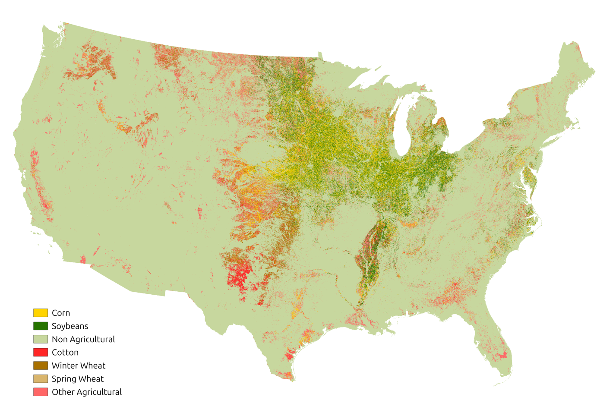

<meta property="og:title" content="Discover EarthDaily's scalable crop identification solution using satellite imagery and AI. Real-time crop maps, field-level insights, and seamless API delivery for agriculture.">

## 🗺️ Get Real-time Crop Classification at Scale

Traditionally, accurate and timely crop mapping has come at a high cost. Field surveys, farmer reports, and manual sampling methods provide precise data—but they are time-consuming, expensive to scale, and often lag behind the pace of market or agro-climatic events. By the time insights reach decision-makers, key opportunities may already be missed—or decisions are made without a full picture of what’s happening in the field. Today, that model is changing.

EarthDaily's Crop Classification product combines satellite imagery, weather data, and advanced AI models to accurately detect what crops are planted and where—all during the active growing season, at national scale.

This breakthrough enables a new standard of crop intelligence that is:

* **Timely available** – Crop masks are provided during the growing season, not months after harvest  
* **Scalable** – Covering millions of hectares with consistent accuracy  
* **Cost-efficient** – Eliminating the need for large-scale field surveys  
* **Seamless** – Accessible through APIs and ready for integration into your business workflows  

Whether you are forecasting crop supply, managing agricultural risk, or optimizing procurement strategies, our solution brings unprecedented scale and efficiency to understanding what’s growing—across regions or entire countries.

 

---

## 👥 Target Audience  
EarthDaily has designed this product for organizations that need timely, accurate, and scalable agricultural intelligence—and have the technical capacity to integrate data via APIs:

- **AgTech Companies & Platforms**  
Power digital farming tools, agronomic models, and targeted crop-specific advice for mid-season decisions.

- **Commodity Traders & Analysts**  
Improve crop acreage estimation, optimize sourcing strategies, and gain early signals of supply shifts for major crops.

- **Food & Beverage Corporates**  
Enhance supply chain transparency, support ESG commitments, and improve seasonal planning and procurement.

- **Insurance & Risk Management Firms**  
Accurately assess crop exposure, monitor planting declarations, and model risk with spatially consistent datasets.

- **Governments & Policy Institutions**  
Support national food security assessments, subsidy programs, and environmental monitoring efforts.

---

## 🌎 Geographic Coverage and Crops

Crop Identification is currently available for the **United States** and **Brazil**, covering key agricultural regions and focusing on the main row crops grown in each country.  

Crop mask layers are generated and updated during the active growing season, providing near-real-time visibility into crop distribution as the season progresses.

Coverage includes crops such as:

* **USA:** Corn, Soybean, Wheat, Cotton  
* **Brazil:** Soybean, Corn (first and second seasons), Sugarcane, Cotton, Wheat and Rice  
* **France:** Winter wheat, Barley, Oil Seed Rape, Corn, Sunflower and Sugarbeet
* **Germany:** Winter wheat, Barley, Oil Seed Rape, Corn and Sugarbeet 

Additional countries and crops can be supported upon request or as part of our product roadmap. [Contact us](https://earthdaily.com/contact) to learn more.

---

## 🔧 Flexible Delivery to Fit Your Workflow

Crop Identification is designed for seamless integration into your operations, offering two delivery mechanisms to match your needs:

- **API Access to Crop Mask Layers (via STAC Catalog)**  
Query spatially and temporally indexed crop masks through our API, fully referenced in a SpatioTemporal Asset Catalog (STAC). Ideal for applications that require pre-processed crop masks over large areas in standard geospatial formats (e.g., GeoTIFF).

- **API Access to Field-Level Information**  
Retrieve crop type predictions linked to individual field boundaries, enabling precise, field-level intelligence. Suitable for systems that work with known field geometries ([Automated field boundaries](https://earthdaily.github.io/earthdaily-documentation/Agro/Library/Automatic_Field_Borders/) are also available)

No matter your architecture or scale, our flexible delivery options make it easy to bring timely, accurate crop intelligence into your existing workflows.

Explore further details in our [API Documentation](https://earthdaily.github.io/earthdaily-documentation/Agro/Library/FieldLevel_CropMask_API_v11092025/).

---

## ❓ FAQ  
!!! tip "What is satellite crop identification?"

    We use optical and SAR satellite data to detect which crop is growing on every plot of land.
    
!!! tip "How accurate is EarthDaily’s crop classification?"

    Soybean in Brazil: F1-score > 0.95
    Corn in the USA Corn Belt: F1-score > 0.95
    Discover more in the dedicated Countries pages.

!!! tip "Can I access crop data during the season?"

    Yes, we deliver crop classification data 6 to 12 months before local agencies.
    
---

--8<-- "snippets/contact-footer.md"
