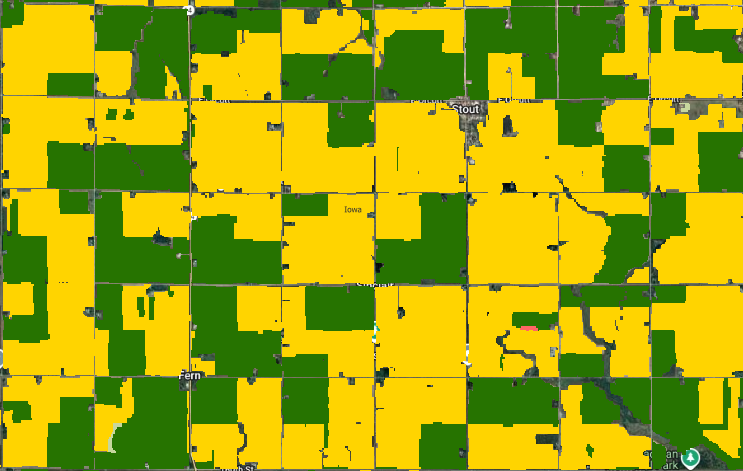
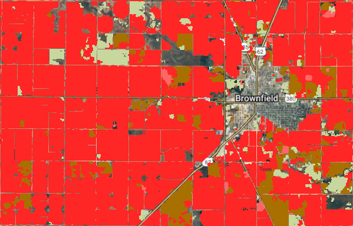

<meta property="og:title" content="Discover EarthDaily's scalable crop classification solution for United States leveraging remote crops monitoring and AI. Real-time crop maps, and seamless API delivery for agriculture.">

# Available Across the United States

The **EarthDaily Crop Identification** product is fully operational across the entire U.S., providing in-season crop classification at **national scale**.  
From the Corn Belt to the Mississippi Delta and the Great Plains, it delivers **timely, consistent, and high-resolution insights** into crop distribution—supporting critical decisions in one of the world’s largest agricultural producers.

Coverage includes key row crops such as **Corn, Soybean, Winter Wheat, Spring Wheat, and Cotton**.

Additional crops can be supported upon request or as part of our product roadmap.

- 
-  

---

## In-Season Deliveries

Crop classification layers are delivered **during the growing season**, with progressive updates that incorporate the latest satellite imagery and weather-adjusted model outputs.

**Delivery schedule:**
- Mid-June  
- Mid-July  

Additional delivery dates can be added upon request. This cadence enables organizations to track acreage distribution and refine supply outlooks as the season advances.

---

## Model Performance

Our AI models deliver **high accuracy for major U.S. row crops**. Below are the typical **F1 score ranges** achieved under operational conditions:

- **Corn:** 0.85 – 0.90  
- **Soybean:** 0.85 – 0.90  
- **Winter Wheat:** 0.75 – 0.80  
- **Spring Wheat:** 0.75 – 0.80  
- **Cotton:** 0.70 – 0.75  

---

## Historical Layers

To support long-term analysis, we provide **historical crop classification layers starting from 2008** using public USDA datasets. All layers are referenced in one place for convenience, enabling seamless analysis of historical trends, crop rotations, and year-over-year changes — without the need to manage multiple data sources.  

---

## Flexible Delivery Options

The product is designed for seamless integration into your workflows, with two API-based delivery mechanisms:

- **Crop Mask API (STAC):** Access spatially indexed, pre-processed crop maps in standard geospatial formats such as GeoTIFF—ideal for large-area analysis.  
- **Field-Level API:** Retrieve crop type predictions linked to known field boundaries for precision use at the farm or parcel level.  

Both options are **scalable, reliable, and built to fit directly into your data pipeline**.  

Explore full technical specifications in our [API Documentation](../Library/FieldLevel_CropMask_API_v11092025.md/).

---

## FAQ

!!! tip "What crops are covered in EarthDaily’s U.S. Crop Identification product?"

    Corn, Soybean, Winter Wheat, Spring Wheat, and Cotton.

****  
!!! tip "How accurate is the model?"

    F1 scores range from **0.70 (Cotton)** to **>0.85 (Corn, Soybean)**, based on validated in-season performance.

****  
!!! tip "How often is the data updated?"

    Twice per cropping season, with progressive refinement as more satellite imagery is collected.

**** 
!!! tip "Can I access data for past seasons?"

    Yes, historical data is available from **2008 onward**.

**** 
!!! tip "What regions of the U.S. are supported?"

    Coverage spans the **entire country**.

**** 
!!! tip "What if I only need data for specific areas?"

    You can request access to selected states as needed.

**** 

---

--8<-- "snippets/contact-footer.md"