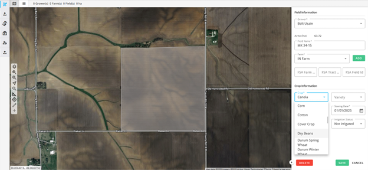

## 📚 Establish Boundaries and Crop History for Your Fields

We make it easy for you to onboard your operation by easily creating Grower, Farm, and Field entities using multiple means – automated field creation, using a field boundary selection layer (in some regions), or uploading your existing field boundaries into our tools. Then, we start the computation of analytics immediately.

You can update your farm and field entities anytime! With different cropping cycles, land sales and rent, or changes to your farm operation, we have made it quick and easy to make updates and continue the insights for each crop and every season.

Learn more about **Automated Field Boundaries** [here](https://earthdaily.github.io/earthdaily-documentation/Agro/Library/Automatic_Field_Borders/).

---

## 🌾 Crop Identification & Rotation Intelligence

To help quickly understand a farm's context, the Digital Ag Solution can automatically retrieve crop rotation history using our Crop Identification layers. During the active growing season, it can also confirm the planted crop, providing clarity on current cropping patterns and supporting a clearer understanding of territory-wide dynamics.

### Crop Identification Availability

Crop Identification is currently available in the following countries:

- **USA**: Corn, Soybean, Wheat, Cotton
- **Brazil**: Soybean, Corn (first and second seasons), Sugarcane, Cotton, Wheat, and Rice
- **France**: Winter wheat, Barley, Oil Seed Rape, Corn, Sunflower, and Sugarbeet
- **Germany**: Winter wheat, Barley, Oil Seed Rape, Corn, and Sugarbeet

More details are available [here](https://earthdaily.github.io/earthdaily-documentation/Agro/Cropid/crop_identification_OverviewPage_v11092025/).

Additional countries and crops could be supported upon request or as part of our product roadmap.

---
 

--8<-- "snippets/contact-footer.md"
 
