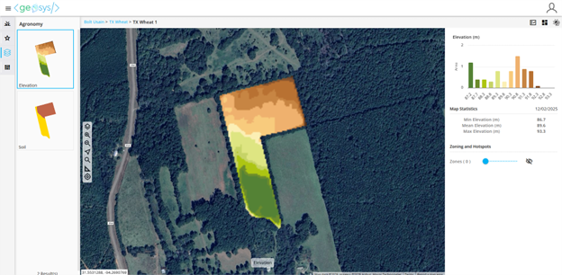

## 🧭 Visualize Your Field from Every Angle

Monitoring crop vigor and diagnosing stress early is essential for preventing yield losses. The Digital Ag solution provides a complete suite of vegetation indices and biophysical variables designed to surface issues quickly and clearly:

- Track canopy development with indices such as **NDVI**, **EVI**, and **GNDVI**, or go deeper with biophysical variables such as **LAI** and **Biomass**, which serve as strong proxies for yield potential and overall crop productivity.
- Adjust nitrogen nutrition with indices like **S2REP** or **NDRE**, which are linked to chlorophyll content and act as reliable indicators of nitrogen uptake.
- Detect water stress with **NDMI**, helping you identify moisture limitations.
- Evaluate light-use efficiency and canopy function with **FAPAR** and **FCover**, which provide deeper insight into crop photosynthetic activity and the fraction of ground effectively covered by vegetation.

---

## 📖 Time Series Captures Your Field’s Track Record

Stay ahead of crop development and yield risks with continuous, season-long visibility into field performance. The Digital Ag Solution provides one of the industry’s most comprehensive temporal datasets—helping you understand not only what is happening today, but how each field has evolved over time.

With our **medium-resolution imagery time series**—built on *Sentinel-2*, *Landsat 8/9*, and premium tasked imagery—you get a clear, consistent view of crop development from **2019 onward**. Advanced denoising and smoothing techniques remove atmospheric and sensor noise, revealing the true biological signal of the crop.

For deeper historical patterns and long-term benchmarking, tap into our **low-resolution imagery time series**, powered by denoised and smoothed **MODIS** data dating back to **2003**. The planned integration of **Sentinel-3** will ensure monitoring continuity while maintaining full cross-calibration with MODIS.

Together, these datasets allow you to analyze multi-season patterns, detect shifts in vigor across years, and uncover insights that support more informed management strategies.

---

## 🗺️ Maps to Analyze Field Variability

The Digital Ag solution provides **Vegetation Field-level Maps** to help you understand in-field variability with clarity and precision. These maps reveal spatial differences in vigor, nutrition, moisture, and canopy structure across every field—enabling you to pinpoint hotspots, identify within-field zones, and target interventions where they will have the greatest impact.

Add even more context with **integrated soil maps** (including *SSURGO-based layers* for the U.S.) and detailed **elevation and slope models**, giving you a full understanding of terrain, risks, and management opportunities across every acre.

Identify emerging issues at a glance with our **HotSpot Processor**, highlighting areas that are changing and may require immediate attention—ensuring you never miss a developing problem and can act quickly.

To keep your workflow seamless, save your go-to layers with **Favorite Maps**—complete with your preferred parameters—so you can pull up the right view in seconds.

---

## 📊 Weather Indicators to Understand Climatic Conditions

The Digital Ag solution provides access to weather indicators—**daily and cumulative precipitation**, **temperature**, **GDD**, and more—to understand growth patterns and see how your conditions compare to previous years.

As a result, you get a clear, reliable picture of crop vigor across space and time—capturing how fields respond to weather events and seasonal conditions. Imagery time series and weather data form the foundational inputs for many agronomic and AI modeling approaches, providing both the long-term context and short-term precision needed to anticipate issues.

---

--8<-- "snippets/contact-footer.md"