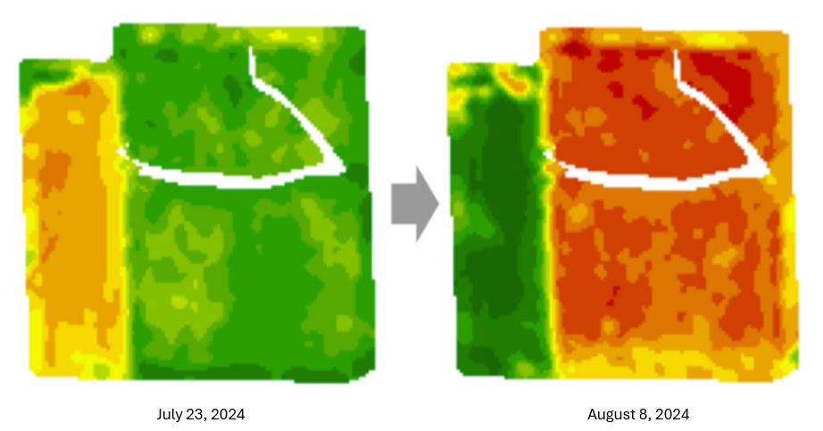
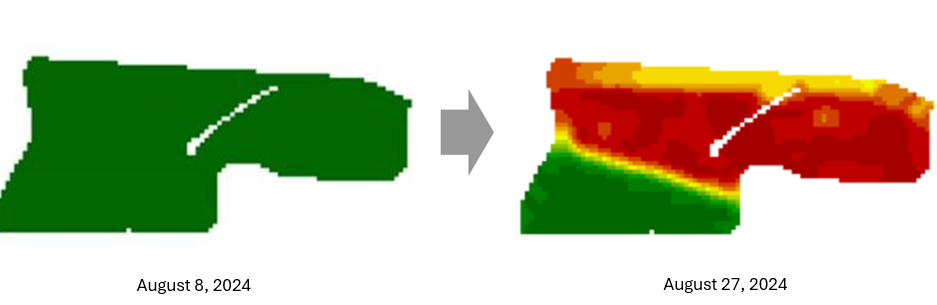
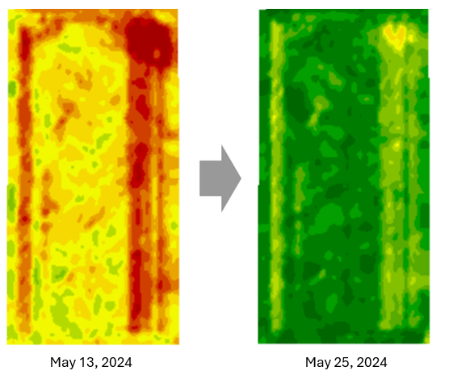
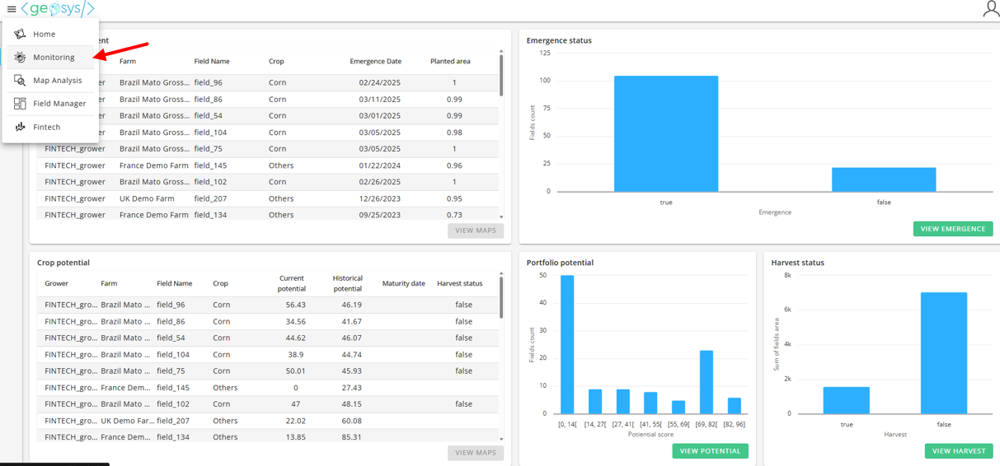
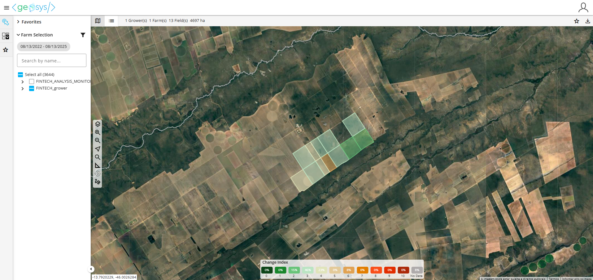
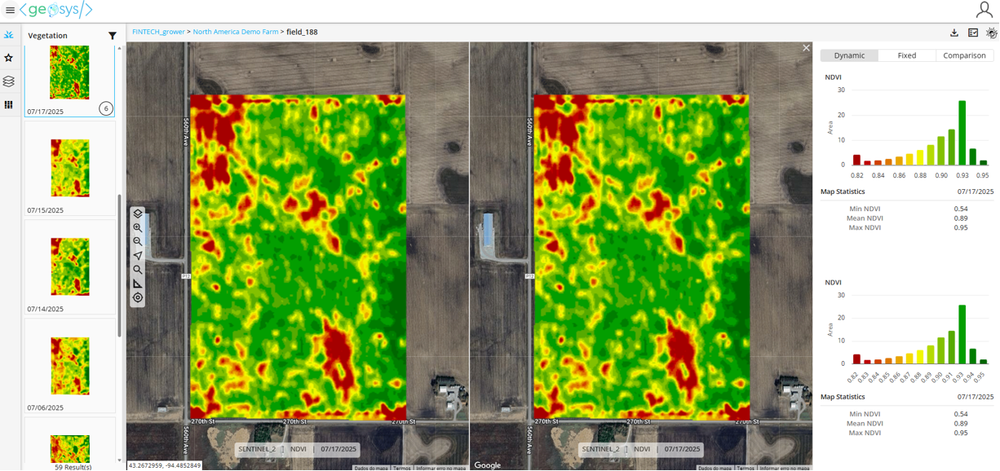

# Change Index

## Overview

The goal of Change Index is to help you decide which in-season map to look at by providing a 0-10 indication of the level of change between two maps for a given field. The change is based on three components of NDVI values within a field — the larger the number, the greater the level of change.

## How is the Change Index Calculated?

Change Idedex is based on three components of change using the field's NDVI values:

### 1. Correlation

- Did the field experience the same change?
- Did all pixels increase by the same amount (small change)?
- Did some pixels increase and some decrease (large change)?

**Extreme Example:** Part of the field is improving while other parts are getting worse. While variation and distribution might have caught some level of change, correlation is needed to understand the extent of this change. The change index here would be **10**.

### 2. Spatial Variability

- Is the field variability the same?
- Are the good spots of the field still good and the bad spots still bad (small change)?
- Are there new good or bad spots which have emerged in the recent image (large change)?

**Extreme Example:** A homogeneous field has changed into one with a lot of variation. The change index here would be **10**.

### 3. Distribution

- Is the overall NDVI distribution the same?
- Does the histogram of the NDVI values for the new image overlap with the previous image (small change)?
- Is there very minimal overlap between the histograms (large change)?

**Extreme Example:** While we can visually see the change in these two maps, the change in correlation and spatial variation are low because the entire field is getting better and the variation pattern is staying about the same. This is expected. The change index here would only be **6**.

---

## Change Index does NOT

- Indicate if change is good or not
- Provide insights into what is causing the change
- Rank the performance of the fields

---

## View Change Index (From Monitoring Module)

1. Select the **Monitoring** tab from the top-left navigation menu.

2. Open **Entity Selection** and choose the desired farm.

3. In the left menu, select **Field Analytics**, then click **Change Index**.

4. A map displaying the farm fields will appear, along with the Change Index legend.

5. Click on a field, then select **Navigate to Map Analysis Module**.

6. The Change Index value will be shown on the map thumbnail. Click the Change Index score to view a side-by-side comparison of the two most recent images.

---

## API

Here is the Change index [API documentation](https://change-index.aws.geosys.com/docs#/Change%20Index%20Compute):

<swagger-ui src="https://change-index.aws.geosys.com/openapi.json"/>

## Change Index FAQ

!!! tip "What is the purpose of the Change Index?"

    The change Index is simply an indication of change within a given field. It helps quickly identify the maps that require further analysis.

!!! tip "Does the Change Index tell me how a field is performing?"
    No. It only indicates the amount of change in the field within the 5 to 15-day threshold.

!!! tip "Why don’t I see a Change Index score for each of my fields?"
    Change Detection is only calculated when there is at least 5 days between two maps but less than 15 days.

!!! tip "Should I only be looking at fields with high Change Index?"
    Not necessarily. While you certainly want to take a closer look at the maps with high Change Index scores, you may also want to look for outliers. For example, during the key growth stage, you might see that most of your fields have a Change Detection score of 4. If there is a field with a Change Detection score of 1, you might want to look at the maps as it could be an indication that the field isn’t growing as expected.

!!! tip "Yesterday a field had a Change Index score of 8 but no score today — what is going on?"  
    Scores are only provided when maps are available within the 5 to 15 day threshold. So, if a score was provided based on a 15-day timespan yesterday and a new image was provided today, the only two images available for comparison are 16 days or 1 day apart. Therefore, no score will be provided.
    
--8<-- "snippets/contact-footer.md"