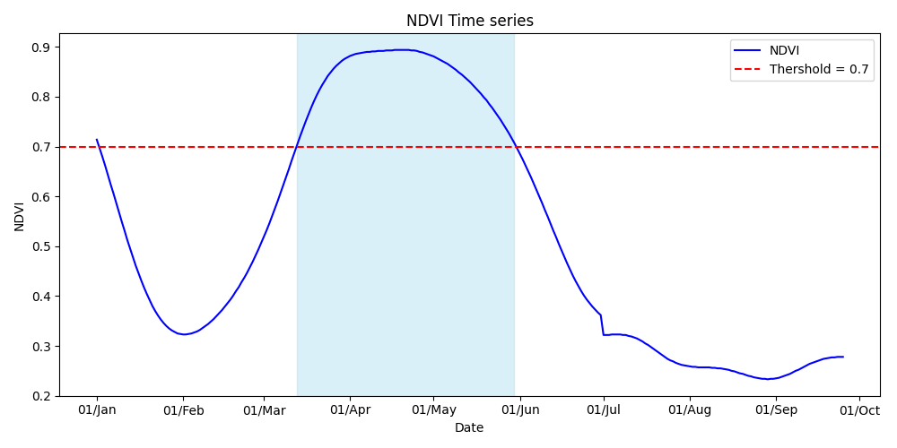
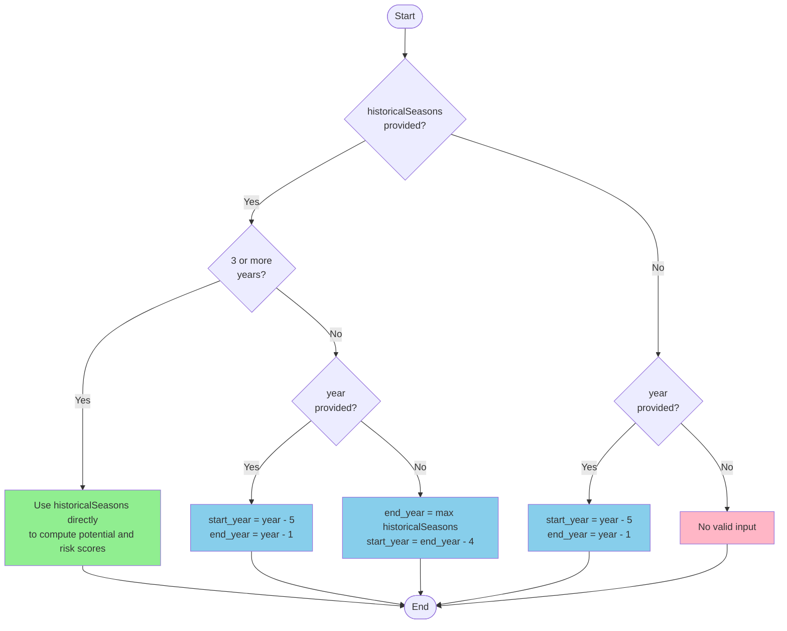

<!-- md:swagger API|https://historical-potential-risk-score.aws.geosys.com/v1/docs -->

# Historical Potential Score

## 📖 Overview

The **Historical Potential Score** analytic provides an indicator of the average potential score over past years for a selected crop and season, based on cumulative NDVI (1). It serves as a benchmark to compare field performance across different areas within a region or across different years. A Risk Score (2) is also provided based on the variability of the past seasons.
{ .annotate }

1.  --8<-- "../../glossary.md:ndvi"
2.  --8<-- "../../glossary.md:risk_score"

The figure below illustrates the expected NDVI development for a typical annual grain crop. The analytic transforms the NDVI time series into a potential score (1), enabling comparisons between fields in the same region or across historical seasons.
{ .annotate }

1.  --8<-- "../../glossary.md:potential_score"

## 🗂️ Baseline Data

The analytic uses NDVI time series data available at both MR (1) and LR (2) resolutions to calculate historical potential and risk scores for agricultural fields.
{ .annotate }

1.  --8<-- "../../glossary.md:mr"
2.  --8<-- "../../glossary.md:lr"

---

## ⚙️ API Access

<swagger-ui src="https://historical-potential-risk-score.aws.geosys.com/openapi.json"/>

---

## ⚙️ Parameters & Variables

### General Parameters

| **Parameter**         | **Variable Name**       | **Description**                                                                                  | **Type**     |
|-----------------------|--------------------------|--------------------------------------------------------------------------------------------------|--------------|
| **ID**                | `id`                     | EarthDaily Agro internal ID                                                                      | `string`     |
| **Geometry**          | `geometry`               | Geometry of the Area of Interest (WKT format)                                                    | `string`     |
| **Historical Seasons** _(Optional)_ | `historicalSeasons` | List of years to compute historical potential and risk scores (e.g., `[2022, 2021, 2019]`)       | `List[int]`  |

### Input Parameters

| **Parameter**         | **Variable Name**       | **Description**                                                                                  | **Type**     |
|-----------------------|--------------------------|--------------------------------------------------------------------------------------------------|--------------|
| **Season Duration**   | `seasonDuration`         | Duration of the season in days                                                                   | `int`        |
| **Season Start Day**  | `seasonStartDay`         | Start day of the season (1–31)                                                                   | `int`        |
| **Season Start Month**| `seasonStartMonth`       | Start month of the season (1–12)                                                                 | `int`        |
| **Threshold Start**   | `thresholdStart`         | NDVI threshold (e.g., `0.7`)                                                                     | `float`      |
| **Year** _(Optional)_ | `year`                   | Reference year for the season. Used to define the 5-year historical window. Example: `2022`      | `int`        |
| **Data Source** _(Optional)_ | `dataSource`     | Data resolution: `LR` or `MR`. Defaults to `LR`                                                  | `string`     |

---

## Output

| **Parameter**                    | **Variable Name**             | **Description**                                                                                  | **Type**     |
|------------------------------|-------------------------------|--------------------------------------------------------------------------------------------------|--------------|
| **Potential Scores**         | `PotentialScores`             | Array of potential scores and corresponding seasons                                              | `object`     |
| **Average Potential Score**  | `AveragePotentialScore`       | Mean potential score over the last five years                                                    | `double`     |
| **Olympic Mean Score**       | `OlympicMeanPotentialScore`   | Mean score excluding NaNs and the highest value                                                  | `double`     |
| **Standard Deviation**       | `StandardDeviation`           | Standard deviation of potential scores over the last five years                                  | `double`     |
| **Season Breaks**            | `SeasonBreaks`                | Array indicating whether a season's score is < 70% of the Olympic mean                           | `object`     |
| **Risk Score**               | `RiskScore`                   | Calculated as (`StandardDeviation` / `AveragePotentialScore`) × 100                              | `double`     |

---

## 📊 Performance and Accuracy

- **Tested Crops**: Corn and Soybeans  
- **Tested Regions**: Brazil  
- **Average Generation Time**: < 1 second

---

## 📜 Rules for Defining Historical Periods

If `historicalSeasons` is provided:

- If **3 or more years** are provided:
  - Use them directly to compute potential and risk scores.
- If **fewer than 3 years**:
  - If `year` is provided:
    - `start_year = year - 5`
    - `end_year = year - 1`
  - If `year` is not provided:
    - `end_year = max(historicalSeasons)`
    - `start_year = end_year - 4`

 If only `year` is provided:
- `start_year = year - 5`
- `end_year = year - 1`

 If neither is provided:
- A **ValueError** is raised.

Here is the chart explaining historical periods:

---

## 💼 Use Case and Product Integration

This analytic is used in:

- [Portfolio](/earthdaily-documentation/Agro/Portfolio/portfolio_product_site_draft/)

---

--8<-- "snippets/contact-footer.md"