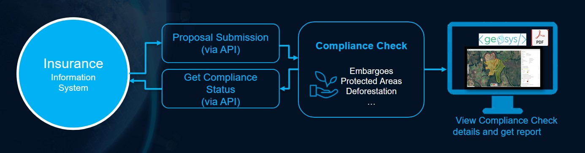
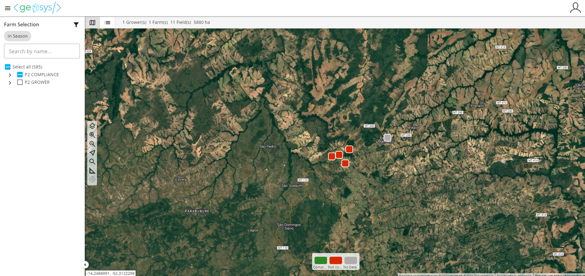
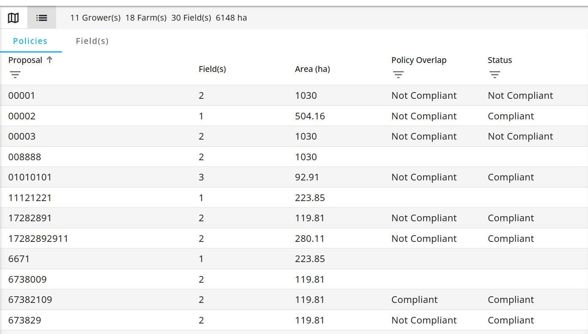
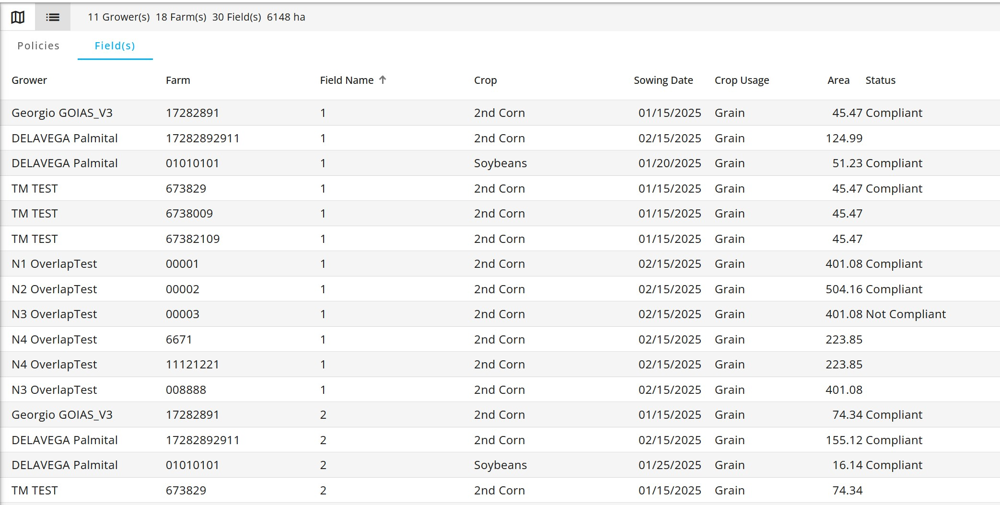
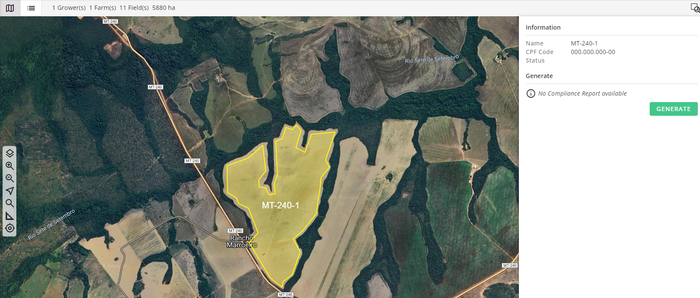
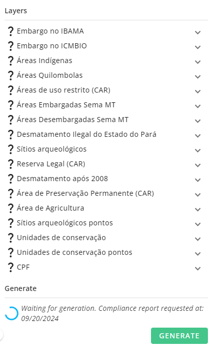
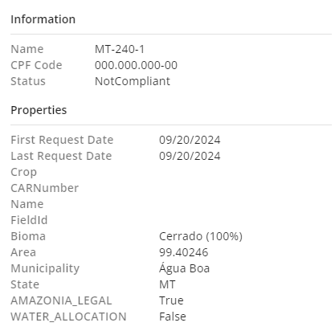
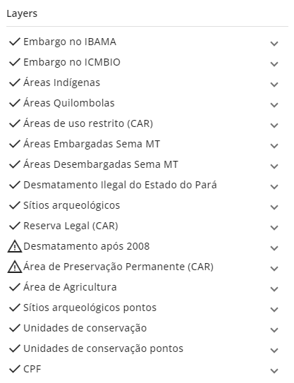
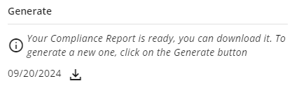

## 🛡️ Compliance Check

With environmental regulations and sustainability standards tightening worldwide, insurers have a crucial role in ensuring the growers they support meet all legal and environmental requirements.

Compliance checks are no longer optional – but manual, time-consuming processes make it tough to keep up, especially across large, diverse portfolios.

Whether you’re tracking land use, monitoring protected zones, or applying your own compliance rules, the Compliance Check module offers a scalable, objective, and customizable approach to evaluate growers' practices across your portfolio.

## 📤 Perform a Compliance Check for a New Proposal

### Input data

To perform a compliance check for a new proposal, the following information needs to be gathered and submitted through API:

- Grower’s details (Firstname & lastname; CPF number)
- Proposal details (ID, date)
- Field details (name, boundary, approximative sowing date, insured crop)

Once submitted, the API returns a **Compliance Status** for a given proposal.

The **Compliance Status** reflects the evaluation of all fields within the proposal. If any single field is flagged as non-compliant, the entire proposal is marked as non-compliant.  

Explore further details in our [API documentation](/docs/Agro/Portfolio/Compliance_API.md)

### 📋 List of Performed Compliance Checks

The following list can be fully tailored to match your compliance strategy.  

| Category         | Country | Layers                                                                                  |
|------------------|---------|------------------------------------------------------------------------------------------|
| Embargoes        | Brazil  | ICMBio, IBAMA, SEMA / SIGA, IAT, LDI, Naturantins                                        |
| Protected Areas  | Brazil  | Indigenous Lands, Conservation Units, Archeological Sites, Quilombolas Areas, Public Forest, Legal Amazonia |
| Deforestation    | Brazil  | PRODES                                                                                   |
| Water Usage      | Brazil  | Public Layers                                                                            |
| Slavery-like Work| Brazil  | Public Layers                                                                            |
| Biomes           | Brazil  | Public Layers                                                                            |
| Policies Overlap | Brazil  | Evaluate whether the given proposal is overlapping with existing policies from the same grower |

### 🛠️ Private Check

If you already have defined geographical restrictions or a preferred/blacklist of users, we can seamlessly integrate your private criteria into the Compliance Check process.

For more information, please [contact](https://earthdaily.com/contact) your Sales Executive.

---

## 📊 Visualize Compliance Check Results in  the App

In today’s landscape, environmental compliance is not just a regulatory requirement — it's a strategic imperative.

As an addition to the Compliance API, our Environmental Compliance module empowers Brazilian users to effortlessly validate whether a specific geometry (such as a field, farm, policy area, or other land parcel) aligns with national environmental regulations.

With just a few clicks, users can identify and visualize overlaps with protected areas, including native lands, permanent preservation zones, and legal reserves. 

The user can either explore the fields in the interactive map or directly dive into the Policies and Fields tables.

### Policies and Fields tables

Two different tabs / tables can be displayed: the **Policy Tab** and the **Field Tab**.

By default, the active tab is the Policy one, listing every policies and proposals and providing some compliance analytics aggregated at the policy level, while the Field tab displays all the fields.

On the bottom-right corner, the portfolio's total number of proposals is displayed. The data is updated automatically (for instance when filters are used).

#### 📋 Policies Tab Summary

| Attribute           | Description                                                                 |
|---------------------|-----------------------------------------------------------------------------|
| **Proposal n°**          | Policy or proposal number (user input)                                     |
| **Field name**              | Field name |
| **Crop**           | Crop name      |
| **Policy Overlap**       |                           |
| **Status**        | Compliant / Not compliant |

#### 🌾 Fields Tab Summary

| Attribute           | Description                                                                 |
|---------------------|-----------------------------------------------------------------------------|
| **Grower**         | Grower name            |
| **Farm**            | Farm or proposal/policy number |
| **Field**            | Field name |
| **Crop**            | Crop name |
| **Sowing date**            | Declared sowing date |
| **Crop usage**           | Type of usage ("Grain" for instance) |
| **Area**           | Area of the field     |
| **Status**        | Compliant / Not compliant |

### Access Field Analysis Details

Once you have a global view of your field of interest, you'll be able to select the field you would like to look at. 

Fields colored in red (not compliant) or green (compliant) have already been analyzed (either through API only or directly in the App)

#### Require Analysis for a Given Field

Click on a gray field to perform analysis on it.

A panel will open on the right. Click on the "GENERATE" button on the bottom right of the panel. A loader will appear and your report will be generated in a few seconds, checking the potential overlap of your field with compliance layers.

#### Visualize Compliance Results
Once a compliance analysis has been done on the field you can access all its detail through this right panel. It is divided in three sections:

* **Section 1:** allows you to get global information on your geometry (when you performed the analysis, where it is located, in which biome, is it part of legal amazon...)

* **Section 2:** allows you to get detail of each compliance item (the layers for which we check the overlap), with the associated detail (% of overlap if any). You can click on the display icon to see the features of the layer that intersect your geometry as well as visualizing the overlap in the map.

* **Section 3:** allows you to downloaded the PDF of your report with all previous information generated

--8<-- "snippets/contact-footer.md"
