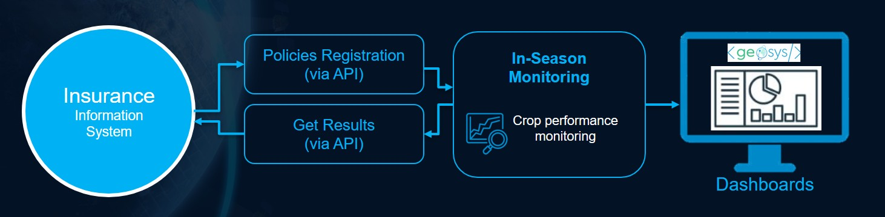

# 🌾 In-Season Monitoring

Issuing a policy is just the beginning. Throughout the growing season, insurers face rising uncertainty – weather events, crop stress, or delayed sowing can all increase the risk of loss. Without timely insights, it’s easy to miss early warning signs.

That’s where satellite imagery and AI analytics come in – offering real-time, field-level visibility across your entire portfolio. Replace guesswork with actionable insights, and transform how you manage agricultural risk.

The In-Season Monitoring module enables insurers to detect early signs of crop underperformance and proactively engage discussions with growers.

Insurance decision-makers can access portfolio dashboards to gain a clear view of risk distribution across their entire book of business.

## 🔍 Stay Ahead of Risk with In-Season Monitoring

### 🔗 Register Policies and Access In-Season Monitoring Results via API

Simply gather a few key details and register policies via API:

- Grower’s details (Firstname & Lastname)  
- Proposal details (ID, Date)  
- Field details (Name, Boundary, Approximative Sowing Date, Insured Crop)  

After an initial configuration, our In-Season Monitoring module automatically tracks your portfolio daily – spotting early signs of crop issues.

The system also supports previously submitted proposals – whether for historical assessment or compliance checks. If policy conversion data is shared, the in-season monitoring can run exclusively on accepted policies – keeping your insights relevant and targeted.

Up-to-date In-Season Monitoring analytics are seamlessly available – giving you the possibility to integrate real-time crop insights directly into your system.

*Reach out to your EarthDaily Agro contact to set up an In-Season Monitoring workflow for your portfolio.*

## 📊 In-Season Monitoring Analytics

A set of analytics is generated for each policy and field in your portfolio – tracking key crop development stages to quickly identify policies that may require attention:

| **Analytics** | **Description** | **Technical details** |
|---------------|-----------------|------------------------|
| **Planting Period Validation (ZARC)** | Assesses whether the sowing date falls within the legal planting window defined by Brazil’s Agricultural Climate Risk Zoning (ZARC) guidelines, identifying non-compliant practices. | [Learn more ](../Library/ZARC.md)|
| **Detected Emergence Date and Emergence Delay** | Confirms whether the crop has successfully emerged after planting and measures timing of emergence vs. historical averages. Delays may signal stress factors. | [Learn more ](../Library/Emergence.md) |
| **Detected Planted Area vs Declared Area (Planted Area Control)** | Identifies actual crop area via satellite and compares with farmer-declared area. Helps verify declarations and reduce fraud. | [Learn more ](../Library/) |
| **In-Season Potential Score** | Evaluates a field’s in-season performance using satellite imagery. Score of 50 = low, 70 = high. Ensures consistent and scalable risk assessment. | [Learn more ](../Library/In-season_Potential_Score.md) |
| **Relative Potential Score (vs History)** | Assesses if in-season performance is above or below historical trends for the same crop, identifying stress or underperformance. | [Learn more ](../Library/In-season_Potential_Score.md) |
| **Detected Harvest Date** | Identifies field harvest timing, marking end of insured period and status of claims. | [Learn more ](../Library/)|

---

## 🧭 Policies & Field-level Dashboard for Analysts

Up-to-date results are also available in a web-based dashboard for analysts, with detailed metrics at the policy and field level.

### 📋 Policies Tab Summary

| **Attribute** | **Description** |
|---------------|-----------------|
| **Policy N°** | Policy or proposal number (user input) |
| **Type** | Indicates Proposal (underwriting) or Policy (contract) |
| **Area (ha)** | Total area of all fields in the policy |
| **Declared Crop** | Crop declared by the user |
| **Crop ID Validation** | OK / NOK – Checks detected with satellite observation vs. declared crop |
| **ZARC Control** | OK / NOK – Validates sowing date vs. ZARC window |
| **Emergence Delay (Days)** | Timing of emergence vs. average (color-coded) |
| **Planted Area Detected (ha)** | Satellite-detected planted area |
| **Planted Area Control** | OK / NOK – Evaluates difference from declared |
| **In-Season Potential Score** | Color-coded score (Very Low to High) |
| **Relative Potential Score** | Score vs historical (Much Worse to Much Better) |

### 🌾 Fields Tab Summary

| **Attribute** | **Description** |
|---------------|-----------------|
| **Policy N°** | Linked policy or proposal number |
| **Field Name** | Field name or identifier |
| **Area (ha)** | Field size in hectares |
| **Declared Crop** | Declared crop |
| **Crop ID Validation** | OK / NOK – Validates against satellite detection |
| **Detected Sowing Date** | Sowing date from satellite imagery |
| **ZARC Control** | OK / NOK – Sowing within legal window |
| **Emergence Delay (Days)** | Delay vs. historical average (color-coded) |
| **Planted Area Detected (ha)** | Satellite-detected area for the field |
| **Planted Area Control** | OK / NOK – Declared vs detected difference |
| **In-Season Potential Score** | Color-coded score |
| **Relative Potential Score** | Score vs. historical (color-coded) |
| **Detected Harvest Date** | Satellite-detected harvest date |

Dive deeper into any field with intuitive map views and insights into the crop’s development cycle.

---

## 📈 Portfolio Dashboard for Executives
Provides a real-time overview of crop development by key stages, enabling insurers to quickly assess portfolio risk and plan for claims.

### 🌱 Crop Establishment

- **Emergence Detection**: % of portfolio with emergence success and acreage
- **Emergence Delay**: % of policies with important or huge delays (early-season risks)
- **ZARC Control**: % of portfolio sown outside legal window
- **Planted Area Control**: % of portfolio with large declared vs detected difference

### 🌾 Crop Development

- **Potential Score**: Compares in-season crop performance to historical trends  
  - Value > 100 = above average  
  - Value < 100 = underdevelopment  
- **Highlight**: % of portfolio with low performance  
- **Visualization**: Graph of distribution of performance across policies

### ✅ Crop Validation

- % of portfolio with unmatched satellite vs. declared crop ID

### 🧾 Harvest Detection

- % of portfolio with detected harvest and acreage – indicates end of insured period

--8<-- "snippets/contact-footer.md"