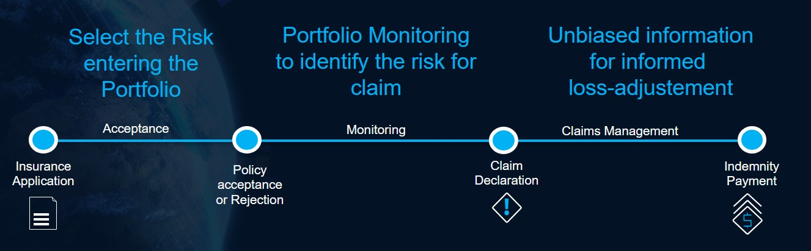

# 🌱 Innovative Ag-Insurance Solution for Portfolio Management

## Introduction
Transform how you manage ag insurance – from smarter underwriting to faster claims – with satellite intelligence and AI at your fingertips.  

Grow your portfolio with confidence by selecting the right risks from day one. Stay ahead of potential losses with real-time crop monitoring throughout the season. And when it comes to claims, rely on clear, unbiased insights to make faster, fairer decisions. 

With satellite imagery, weather data, and powerful analytics, you’re not just insuring farms – you’re ensuring smarter outcomes.  

### ✅ Benefits for Insurers
- **Ensure Environmental Compliance**: Remotely verify land use, crop practices and adherence to environmental standards to meet regulatory and ESG requirements 
- **Manage Portfolio Growth**: Make smarter underwriting decisions by identifying and avoiding high-risk fields with data-driven risk assessments.
- **Monitor Claims Exposure**: Detect early warning signs during the growing season and proactively manage potential losses
- **Faster, Fairer Claims Decisions**:  Leverage unbiased, field-level insights to validate claims, reduce fraud and build trust with your policyholders. 

### 👥 Who Is It For?
- **Underwriters**: Confidently assess risk.
- **Portfolio Managers**: Monitor exposure and anticipate claims.
- **Loss Adjusters**: Reduce time spent verifying field conditions.

## 🔧 Product Capabilities

### 🔍 1. Smart Underwriting
Use satellite data for making informed decisions before issuing a policy.

#### Key Features
- **Field-Level Performance Analysis**: Historical crop rotation and performance
- **Risk Scoring**:  Identify field productivity inconsistencies and flag high-risk fields
- **Portfolio Dashboard**: Get a dynamic view of risk distribution across the portfolio.

### ♻️ 2. Environmental Compliance Checks

Ensure your proposals portfolio aligns with ESG and regulatory standards 

### 🌾 3. In-Season Monitoring

Monitor and manage your portfolio throughout the growing season :  
- **Land Use Validation** : Confirm declared crop types and land use against actual satellite imagery
- **Real-Time Vegetation Monitoring** : Detect early signs of crop stress, underperformance or anomalies using crop-health indices
- **Portfolio Dashboard** : Get a dynamic view of crop conditions and exposure across all active policies.

### 🧾 4. Claims Management Report

Make claims handling more efficient, accurate and transparent:  
- **Verify Claims Remotely** : Use before-and-after satellite imagery and crop health indices to objectively evaluate the timing and extent of yield losses 
- **Prepare Field Visits** : Prepare in-person assessments with unbiased insights and avoid adverse selection 

### Insurance Portfolio Overview

### 🌍 Available Countries & Crops
The insurance portfolio management product is available over Brazil for major crops including soybean, corn, sugarcane, cotton and rice.  

## 🧭 Getting Started
Two main options:
- **APIs** for seamless integration.
- **Web-based dashboards** for underwriters and analysts.

To schedule a demo, contact us [here](https://earthdaily.com/contact)