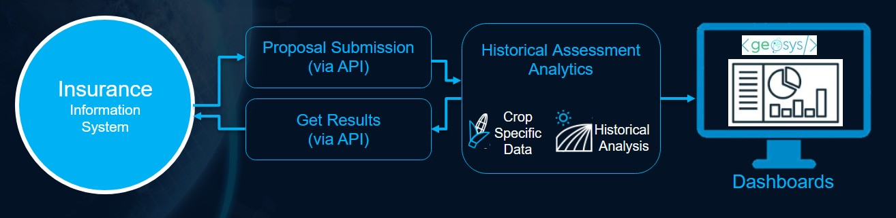
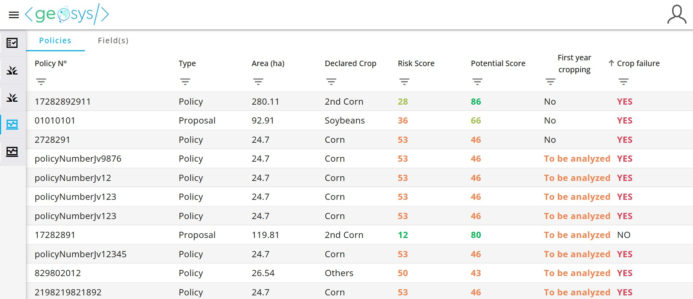
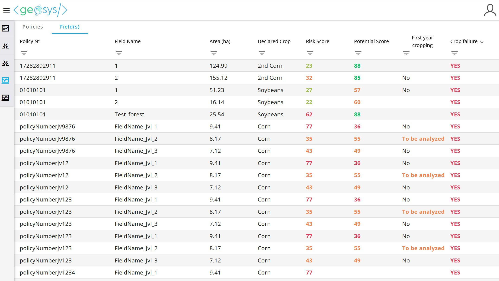
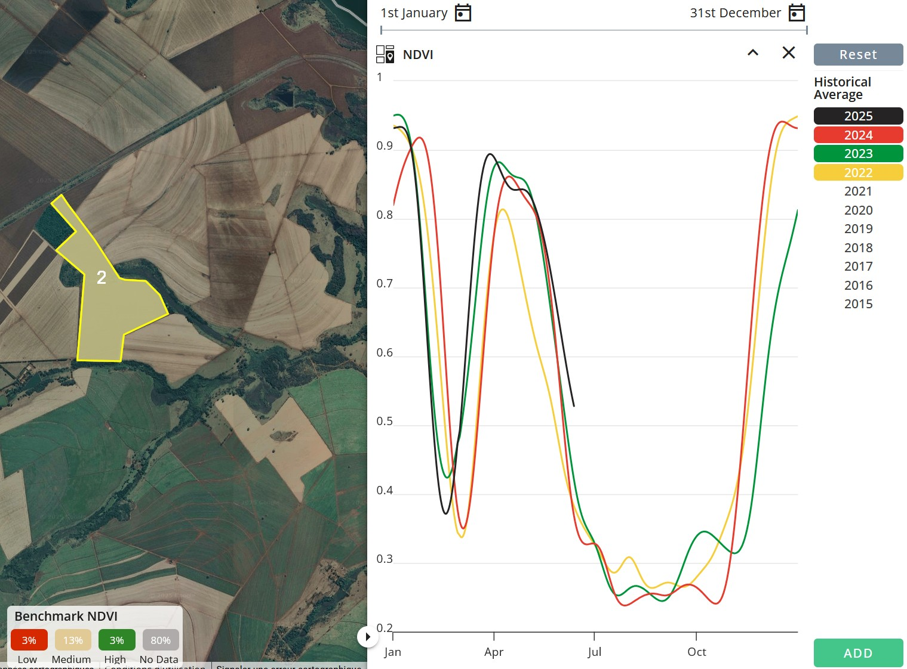
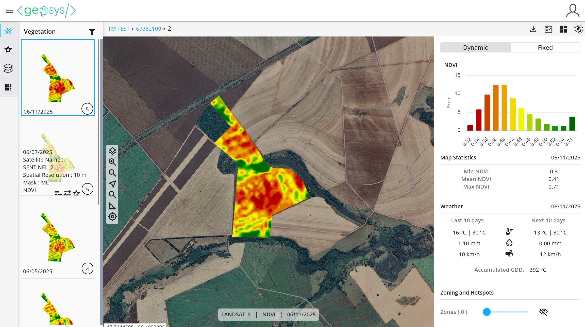
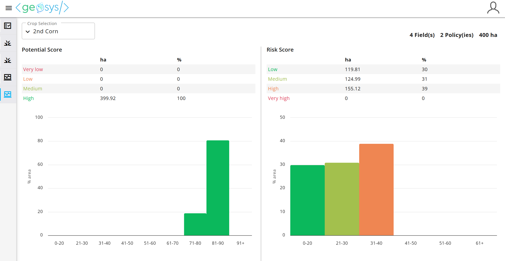

## 📝 Smart Underwriting

Underwriting agricultural insurance can be challenging due to incomplete, inconsistent, or unreliable data provided by growers. Also, information often varies widely from one grower to another, making it difficult to get homogeneous risk assessment across the portfolio. Satellite imagery helps overcome these gaps by offering a consistent, objective view of each field’s history and performance.

The Smart Underwriting module empowers underwriters with key insights to evaluate grower risk using historical performance analysis prior to policy issuance.

Insurance decision-makers can access portfolio dashboards to gain a clear view of risk distribution across their entire book of business.

## 📤 Get Historical Assessment for a New Proposal

### Submit proposals and get results via API

When evaluating a new proposal during underwriting, few key details need to be gathered and submitted through API to launch the historical assessment process:

- Grower’s details (Firstname & lastname)
- Proposal details (ID, date)
- Field details (name, boundary, approximative sowing date, insured crop)

Explore further details in our [API documentation](https://earthdaily.github.io/earthdaily-documentation/Agro/Portfolio/Historical_Assessment_API/).

### 📊 Historical Assessment Analytics

The following analytics are computed over the submitted proposals:

| Analytics                    | Description                                                                                                                                     | Technical Details                                                                                      |
|-----------------------------|-------------------------------------------------------------------------------------------------------------------------------------------------|---------------------------------------------------------------------------------------------------------|
| Historical Average Potential Score | This analytic evaluates a field’s historical performance using satellite imagery – reflecting yield potential, focusing on years when the same insured crop was planted.  • A score of 50 indicates low performance  • A score of 70 indicates high performance. With only minimal inputs required, it ensures a consistent and scalable risk assessment across the entire portfolio. |   Link to Analytic catalog |
| Risk Score                  | The risk score – derived from historical potential scores, measures fluctuations in crop performance over time and reveals underlying production risks.  • A score of 20 reflects stable, consistent yields  • A score of 65 indicates significant variability | Link to Analytic Library |
| First-year Cropping Detection | This analytic identifies newly cultivated fields that may carry higher risk, helping to make informed underwriting decisions.                    | Link to Analytic Library |
| Season Failure Detection    | This analytic spots fields with track records of crop failure over history to detect underlying risk.                                            | Link to Analytic Library |

---
## 📈 Proposals & Field-level Dashboard for Analysts

The results of the analysis are also available on a web-based dashboard for Analysts with detailed metrics at the proposal level and granular insights down to individual fields.

Two different tabs / tables can be displayed: the **Policy Tab** and the **Field Tab**.

By default, the active tab is the Policy one, listing every policies and proposals and providing some analytics aggregated at the policy level, while the Field tab displays all the fields.

By default, as the Executive dashboard, the Analyst dashboard displays data for all crops within the proposals portfolio, but every table column can be used to sort or filter the data, including the crop.

On the bottom-right corner, the portfolio's total number of proposals is displayed. The data is updated automatically (for instance when filters are used).

### 📋 Policies Tab Summary

| Attribute           | Description                                                                 |
|---------------------|-----------------------------------------------------------------------------|
| Policy N°           | Policy or proposal number (user input)                                     |
| Type                | Indicates whether it's a Proposal (underwriting phase) or a Policy (contract) |
| Area (ha)           | Total area (in hectares) of all fields in the policy                       |
| Declared Crop       | Crop declared by the user                                                   |
| Risk Score          | Weighted average of historical risk scores   • LOW (0-20)   • MEDIUM (20-30)   • HIGH (30-60)   • VERY HIGH (> 60) |
| Potential Score     | Weighted average of potential scores   • VERY LOW (0-40)   • LOW (40-60)   • MEDIUM (60-70)   • HIGH (> 70) |
| First Year Cropping | • YES – At least one field is newly cropped   • TO BE ANALYZED – Uncertain   • NO – All fields have cropping history |
| Crop Failure        | • YES - if at least one field experienced crop failure                      |

### 🌾 Fields Tab Summary

| Attribute           | Description                                                                 |
|---------------------|-----------------------------------------------------------------------------|
| Policy N°           | The policy or proposal N° the field is linked to                            |
| Field Name          | Name or identifier of the field (user input)                                |
| Area (ha)           | Size of the field in hectares                                               |
| Declared Crop       | Crop declared by the user                                                   |
| Risk Score          | Historical risk score   • LOW (0-20)   • MEDIUM (20-30)   • HIGH (30-60)   • VERY HIGH (> 60) |
| Potential Score     | Historical potential score   • VERY LOW (0-40)   • LOW (40-60)   • MEDIUM (60-70)   • HIGH (> 70) |
| First Year Cropping | • YES – Fewer than 3 cropped years in the last 5   • TO BE ANALYZED – 3+ years, needs review   • NO – Cropped in last 2 years |
| Crop Failure        | • YES – If at least one crop failure occurred in the last 5 years           |

By double-clicking (or clicking on the Analyze button), you can dive deeper into any field with intuitive map views and insights into the crop’s development cycle.

---

## 📈 Portfolio Dashboard for Executives

The portfolio dashboard helps assess the overall composition of the portfolio – based on historical assessments analysis over all the submitted proposals – and supports informed decisions on adjusting risk exposure.

Satellite images unlock consistent and scalable risk assessment across the entire portfolio – eliminating the challenges of incomplete, inconsistent, or biased data often provided by growers.

### 📖 Potential Score Section

The Potential Score section illustrates the distribution of proposals across score categories, helping evaluate performance levels:

- A dominant “LOW” category shows a mostly low-performing portfolio.
- A dominant “HIGH” category indicates a portfolio of high-performing proposals.

Depending on the composition (low, medium, high), the insurer can adjust underwriting strategy.

---

### 📊 Risk Score Section

The Risk Score section shows how proposals are distributed across risk categories, revealing seasonal performance stability:

- A dominant “LOW” category = stable, consistent yields.
- A dominant “HIGH” category = high seasonal variability.

This supports strategy adaptation and defining further risk acceptance guidelines.

--8<-- "snippets/contact-footer.md"
