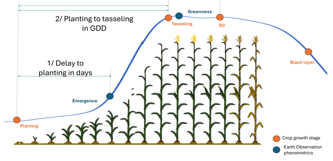
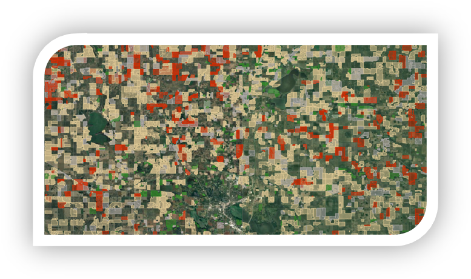
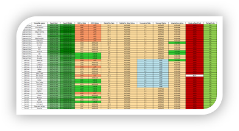

# Territory Insights

## 🌾 Introduction

Territory Insights is a low-touch, fully automated agricultural intelligence service that transforms how agronomists and agricultural retailers engage with growers. In today's increasingly complex agricultural landscape—where weather patterns are unpredictable, market conditions shift rapidly, and staff transitions can mean losing years of accumulated local knowledge—maintaining contextual relevance and responsiveness at scale has never been more challenging.

Territory Insights addresses this challenge by providing real-time, field-level crop insights without requiring any user inputs. By combining satellite imagery, AI-powered field delineation, weather data, and predictive analytics, it enables marketers and agronomists to become trusted advisors who can recommend the right input when conditions call for it, open grain marketing discussions at the optimal moment, and address concerns before they become problems.

### Benefits

- **Automated Field Borders**: Transform hours of manual field data collection into instant, automated insights with AI-powered field border delineation and crop identification
- **Precise Timing**: Pinpoint exactly when and where input placement opportunities arise with predictive growth stage (e.g., tasseling prediction +/- 2 days)
- **Advanced Targeting**: Select growers in areas with higher yield potential or specific weather conditions for targeted marketing campaigns
- **Strategic Decision Making**: Field-level details consolidated at various levels into clear, intuitive reports enabling strategic decisions without losing sight of field-level precision
- **Sales Efficiency**: Adapt segmentation based on growing conditions and improve sales team management through data-driven prioritization
- **Competitive Advantage**: Stay ahead of market shifts with real-time agricultural intelligence and maintain relevance in high-volatility environments

### Targeted Audience

- **Agricultural Retailers & Cooperatives**: Organizations managing large territories and grower networks seeking to optimize sales team efficiency and input placement strategies
- **Agronomists & Crop Advisors**: Professionals needing real-time crop insights to provide timely, relevant recommendations across multiple grower accounts
- **Agricultural Input Companies**: Seed, fertilizer, and crop protection companies looking to scale their market reach and improve ROI on product placement
- **Marketing Teams**: Agricultural marketing professionals executing crop status-based campaigns, enabling precision targeting of growers or accounts matching specific conditions such as growth stage, yield potential, or weather patterns for timely and contextually relevant messaging
- **Grain Buyers & Elevators**: Organizations wanting to synchronize grain marketing discussions with optimal crop timing
- **Agricultural Auditing Companies**: Firms requiring efficient prioritization of ground survey work and remote harvest monitoring capabilities
- **Renewable Energy Companies**: Biofuel producers seeking to scale low-carbon sourcing through identification of growers with favorable crop rotation patterns

## 🚜 Product, Modules & Capabilities

  

    <h3>Territory segmentation</h3>
    <ul>
      <li>Automated field border delineation using advanced AI models</li>
      <li>Imagery-based crop identification across entire territories</li>
      <li>Strategic territory sampling for comprehensive coverage</li>
      <li>No user inputs required—fully automated data collection</li>
    </ul>
  

  

    
  

  

    
  

  

    <h3>Crop Phenometrics & Predictions</h3>
    <ul>
      <li>Convert imagery time series to power precise crop phenometric detection</li>
      <li>Leverage weather data for predictive growth stage forecasting</li>
      <li>Tasseling prediction with +/- 2-day accuracy across multiple US states</li>
      <li>Crop potential assessment based on real-time conditions</li>
      <li>Disease risk based on local weather forecast</li>
    </ul>
  

  

    <h3>Targeting & Segmentation</h3>
    <ul>
      <li>Location-based grower targeting by yield potential, weather conditions, or crop stage</li>
      <li>Dynamic segmentation that adapts to changing growing conditions</li>
      <li>Field-level precision with regional aggregation capabilities (county, township, custom)</li>
      <li>Integration-ready for CRM and email marketing platforms</li>
    </ul>
  

  

    
  

  

    
  

  

    <h3>Sales & Marketing Enablement</h3>
    <ul>
      <li>Automated lead generation based on crop timing and conditions</li>
      <li>Tailored messaging aligned with current crop context</li>
      <li>Visual reporting dashboards for sales team management</li>
      <li>Power location based marketing campaigns</li>
    </ul>
  

## 🛠 Product Overview

Territory Insights operates as a fully automated, cloud-based service that requires no manual data input from users. The system continuously monitors your territory using satellite imagery and weather data, automatically identifying fields, crops, and growth stages.

### How It Works:

1. **Territory Setup**: Define your geographic area of interest (state, county, or custom boundary)
2. **Automated Monitoring**: AI models continuously analyze satellite imagery to identify crops and emergence
3. **Predictive Analytics**: Machine learning algorithms combine imagery time series with weather data to predict growth stages and assess yield potential
4. **Insight Delivery**: Consolidated reports and alerts delivered through data export, dashboards, APIs, or integrated into existing systems
5. **Action**: Sales teams receive prioritized lists of location, optimal timing windows, and tailored messaging for maximum engagement

### Key Differentiators:

- **Zero Manual Input**: Unlike traditional field monitoring that requires growers to upload field boundaries or self-report planting dates, Territory Insights automatically generates all intelligence
- **Predictive Not Just Reactive**: Forecasts growth stages days in advance rather than just reporting current status
- **Scale Without Complexity**: Monitor hundreds of thousands of fields across entire territories with the same ease as monitoring a single field
- **Agronomic Context**: Insights come with clear and factural explanations of why they matter and what actions to take

## 📊 Data & Analytics Coverage

### Analytics

**Crop Insights:**

- [Crop type identification](../Cropid/cropid_product.md) (corn, soybeans, wheat, and other major crops)
- Planting date estimation
- Growth stage tracking and prediction ([emergence](../Library/Emergence.md), vegetative stages, reproductive stages, maturity)
- Crop vigor and health assessment
- [Predictive disease risk](../Library/disease_risk.md) for application timing optimization
- [Yield potential scoring](../Library/In-season_Potential_Score.md) relative to historical averages and current season conditions

**Weather Integration:**

- Historical weather pattern analysis
- Growing Degree Day (GDD) accumulation tracking
- Precipitation and moisture stress indicators
- Temperature extremes and crop stress events
- Forecast integration for predictive analytics

**Targeting Criteria:**

- High yield potential
- Optimal application timing windows
- Crop stage synchronization across territories
- Historical performance patterns
- Crop rotation pattern analysis

### Data Coverage

**Geographic Coverage:**

- Primary: United States (all major agricultural regions)
- Expanding: Canada, Brazil, Argentina, and other key agricultural markets

**Temporal Coverage:**

- Current season monitoring (daily to weekly updates depending on requirements)
- Historical baseline (5-10 years of historical crop performance data)
- Predictive forecasting (7-21 days ahead for growth stage predictions)

**Spatial Resolution:**

- Field-level analysis (typical field sizes from 10-1000+ acres)
- Sub-field variability detection where relevant
- Regional aggregation (county, state, custom territories)

**Data Sources:**

- Multi-satellite imagery (Sentinel-2, Landsat, and commercial providers)
- Multi weather datasets
- Other public reference datasets

## 🔗 Support & Resources

### Use Case Examples:

  

    <h4>Fungicide Sales Growth</h4>
    
↑ 10% growth • $4-6/acre margin

    
A major agricultural retailer used Territory Insights to identify corn fields approaching the optimal fungicide application window, enabling agronomists to proactively contact growers.

    <!-- <a href="#">Learn More →</a> -->
  

  

    <h4>Harvest Monitoring</h4>
    
↓ 60% reduction in field visits

    
An auditing company deployed Territory Insights to remotely monitor soybean harvest timing, allowing inspectors to be deployed only when harvest was confirmed.

    <!-- <a href="#">Learn More →</a> -->
  

  

    <h4>Biofuel Sourcing</h4>
    
× 3x faster sourcing expansion

    
A renewable energy company identified growers with corn-soybean rotation patterns suitable for introducing oilseed crops into their portfolio.

    <!-- <a href="#">Learn More →</a> -->
  

--8<-- "snippets/contact-footer.md"