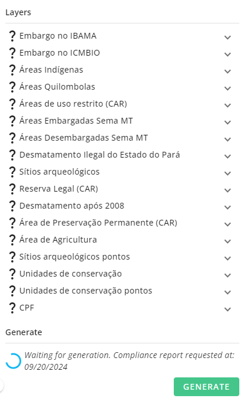

# Compliance Analysis

Today environmental compliance services play a relevant role in the search for the preservation of the environment, in addition to protecting companies from financial and reputational risks.
This module enables Brazilian customers to quickly check whether or not a given geometry (field, farm, policy or other) complies with environmental and national legislation. It is used to check that there is no overlap between the geometry and protected areas such as native land, permanent protection areas, legal reserves, etc. 
 
 

## Portfolio analysis

This module allows the user to navigate through its portfolio, launch compliance analysises and clickly identify the geometries (fields, farm, policies...) at risk.

> In the Compliance module, as in the other modules, the selection panel will by default display all Growers/Farms which have at least one field in the current season.
Click on the Filter icon to open otions which will allow you to make selections shorten the Grower/Farm based on In-Season or Sowing Date range, Crop Type, Usage and/or Irrigation Status. 
Then, select one or many Growers/Farms and see all the fields in either a Map or Grid view.    
To toggle between the two views click on the map or list icon in the top right of the screen.
 

 

## Access field analysis details

### Require analysis for a given field

Once you have a global view of your field of interest, you'll be able to select the field you would like to look at.
Field colored in red or green have already been analyzed. 
Click on a grey field to perform analysis on it.

 

 

A panel will open on the right.
Click on the "GENERATE" button on the bottom right of the panel.
A loader will appear and your report will be generated in few seconds.

 

 

### See compliance results

Once a compliance analysis has been done on the field you can access all its detail through this right panel.
It is divided in three sections : 
- the first one allows you to get global information on your geometry (when you performed the analysis, where it is located, in which biome, is it part of legal amazon...)

 

- the second one allows you to get detail of each compliance item (the layers for which we check the overlap), with the associated detail (% of overlap if any). You can click on the display icon to see the features of the layer that intersect your geometry.

 

- the last one allows you to downloaded the PDF of your report with all previous information generated

 

--8<-- "snippets/contact-footer.md"