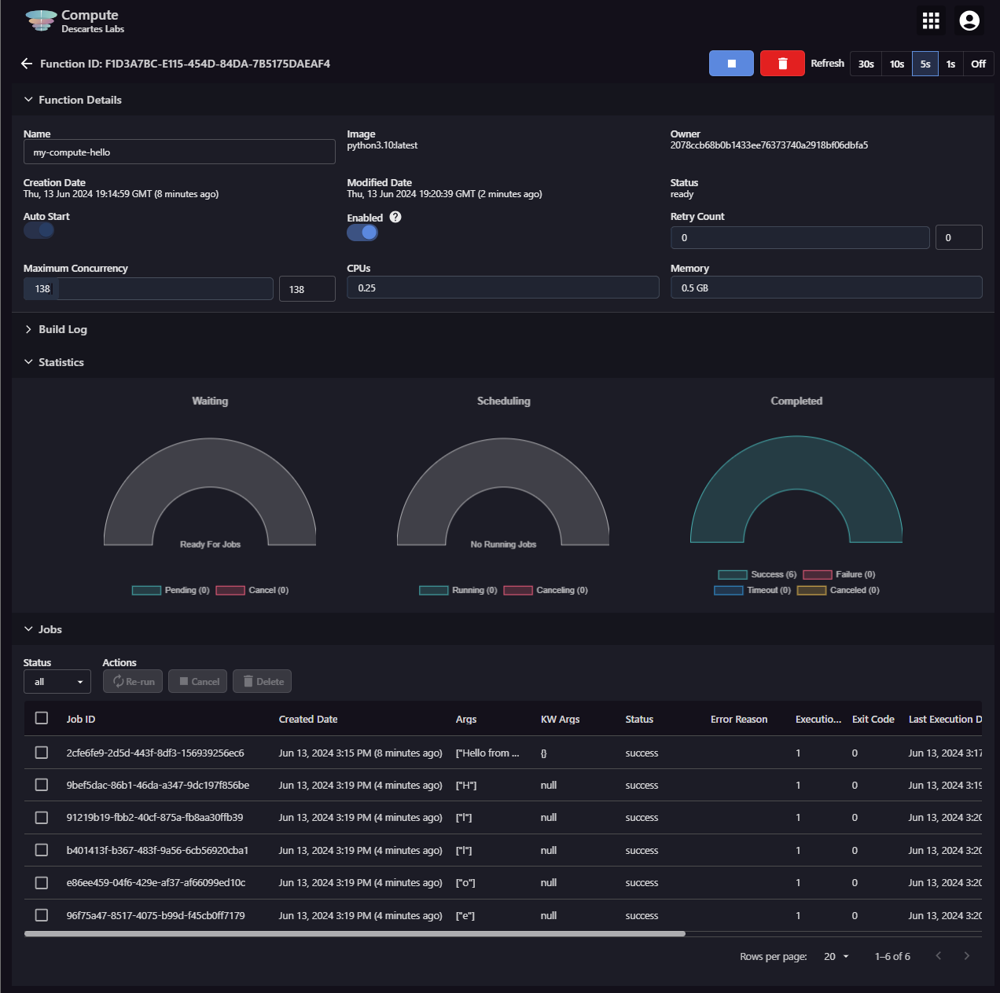

# EarthOne Compute API

## An introduction to the EarthOne Compute API and its key concepts, classes, and methods

### Overview

The [EarthOne Compute API](https://docs.descarteslabs.com/descarteslabs/compute/readme.html), or Batch Compute, is a highly scalable cloud computing service designed to parallelize any computation, specifically those leveraging our [Catalog API](https://docs.descarteslabs.com/descarteslabs/catalog/readme.html) and its datasets. This service packages up your Python code and executes it on nodes hosted by Descartes Labs.

Please visit the [Compute Guide](https://docs.descarteslabs.com/guides/compute.html) for a more in-depth primer on the Batch Compute service.

This document gives a high-level introduction to the Compute API. For more detailed, practically applied tutorial notebooks please reference the [Example Notebooks](https://github.com/earthdaily/earthone-example-notebooks) on GitHub or install them by running:

```
git clone https://github.com/earthdaily/earthone-example-notebooks.git
```

### Functions and Jobs

The core object within Batch Compute is the [Function](https://docs.descarteslabs.com/descarteslabs/compute/readme.html#descarteslabs.compute.Function), a serverless, user-configurable cloud function. Functions can be treated like any other Python function, taking any arbitrary input argument and performing whatever task it is written to do, such as writing a new object back to Catalog or returning some calculated statistic. The Batch Compute service was designed to simplify complex cloud infrastructure and lower the barrier to scale beyond the limitations of your local computer.

Each time we invoke, or pass new arguments to, a Function, that triggers a single [Job](https://docs.descarteslabs.com/descarteslabs/compute/readme.html#descarteslabs.compute.Job), which we can track in real time using the [Compute UI](https://earthone.earthdaily.com/compute). Each user can run up to **1000 concurrent Jobs**.

#### Creating a Function

To create a Function, we start by iterating on your local environment on a Python function. At its simplest level, the function will accept input parameters, define some processing to be performed, and optionally return some output.

```python
def hello_world(arg):
    print(arg)
    return arg
```

We then instantiate our Function by passing a few key parameters:

- Our locally defined Python function
- A Function **name**
- **Image URL**, always `"latest:pythonX.Y"` where X is the major Python version and Y the minor (e.g. `"latest:python3.10"`)
- **Number of CPUs** per Job, up to 16 vCPUs
- **Memory** allotted per Job, up to 120 GB
- **Maximum Concurrency** — how many active Jobs can run in parallel
- **Timeout** before canceling a Job, in seconds
- **Retry Count** if a Job fails
- Optional **requirements** for dependencies [not installed by default](https://docs.descarteslabs.com/guides/compute.html#current-images)

```python
from descarteslabs.compute import Function

async_func = Function(
    hello_world,
    name='my-compute-hello',
    image="python3.10:latest",
    cpus=1,
    memory=2048,
    maximum_concurrency=10,
    timeout=600,
    retry_count=3,
)

async_func.save()
```

> Only certain combinations of CPUs and memory are available. Visit the [Documentation for more details](https://docs.descarteslabs.com/guides/quota.html#general-limitations).

#### Function Lifecycles and Managing Active Jobs

Once a Function is saved, it can be tracked by both its **ID** and **Name** on the [Compute Monitor UI](https://earthone.earthdaily.com/compute). The general lifecycle of a Function starts in the state of `pending`, while the initial Docker image is built. If a Function fails to build, access the **Build Log** to determine the point of failure through either the UI or through the Function itself. Once a Function is successfully built it starts to schedule the pending Jobs. You can submit new Jobs at any time even while the Function is building.

Submit a new Job to your Function the same way as a local Python function, or in bulk by passing an iterable into the [.map()](https://docs.descarteslabs.com/descarteslabs/compute/readme.html#descarteslabs.compute.Function.map) method:

```python
job = async_func("Hello World")
jobs = async_func.map(["H", "e", "l", "l", "o"])
```

Track progress either through the API directly, or interactively through the [Compute Monitor UI](https://earthone.earthdaily.com/compute):



This interface allows the user to:

- Modify a Function's maximum concurrency, number of CPUs, memory
- Delete and stop a running Function
- Access the Function's Build Logs, in case of a failure to build
- Access each individual Job's input arguments, runtime, status, logs, and outputs

#### Retrieving Results of a Function

In practice, these Functions can return any number of results, such as complex time-series statistics, which must be managed in bulk. Each Job's result can be accessed through either the Job object itself or through [Blobs](https://docs.descarteslabs.com/descarteslabs/catalog/docs/blob.html#descarteslabs.catalog.Blob) that are created with each Job. The best way to access all of the results of a Function's Jobs is to construct a search filter to retrieve a list of Job results:

```python
from earthdaily.earthone.auth import Auth
from earthdaily.earthone.catalog import Blob, properties as p

auth = Auth.get_default_auth()
namespace = f"{auth.payload['org']}:{auth.namespace}"

for b in (
    Blob.search()
    .filter(p.namespace == namespace)
    .filter(p.name.startswith(f"{async_func.id}/"))
    .filter(p.storage_type == StorageType.COMPUTE)
):
    print(f"ID: {b.id}")
    print(b.data())
    print("\n")
```

### Compute Best Practices

The Compute API is best utilized when paired with high-throughput access to raster data through the [Catalog API](https://docs.descarteslabs.com/descarteslabs/catalog/readme.html). Typical use cases include the generation of dense time-series statistics such as daily weather conditions over large areas and scaled inference and training of AI models at high spatial resolution.

#### Catalog Limits

Since each user is allotted up to 1000 concurrent Jobs, it is necessary to be aware of the [Quotas and Limits](https://docs.descarteslabs.com/guides/quota.html) that pertain to the various creation and retrieval methods of the Catalog API.

> If your Jobs are failing due to a "Maximum retries" error, this is most likely due to a limit on the Catalog end!

#### Scaling Processing Efficiently

Once familiar with the Catalog limitations, it is also beneficial to plan out an optimal method over which large spatiotemporal scales are divided and submitted to the Compute service. In general, try to avoid duplicating both spatial and temporal *searches* and *retrievals* of data — think in a "read-once and store-only-your-results" paradigm. It is best to choose an optimal tiling grid, such as with [DLTiles](https://docs.descarteslabs.com/descarteslabs/geo/readme.html#descarteslabs.geo.DLTile), which strike a balance of per-Job runtime and overall count of tiles. In some cases, especially with coarser imagery such as weather data, it may be wisest to submit Image IDs as an input argument versus the DLTile ID approach.

Contact [dl.support@earthdaily.com](mailto:dl.support@earthdaily.com) with any questions on the overall efficiency and performance of your processing!
