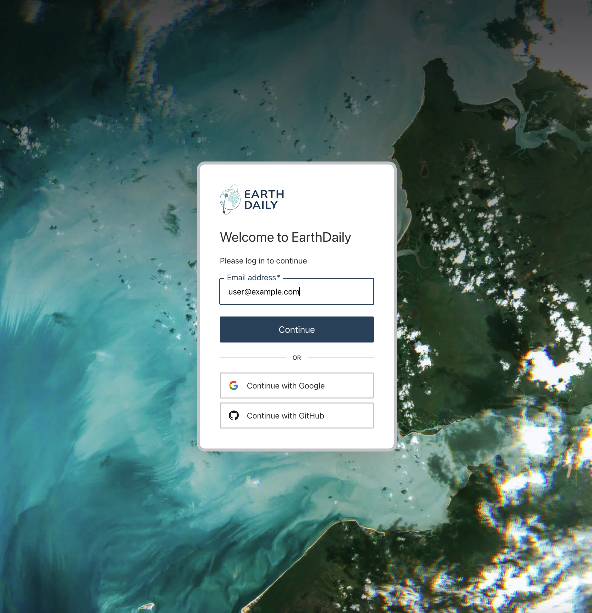
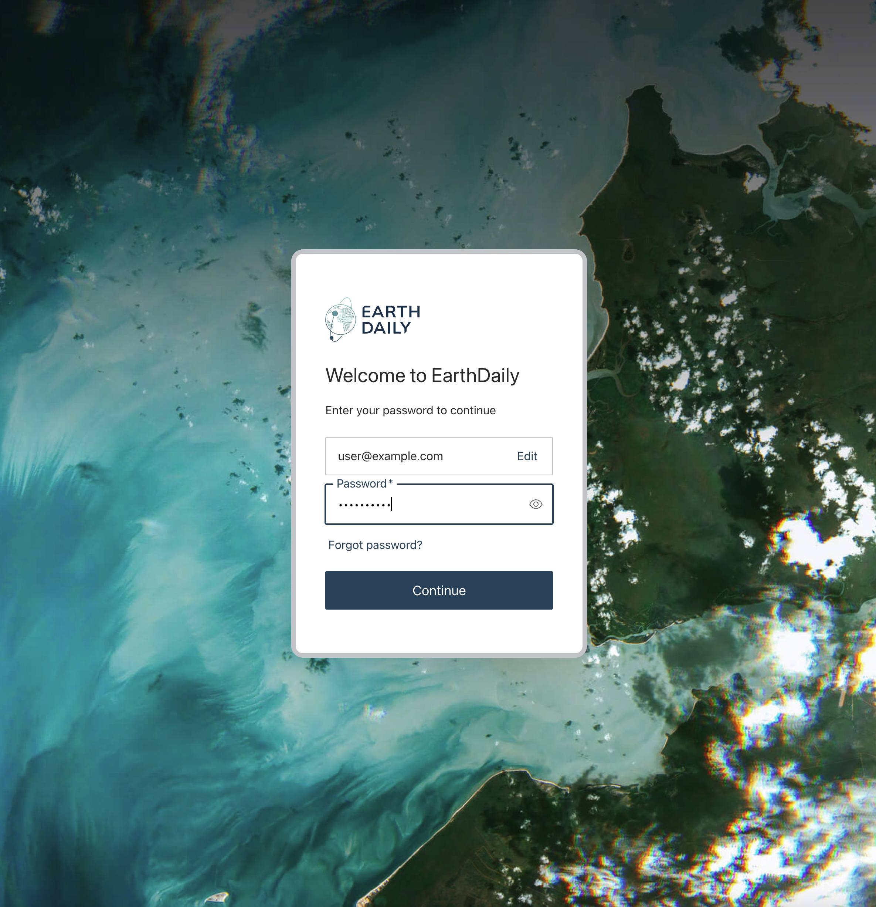

# Introducing EarthOne

## The EarthOne Analytics Platform

EarthDaily is excited to announce that the Descartes Labs Platform is now **EarthOne**! Alongside this renaming comes a few user experience changes, which are detailed below.

### Updated Product URLs

> **All old `*.descarteslabs.com` URLs went dark December 1, 2025!**

All applications previously hosted at <https://app.descarteslabs.com> are now located under <https://earthone.earthdaily.com>. This includes:

- [Docs](https://docs.earthone.earthdaily.com/)
- [Explorer](https://earthone.earthdaily.com/explorer)
- [Workbench](https://earthone.earthdaily.com/workbench/)
- [Compute](https://earthone.earthdaily.com/compute)
- [Storage](https://earthone.earthdaily.com/storage)
- [Usage](https://earthone.earthdaily.com/account/usage)
- [Marigold](https://earthone.earthdaily.com/marigold/)
- [Iris](https://earthone.earthdaily.com/iris/)

#### What if I only use Marigold or Iris?

Subscribers to these applications only need to bookmark these new `earthone.earthdaily.com/` URLs and take note of the newly branded login experience. No other changes should be expected.

- <https://earthone.earthdaily.com/marigold/>
- <https://earthone.earthdaily.com/iris/>

### Logging In

The login experience is now streamlined with the rest of [EarthDaily's](https://earthdaily.com/) products. Note that self-signup is no longer supported; please contact [support@earthdaily.com](mailto:support@earthdaily.com) if you do not yet have an account.





#### What if my Organization has Single Sign-On enabled?

If you are an enterprise customer with SSO integration to EarthDaily, you will still enter your email address into the new login page and will automatically be redirected to your corporate identity login as before.

### Customer Service Desk

The same [Customer Service Desk (CSD)](https://earthdaily.atlassian.net/servicedesk/customer/portal/67) will be at your disposal to answer any questions and submit any issues at [support@earthdaily.com](mailto:support@earthdaily.com). For added security, when interacting with Support through tickets directly you will be prompted to verify your email.

### Installing the Python Client

The Python APIs have been renamed from `descarteslabs` to `earthdaily-earthone`. To install EarthOne:

```
pip install earthdaily-earthone
```

To install Dynamic Compute:

```
pip install earthdaily-earthone-dynamic-compute
```

Once installed, simply re-authenticate to generate a new token:

```
earthone auth login
```

### Updated Import Syntax

The only major code change is how you import and reference the EarthOne Python client:

```python
# Previous
import descarteslabs as dl
from descarteslabs.catalog import Product

print(dl.__version__)
```

```python
# Current
import earthdaily.earthone as eo
from earthdaily.earthone.catalog import Product

print(eo.__version__)
```

#### What about example notebooks?

All tutorial notebooks have been updated and are publicly available at <https://github.com/earthdaily/earthone-example-notebooks>. Clone them via:

```
git clone https://github.com/earthdaily/earthone-example-notebooks.git
```

### Product ID Updates

No data has been touched! The only change you'll need to accommodate is that EarthDaily-owned Core product namespaces have changed from `descarteslabs:` to `earthdaily:`:

```python
# Previous
fused_bec_pid = "descarteslabs:bare-earth:fused:v1"

# Current
fused_bec_pid = "earthdaily:bare-earth:fused:v1"
```

### Batch Compute Functions

Once you have updated your environment to the EarthOne Python Client, you will need to re-create your batch Compute Functions:

```python
from earthdaily.earthone.compute import Function

async_func = Function()
async_func.save()
```

To ensure you have properly updated EarthOne tokens for Compute, run this one-time credentials update following authentication:

```python
from earthdaily.earthone.compute import ComputeClient

client = ComputeClient.get_default_client()
client.set_credentials()
```

### Support

As always, feel free to reach out at [support@earthdaily.com](mailto:support@earthdaily.com) if you have any questions!
