# EarthOne Explorer UI

## An Overview of the EarthOne Explorer UI

### What is Explorer?

[EarthOne Explorer](https://earthone.earthdaily.com/explorer) is your first stop in discovering what geospatial data you have available to you — an interactive web mapping interface with a familiar GIS-style look and feel.

When you first log into Explorer, you will be dropped into an empty map view:

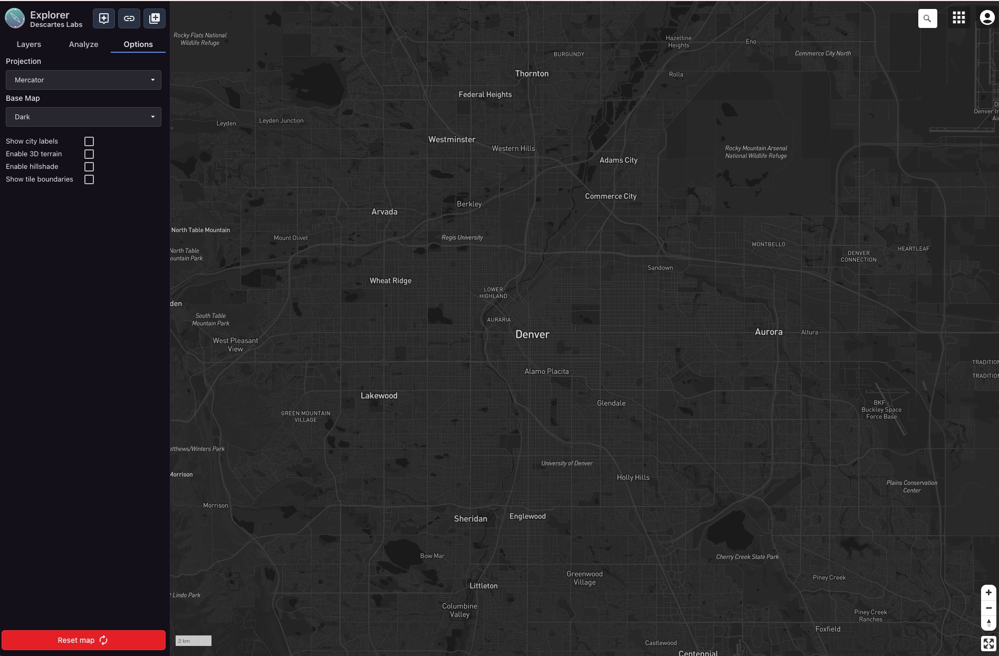

### Finding Data Sources

To search and add new data to your Explorer viewport, click **Add a new Layer** in the top left of the application:

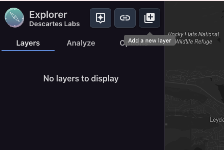

This will bring up a tabular view of data sources, or Products. You can toggle between **Core Products** — ones maintained by EarthDaily:

Or view **My Products** — data sources owned and maintained by you and your organization:

Note that raster data sources are denoted by the image symbol, while vector data sources by a vector symbol.

### Product Metadata

To search for a particular data source, you can type the product name or keyword into the search bar.

For example, "Sentinel-2" brings up the various processing levels of Sentinel-2 data available on the EarthOne Catalog. Note the accompanying metadata such as:

- Description
- Temporal acquisition information
- Spatial resolution(s)
- Bands

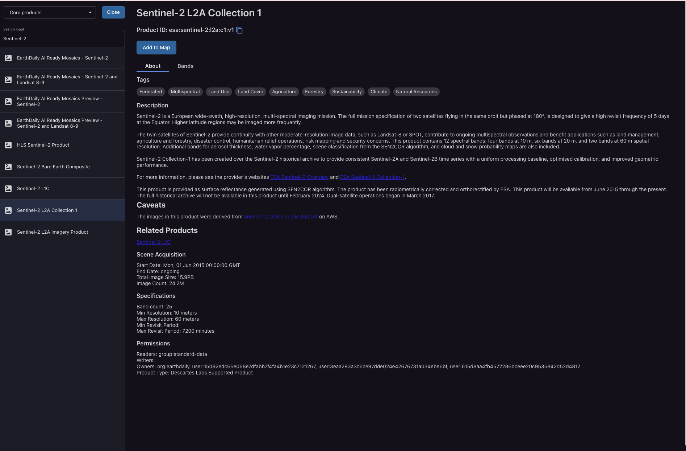

You can also view the expanded Band metadata in its own tab:

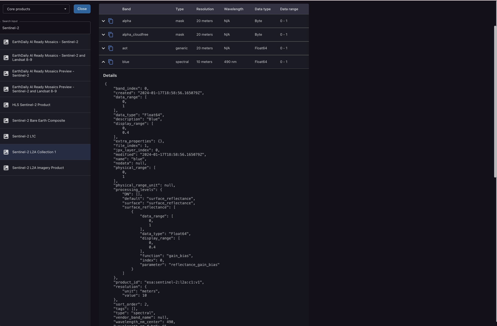

### Adding Data to the Map

By clicking **Add to Map** from the Product view, this will add the layer in question to the Explorer interactive web map:

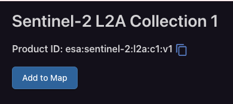

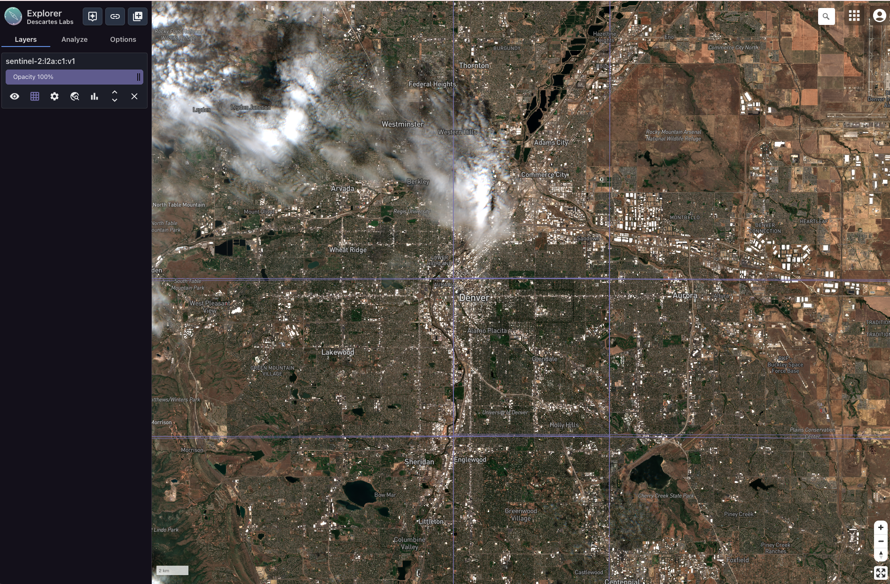

*You can add as many data sources into your Explorer viewport as you'd like. This also works for vector layers!*

### Working with Imagery in Explorer

By default, Explorer will try to set the date range to the latest available imagery. You can change the visualized date range and inspect available coverage through the General Settings dialog and enabling the Coverage Chart option:

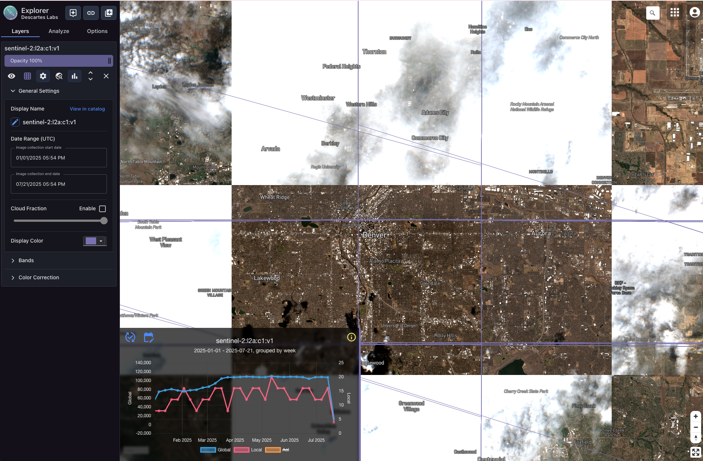

#### My Viewport is Cloudy — now what?

A common filter to apply to temporal stacks of imagery is by cloud fraction. Explorer enables basic image filtering wherever that property is available, such as in Sentinel-2:

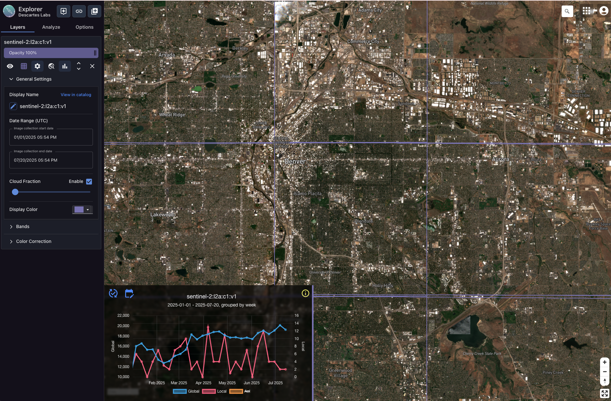

### Image Metadata

Clicking on an individual image, outlined in different colors per layer, will bring up the image properties:

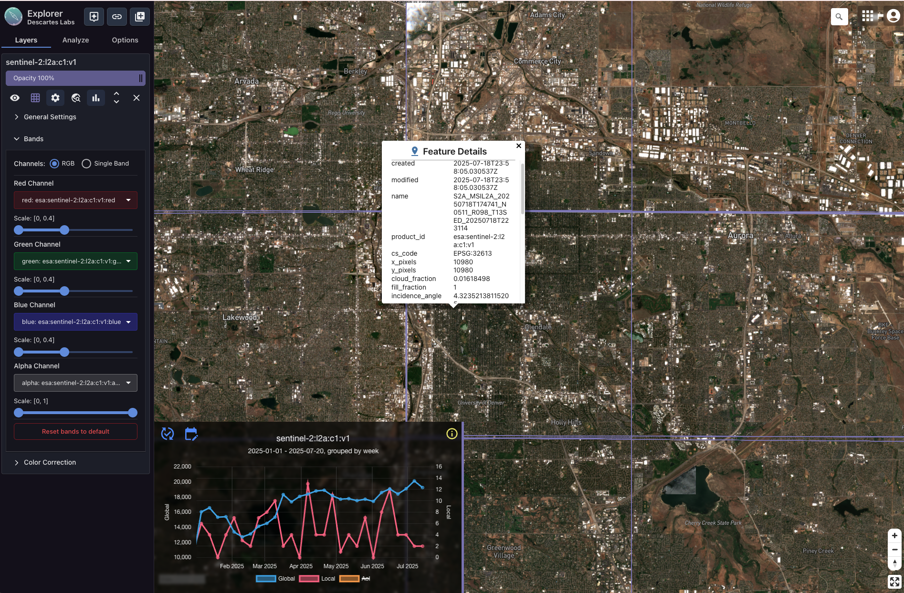

### Visualization Options

Expanding the Bands dropdown will bring the option to visualize single-band with a specified colormap, or to create false-color RGB composites:

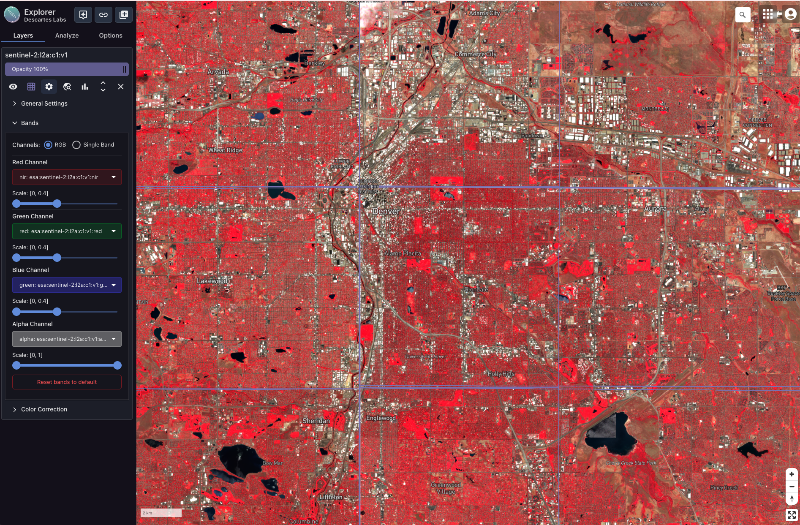

### Miscellaneous Explorer Features

Clicking **Jump to Latest Image** will pan your viewport and set the date range to the latest acquired image in the product:

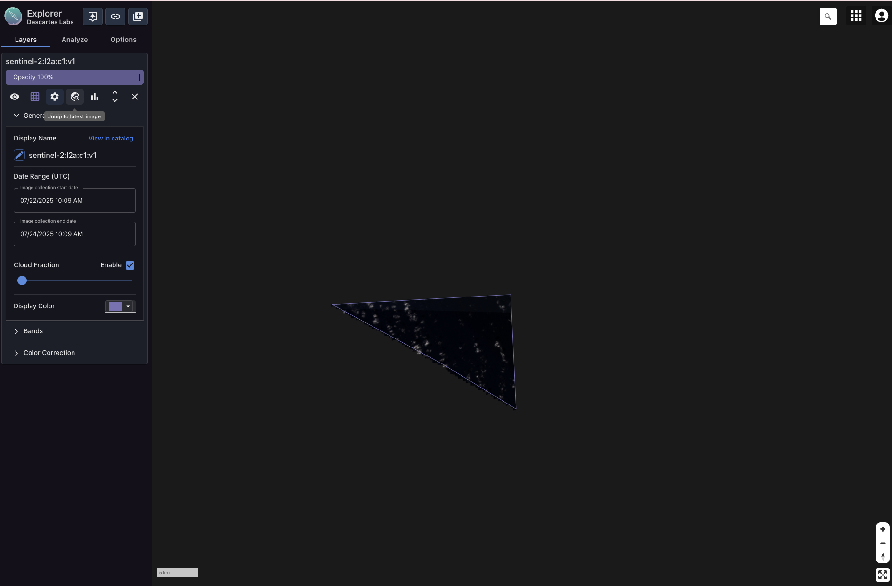
