# EarthMosaics

## Introduction

[**EarthMosaics**](https://console.earthdaily.com/mosaics) delivers cloud-free, temporally coherent mosaics with the highest possible geolocation, radiometric quality, enabling users to examine true signals, minimize false positives in change detection, and easily contextualize with other geospatial datasets. From analysing a regional forest to monitoring a mining site, predicting water reservoir levels to measuring melting permafrost, EarthMosaics offers application-specific and customized insights fulfilling unique needs of each use case.

AI Ready Mosaics are complex, costly to produce, and designed to feed directly into ML applications.

[EarthMosaics](https://console.earthdaily.com/mosaics) from EarthDaily Analytics provides you a way to explore and get a free preview and you can also place orders for full resolution Mosaics.

## Getting started with Mosaics

Below is the landing page when you navigate to [EarthMosaics](https://console.earthdaily.com/mosaics):

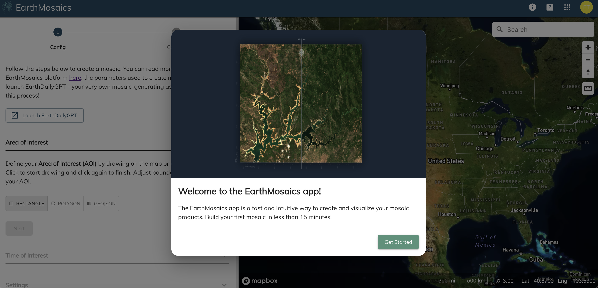

When you are a first time user, you get the Welcome dialog with an option to Get Started.

Pressing `GetStarted` takes you to the New Orders page:

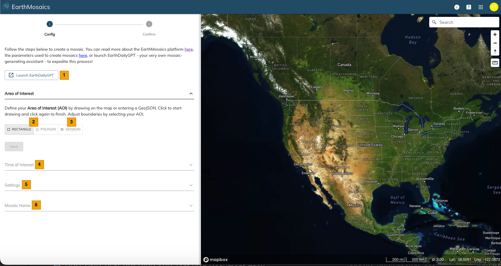

| S. No | Label | Description |
|-------|-------|-------------|
|  | Launch EarthDailyGPT | Use EarthDailyGPT to assist with generating a mosaic |
|  | Area of Interest - draw on map | Draw a polygon for your mosaics order (limit < 200,000 km²). Only polygons supported (not multipolygons) |
|  | Area of Interest - use GeoJSON | Enter an existing GeoJSON instead of drawing (same area limit) |
|  | Time of Interest | Specify the time of interest |
|  | Settings | Multiple choices to configure your order |
|  | Mosaic Name | Enter a name for easy identification |

The AOI defines the geographic extent used to build the mosaic. You can either draw the AOI on the map or provide GeoJSON. To draw, choose Rectangle or Polygon option, then left-click on the map.

Once you draw a polygon, the area calculator displays the total area:

| S. No | Label | Description |
|-------|-------|-------------|
|  | Fit Bounds | Bring back focus on the drawn area and fit to viewport |
|  | GeoJSON | Enter or edit the GeoJSON |
|  | Delete | Delete the existing AoI |

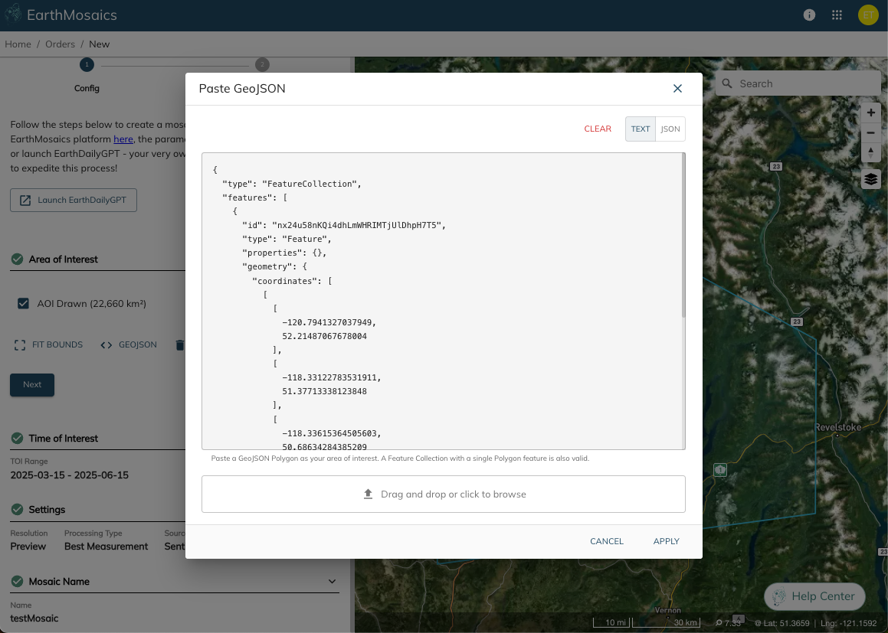

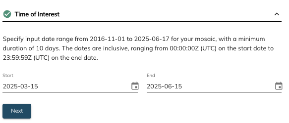

## Mosaic Preview Order

The settings define how your mosaic will be generated:

- **Resolution** — Preview is free, Full is paid. Create a Preview first to verify your settings.
- **Processing type** determines pixel selection:
    - **Best Measurement:** considers cloud, cloud shadow, distance to nearest occlusion, aerosol optical thickness, relative acquisition time, acquisition platform, and smoothness characteristics
    - **Min/Max NDVI (beta):** augments Best Measurement with per-pixel NDVI weighting
    - **Min/Max NBR (beta):** augments Best Measurement with per-pixel NBR weighting
- **Source** — Sentinel-2A only, or combination of Sentinel-2A and Landsat-8/9

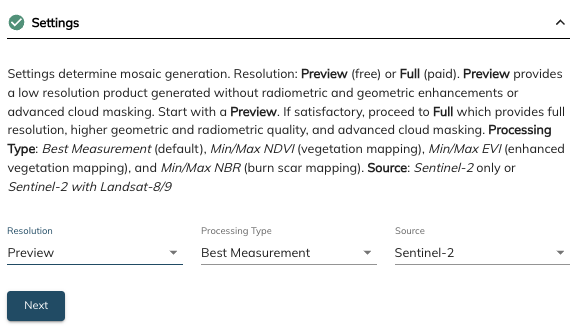

After confirming settings and entering a name, submit the order:

## Mosaic Full Resolution Order

Full Resolution orders are similar to Preview except with an additional payment step.

Preview orders have 2 steps: Configuration and Confirmation.
Full Resolution adds a third step: Quote.

Select "Full" as your Resolution setting:

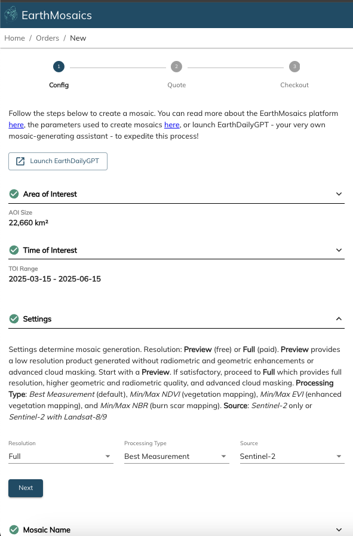

Confirm the order settings to checkout:

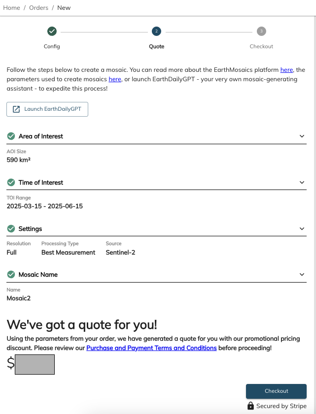

The checkout screen shows the order price:

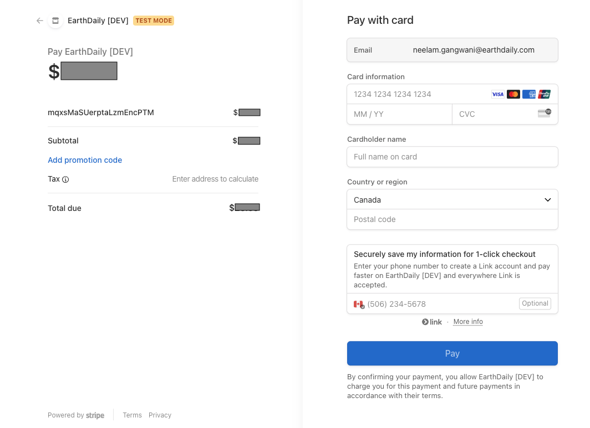

If you have coupons to redeem, enter the coupon code for eligible discounts. Once ready, proceed to pay.

## Managing Mosaics Orders

After placing the order (Preview or Full), you will be redirected to your Dashboard:

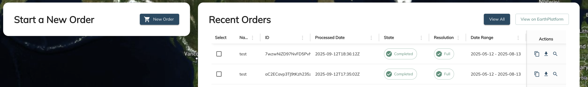

Your order will show an "In Progress" state. There is a button to view all Mosaic Orders on EarthPlatform:

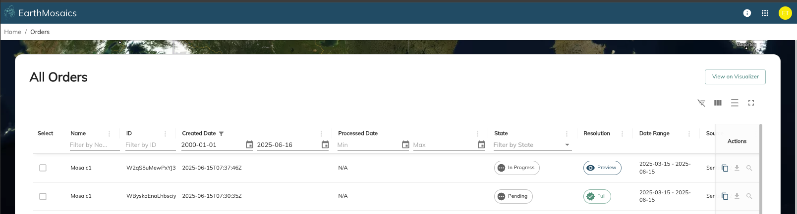

The Order ID can be found in your Account Information page under "My Orders":

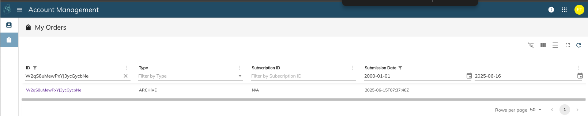

Click the Order Id link for more details:

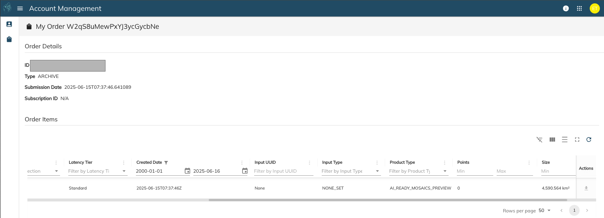

Once processed successfully, the state changes to "Completed" with additional options:

| S. No | Label | Description |
|-------|-------|-------------|
| 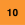 | Copy | Copy the order to reuse settings or make minor modifications |
|  | Download | Download your product (Preview or Full) |
| 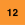 | View | View the product in EarthPlatform |

The [EarthPlatform](earthplatform.md) visualizer opens in a new tab:

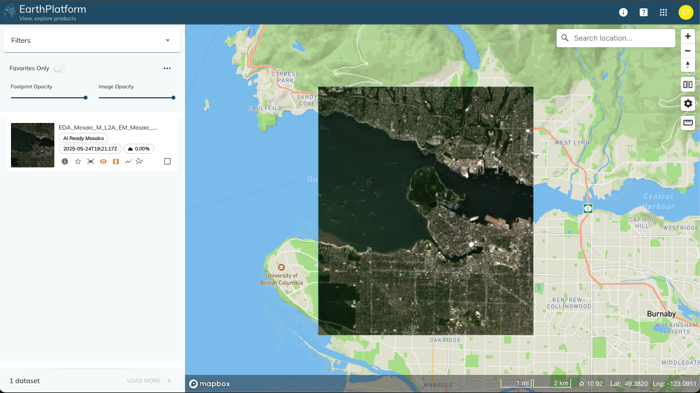
