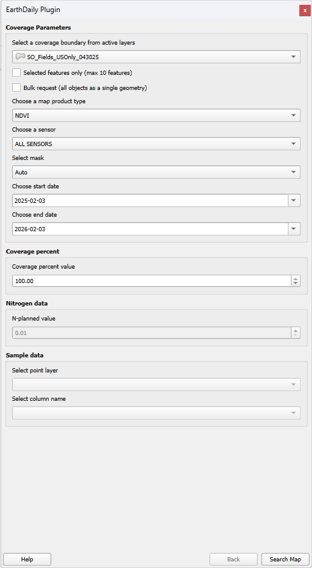
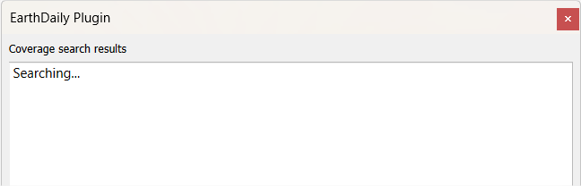
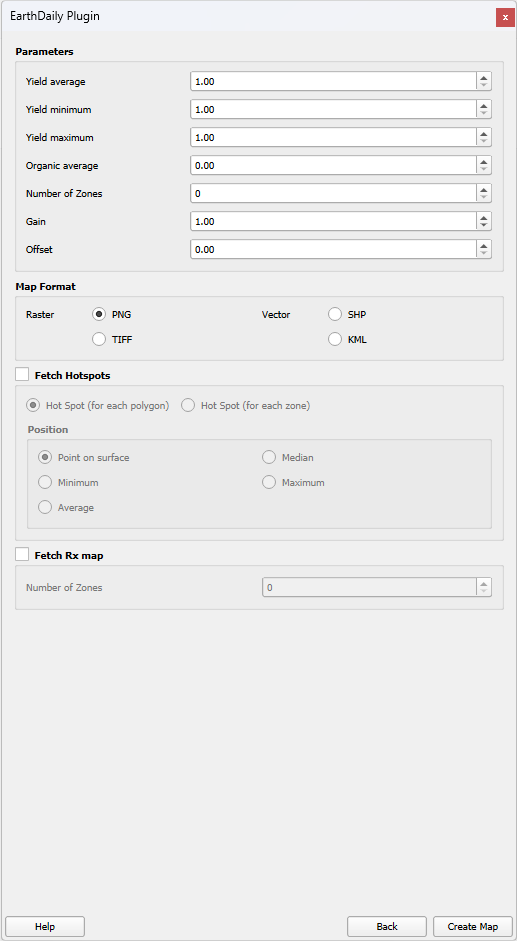
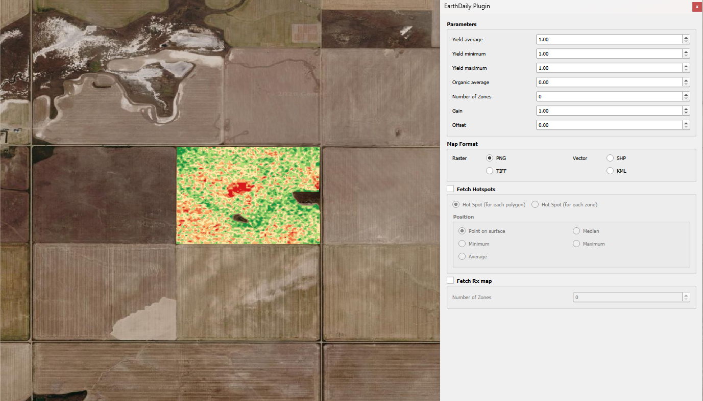
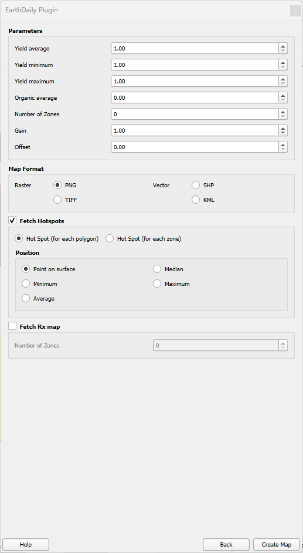

## 🗺️ Get Analytics on the Map

The following sections will guide you through the steps to add layers in the QGIS map view. Please be sure to have the plugin panel visible.

## 📌 Select Polygon(s)

The EarthDaily® Platform offers polygon-based maps creation capabilities. You need to have in your layer tree at least one polygon layer loaded. Within this layer, you can define a selection using QGIS object selection tools.

On the <Strong>EarthDaily® plugin > Coverage parameter</Strong> you will be able to select the layer containing polygons you want to extract maps for. By default, the first layer in view will be selected. The `drop down` list will contain <Strong>only polygon layers loaded in the view</Strong>.

The <Strong>Selected features only</Strong> option allows you to get maps only on selected object(s) of the layer define above.

The <Strong>Bulk request</Strong> option allows you to select all geometries of the layer (or the selection based on the previous option status) as one single API request. When this option is not checked the tool will send one request per polygon.

The map type selection allows you to select the type of content you are interesting to get. The following options are available: 

- `Color Composition` will return either a true or false color map (depending on bands available) on an expanded bounding box of the polygons.
- `CVI` will return CVI vegetation index map clipped to the polygon boundary.
- `CVIN` will return CVI normalize vegetation index map clipped to the polygon boundary.
- `Elevation` will return the elevation map clipped to the polygon boundary.
- `EVI` will return EVI vegetation index map clipped to the polygon boundary.
- `GNDVI` will return GNDVI vegetation index map clipped to the polygon boundary.
- `In Season Field Average LAI` will return in-season Leaf Area Index. It is used as an indicator of the amount of biomass/leaf material.
- `In Season Field Average NDVI` will return NDVI vegetation index map clipped to the polygon boundary.
- `In season S2REP` will return S2REP Index. Generates a map according to the amount of chlorophyll content per unit of leaf (LCC).
- `In season field average LAI` will return the variable-rate application map based on LAI map to better inform input placement.
- `In season field average NDVI` will return the variable-rate application map based on NDVI map to better inform input placement.
- `In season field average reverse LAI` will return the variable-rate application reverse map based on LAI map to better inform input placement.
- `In season field average reverse NDVI` will return the variable-rate application reverse map based on LAI map to better inform input placement.
- `LAI` will return Leaf Area Index clipped to the polygon boundary. It is used as an indicator of the amount of biomass/leaf material.
- `NDMI` will return NDMI vegetation index map clipped to the polygon boundary.
- `NDVI` will return NDVI vegetation index map clipped to the polygon boundary.
- `NDWI` will return NDWI vegetation index map clipped to the polygon boundary.
- `OM` will return an organic matter (%) map clipped on the polygon based on user inputs.
- `Reflectance` will return Reflectance map at Top of Canopy for Sentinel 2 and Landsat-8 and 9.
- `S2REP` will return S2REP Index. Generates a map according to the amount of chlorophyll content per unit of leaf (LCC).
- `Sample Map` will return a map of tissue, soil sample, or scouting points based on user inputs.
- `SAMZ` will return a management zones map clipped on the polygon based on user image selection (optional, in this the system will select 5 most relevant images).
- `SLOPE` will return a slope map, derived from elevation map clipped to the polygon boundary showing the % slopes of the field.
- `YGM` will return yield goal map clipped on the polygon based on user inputs
- `YPM` will return yield variability map clipped on the polygon based on user inputs

!!! note
    A description of the various map types is available [here](../Agro/Library/Map-types.md).

It is also possible to filter the maps based on the sensor used to acquire data, for example if user wants only Sentinel-2 data. The following options are available:

- `DEIMOS-1` is a commercial data source at 22m ground resolution with an approximate 2-day revisit (combined).
- `ALSAT-1B` is Algeria Satellite 1B with a 24m ground resolution, with up to 3 days revisit.
- `GAOFEN-1` and `GAOFEN-6`, have respectively a ground resolution equal to 16m with a revisit of 4 days.
- `CBERS-4` (MUXCam) is operated by the China-Brazil Earth Resources Satellite Program with 20m spatial resolution and a revisit capacity of 26 days. Images are available only in Brazil via the Geosys virtual constellation.
- `LANDSAT_8` and `LANDSAT_9` are operated by NASA and USGS providing moderate-resolution imagery at 30m resampled to 15m by EarthDaily. Revisiting every 16 days.
- `RESOURCESAT2` is the Linear Imaging Self-Scanning Sensor (LISS-III) with 23.5-meter spatial resolution LISS-IV Camera with 5.8-meter spatial resolution. Revisiting every 24 days.
- `SENTINEL_2` is operated by ESA and has a spatial resolution of 10m. Revisiting every 5 days under the same viewing angles. Multi-spectral data with 13 bands in the visible, near infrared, and short-wave infrared part of the spectrum.

The last parameters are the start and end date for imagery selection. It allows you to select the date range for image selection. This is important to limit the size of the response.

When all search parameters are defined, click the <Strong>Search Map</Strong> button to start generating maps.

The <Strong>Help</Strong> button will bring up the help window:

After clicking the <Strong>Search Map</Strong> button, the plugin will call EarthDaily Platform for each polygon (layer or selection) to check for the images available; this is what is called the <Strong>Coverage</Strong> of the polygon.

This message will appear while the coverage is compiled:

!!! info
    If no results are found, it is most likely due to the input layer not having a defined coordinate system. It's important to check that before clicking <Strong>Search map</Strong>.

## 🌐 Get Coverage Catalog

Once all datasets have been retrieved the plugin panel will display a list of coverage data for each selected field as shown below:

For each coverage item the following information is available:

- Map thumbnail on the left
- Field ID of the polygon on EarthDaily Platform
- Acquisition date
- Sensor type

Selecting one or more items on the coverage panel will cause them to appear in blue. The <Strong>Back</Strong> button allows you to come back to the Coverage Parameters options. The <Strong>Next</Strong> button allows you to go back to the map extraction panel.

## 🗺️ Get Maps

After selecting one or more coverages, the panel offers the user the oppurtunity to set map creation and extraction parameters:

Map creation parameters are:

- Yield average for yield variability map creation
- Yield average, min and max for yield goal map creation
- Organic matter average (%) for OM map creation
- Number of zones for SaMZ map creation and/or for HotSpot creation
- Gain and Offset options for nitrogen map creation

THe EarthDaily platform provides the following data extraction format:

- For map as raster dataset:
    - PNG with Word file
    - GeoTiff
- For map as vector dataset:
    - ESRI shapefile
    - KMZ

By clicking on the <Strong>Create Map</Strong> button, the data extraction and loading of coverage(s) on the map will start. It is important to keep in mind that data will be exported in the folder before being loaded on the map; this means that they will be available offline.

Here is an example of maps loaded on the map view:

The plugin can provide you, as an option, the Hotspots of your field. When clicking the <Strong>Fetch Hotspots</Strong> button, you will have two options:

- Recieve the hotspots by polygon
- Recieve the hotspots for each polygon part

Here is an example of maps loaded on the map view with the first hotspot option, one spot per polygon:

Here is an example of maps loaded on the map view with the second hotspot option, one spot for each polygon:

--8<-- "snippets/contact-footer.md"

