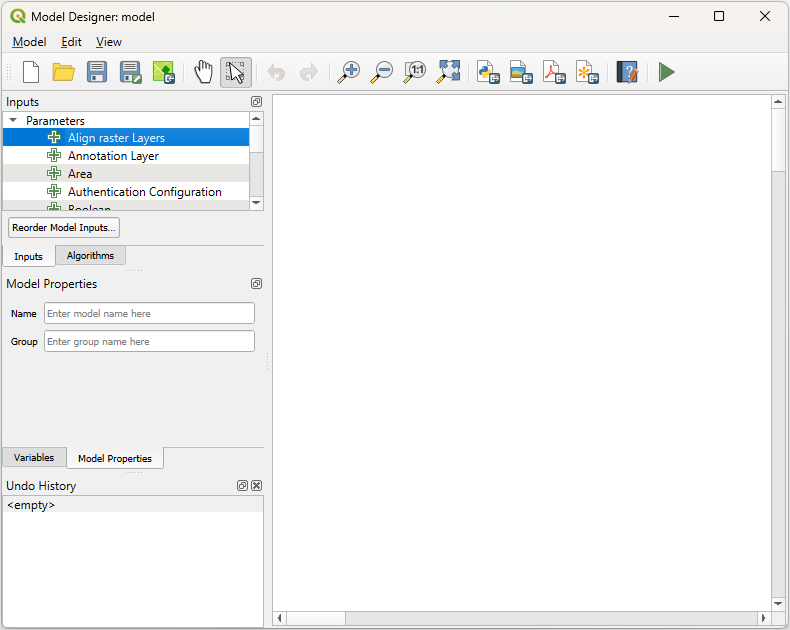

## 🧰 Processing Toolbox

The EarthDaily® Plugin for QGIS offers workflow automation opportunities through the integration with the QGIS processing toolbox. 

To access GEOSYS® Field Level map functions, please go to **Processing > Toolbox**. 

The processing toolbox includes a GEOSYS section in the main tree view with a function <Strong>Get field level map</Strong>. The processing functions use the same configuration defined in the plugin options. Selecting the **Get field level map** tool, will open this window (usually docked on the right side).

## 🗺️ Get Field Level Map Function

The screen allows to configure the processing algorithm with:

- The vector input file containing polygon objects. 
- The image date: the tool will select the closest image of selected date.
- The map type.
-	A sensor filter allowing you to request maps from specific sensor. The default value is **All Sensors**.
-	The output layer location if you want to extract file on a specific folder.
-	Option to add output layer on the map.

By clicking **Run**, the processing will start fetching data. If several vector files have to be processed as a batch, the button <Strong>Run as Batch Process…</Strong> will allow user to configure a multi-file processing batch.

It is important to note that all polygons from the vector layer will be processed as a bulk request (all geometry aggregated as one request). If you want to have one output per polygon, you will need to split your input layer into several layers containing one object and then run a batch processing.

## 📝 Model Designer

Processing functions are also available in the **Model Designer** allowing user to build complex data workflow and repeat execution. To access Model Designer, go to <Strong>Processing > Model Designer</Strong>.

QGIS Model Designer allows the user the opportunity to do deep analysis of our map layers. For more information, consult this [QGIS Model Designer](https://docs.qgis.org/3.40/en/docs/user_manual/processing/modeler.html) resource or reach out to our contact below.

!!! info
    To learn more about EarthDaily's product offerings, access the resources below.
    
      - <https://earthdailyagro.com/industries/>  for general information on our service portfolio
      - <https://earthdaily.com/earthdaily/> for information about our new constellation

--8<-- "snippets/contact-footer.md"

