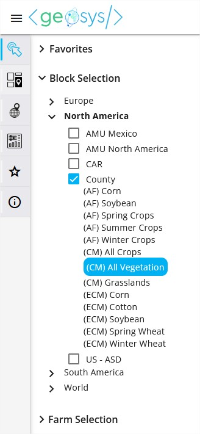
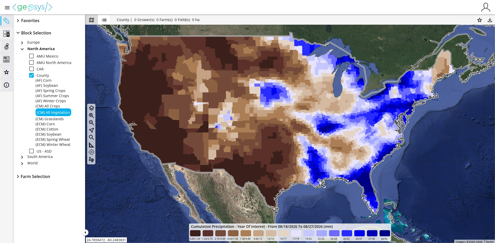

---
keywords:
  - regional monitoring
  - crop mask
  - vegetation analytics
  - rainfall
  - temperature
  - time series
---

# Monitoring - Regional

## 🔍 Entity Selection

When viewing the **Monitoring Module** you will first select the entity(ies) you would like to view.  
> In **Regional Monitoring**, you will need to open either the Favorites or Block Selection to choose your entity(ies).   

 

**Block Selection** will show all of the aggregation levels (Blocks) you have available in your subscription.

### Crop Mask Selection

EarthDaily Agro provides both static and dynamic crop masks to help you hone in on the regional analytics you need while giving you the most accurate and up-to-date crop masks for your analysis. 

#### Types of Crop Masks

* **Dynamic masks** provide higher precision but have limited availability, especially in regions without preseason data.
    * Dynamic crop masks are generated from medium-resolution pixels corresponding to a specific crop type and are more precise but limited in time.

* **Static masks** remain essential for consistency, early-season analysis, and modeling.
    *	Static crop masks are based on MODIS (low-resolution) pixels
    *	Generated from an all-crops mask and filtered afterward - consistent across the full season.

#### Choosing a Crop Mask
In the Geosys App, when you have selected _Regional Monitoring_ from your main menu, you can navigate to your region via Block Selection in order to view the available crop masks.
 
**ECM** – EarthDaily Crop Mask

* Generated from pixels corresponding to a specific crop type - more precise but limited in time
* Dynamic crop mask published at provided at intervals during the growing season (dependent on region and crops)
* Calculated from MR data on the current season vs. masks calculated from LR data

!!! info
    For more information: [EarthDaily Crop Masks](https://docs.earthdaily.com/agro/cropid/)

**CM** – Crop Mask

* Static crop mask based on MODIS, best for early-season analysis before we have a clear signal/crop designation from MR
* Generated from an all-crops mask and filtered afterward - consistent across the full season

**AF** – AMU Filter

* Static, aggregated by AMU
* The AMU filters are derived from a crop mask (ALL CROPS) and take away some AMUs not relevant for the analysis of the given crop category, but will show the exact same NDVI values than the All Crops mask.

> After the block selection the default analytic will be displayed.

 

### Select Regional Analytic

Regional analytics categories include:

- Vegetation
- Rainfall
- Temperature
- Wind
- Solar Radiation

> Follow the five steps in the "Select an Analytic" menu and click OK to load the map.    

  
 

## 📈 Time Series Viewer

Click on one or more entities and it will open the **Time Series Viewer** panel. You may select one entity by clicking on it, or multiple entities by using the lasso in the map navigation menu (freeform line tool at the bottom). Click on the Years on the right side of the panel to add more curves. The color of the year selected will correspond to the color of the curve. Click on the date calendars at the top of the panel to adjust the Start and End Dates of the Time Series.  
 

 

### Add Time Series

Add additional Time Series views to the panel by clicking the **Add** button in the bottom right of the panel and selecting the Analytic you wish to view.
 

 

 

## 📌 Favorite Maps

If you have a Regional Monitoring Map that you frequently visit you can save it as a **Favorite** so you do not need to select the Block, Mask and Analytic information each time you want to access the map. Once you have created the map you will need to click on the **Star** icon located in the top right of the screen.
 

 
Next you will choose a title for the Favorite Map and click **Save.**

 
Your Favorite Map can now be accessed through the quick selection at the top of the left panel.

 
To see all parameters in each of the Favorites you can click on the **Star** icon in the far left panel.

--8<-- "snippets/contact-footer.md"
