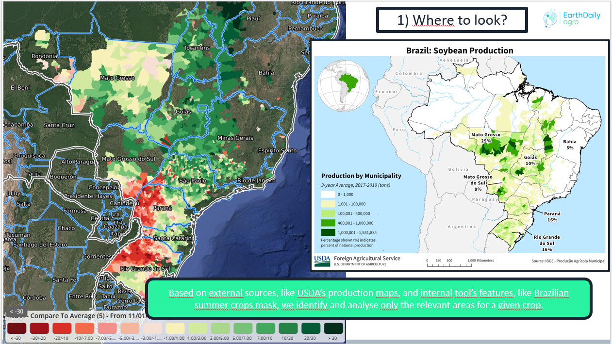
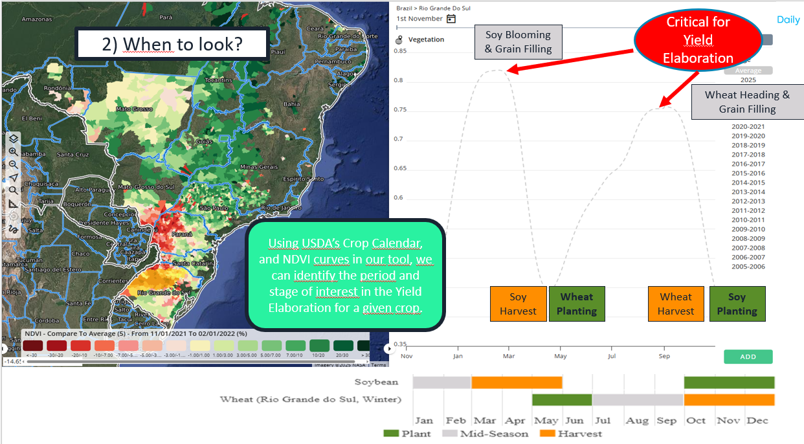
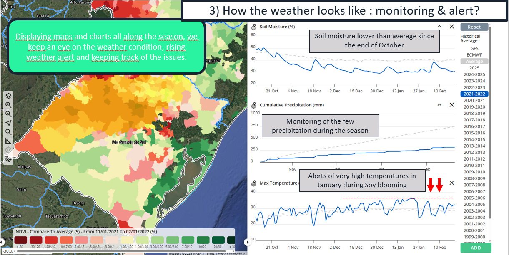
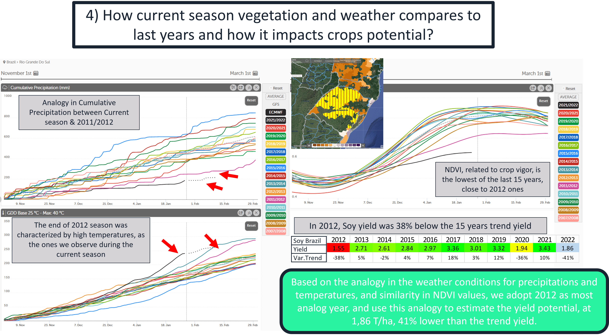
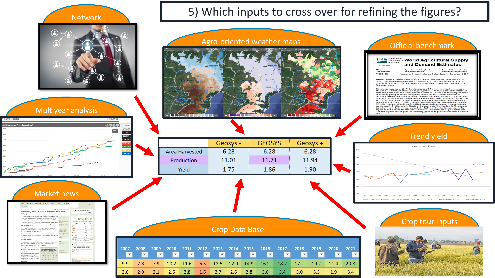

---
keywords:
  - yield elaboration
  - yield forecast methodology
  - vegetation monitoring
  - weather monitoring
  - historical analog
  - production estimation
---

## 🌾 Yield Elaboration Method

EarthDaily's Yield Elaboration Method starts with answering these key questions and quandaries:

- Where to look?

 
- When to look?

- Vegetation and Weather Monitoring

- Historical Analog Detection

- Historical Dataset Comparisons

--8<-- "snippets/contact-footer.md"