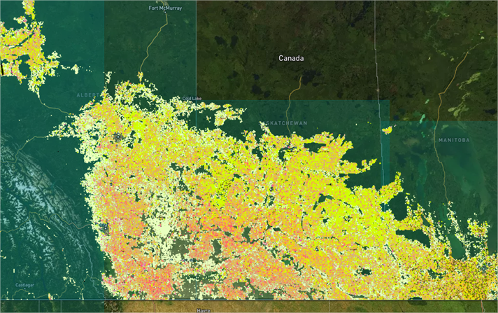

---
keywords:
  - Canada crop identification
  - corn
  - soybean
  - spring wheat
  - canola
  - spring barley

---
<meta property="og:title" content="Discover EarthDaily's scalable crop classification solution for Canada leveraging remote crops monitoring and AI. Real-time crop maps, and seamless API delivery for agriculture.">

## 🌎 Available Across Canada

The **EarthDaily Crop Identification** product is fully operational across the growing regions of Canada, providing in-season crop classification for major crops. From Ontario to the Great Plains, it delivers **timely, consistent, and high-resolution insights** into crop distribution—supporting critical decisions in one of the world’s largest agricultural producers.

Coverage includes key crops such as **Corn, Barley, Canola, Spring Wheat, Winter Wheat, Soybean and Hay/pasture.**

Additional crops can be supported upon request or as part of our product roadmap.

---

## 📤 In-Season Deliveries

Crop classification layers are delivered **during the growing season**, with progressive updates that incorporate the latest satellite imagery and weather-adjusted model outputs.

**Delivery schedule:**

* July 15th (in-season)
* September 30th (end of season)

Additional delivery dates can be added upon request. This cadence enables organizations to track acreage distribution and refine supply outlooks as the season advances.

---

## 🎯 Model Performance

Our AI models deliver the following accuracy ranges by crop type and time of season, represented by an **F1 score** as follows. Below are results achieved after rigorous cross-validation evaluation over 6 years (2019-2025). In-season scores are the lower end of the range and end of season scores reflect higher accuracy.

- **Corn:** 0.78-0.88
- **Barley:** 0.38-0.54
- **Canola:** 0.77-0.84
- **Spring Wheat:** 0.67-0.72
- **Winter Wheat:** 0.70-0.73
- **Soybean:** 0.71-0.86
- **Hay/pasture:** 0.84-0.86

---

## 🗺️ Historical Layers

To support long-term analysis, we provide **historical crop classification layers starting from 2019** using public ACI datasets. All layers are referenced in one place for convenience, enabling seamless analysis of historical trends, crop rotations, and year-over-year changes — without the need to manage multiple data sources.  

---

## 🔧 Flexible Delivery Options

The product is designed for seamless integration into your workflows, with two API-based delivery mechanisms:

- **EarthData Store API (STAC):** Access spatially indexed, pre-processed crop maps in standard geospatial formats such as GeoTIFF—ideal for large-area analysis.  
- **Field-Level API:** Retrieve crop type predictions linked to known field boundaries for precision use at the farm or parcel level.  

Both options are **scalable, reliable, and built to fit directly into your data pipeline**.  

Explore full technical specifications in our [API Documentation](../library/FieldLevel_CropMask_API_v11092025.md/).

---

## ❓ FAQ

!!! tip "What crops are covered in EarthDaily’s Canada Crop Identification product?"

    Corn, Hay/pasture, Soybean, Spring Wheat, Winter Wheat, Barley, and Canola/Rapeseed.

!!! tip "How accurate is the model?"

    F1 scores range from 0.54 - 0.88, depending on crop and based on historical, in-season, and end of season performances.
    
!!! tip "How often is the data updated?"

    Twice per cropping season, with progressive refinement as more satellite imagery is collected.
 
!!! tip "Can I access data for past seasons?"

    Yes, historical data is available from **2019 onward**.
    
!!! tip "What regions of Canada are supported?"

    Coverage spans the major growing regions of Ontario, Manitoba, Alberta, and Saskatchewan.

!!! tip "What if I only need data for specific areas?"

    You can request access to selected provinces or regions as needed.

---

--8<-- "snippets/contact-footer.md"
