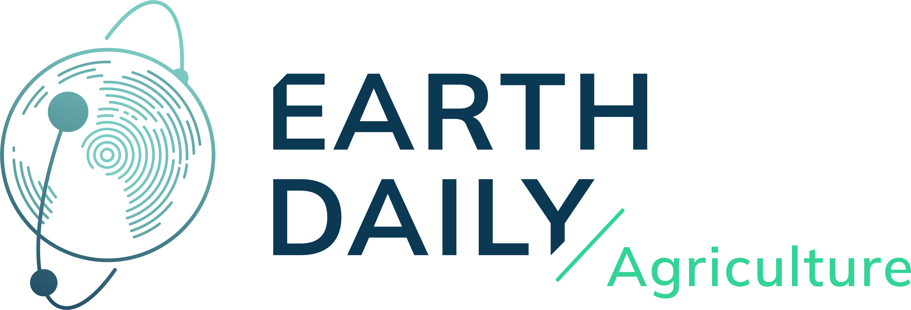

---
hide:
  - navigation
  - toc
---

{ width="200" align=left }

Explore our comprehensive suite of agricultural intelligence solutions designed to transform decision-making in agriculture, insurance, and commodity markets.

-   :material-package-variant:{ .lg .middle } __Digital Ag__

    ---

    Advanced data extraction and analytics platform for agricultural monitoring and field-level analysis.

    [:octicons-arrow-right-24: Learn more](digital_ag/index.md)

-   :material-chart-line:{ .lg .middle } __Crop Intelligence__

    ---

    Real-time crop monitoring and vegetation analysis.

    [:octicons-arrow-right-24: Learn more](commodities_intelligence/index.md)

-   :material-monitor-dashboard:{ .lg .middle } __Portfolio Management__

    ---

    Complete portfolio analysis with smart underwriting, historical assessment, environmental compliance, and in-season monitoring.

    [:octicons-arrow-right-24: Learn more](portfolio/index.md)

-   :material-compare-remove:{ .lg .middle } __Parametric Insurance__

    ---

    Imagery and Weather agricultural parametric insurance indexes for smart risk management.

    [:octicons-arrow-right-24: Learn more](parametric/index.md)

-   :material-map-search:{ .lg .middle } __Crop identification__

    ---

    AI-powered crop type identification across the US, Brazil, and Western Europe with field-level accuracy.

    [:octicons-arrow-right-24: Learn more](cropid/index.md)

-   :material-target-variant:{ .lg .middle } __Territory Insights__

    ---
    
    Automated Crop Intelligence for Smarter Sales

    [:octicons-arrow-right-24: Learn more](territory_insights/index.md)

