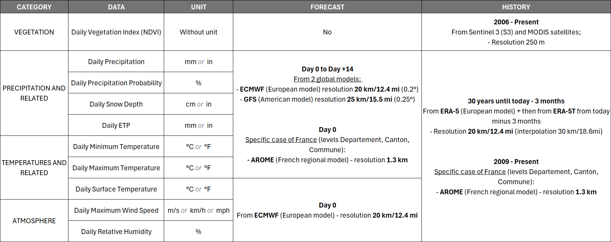
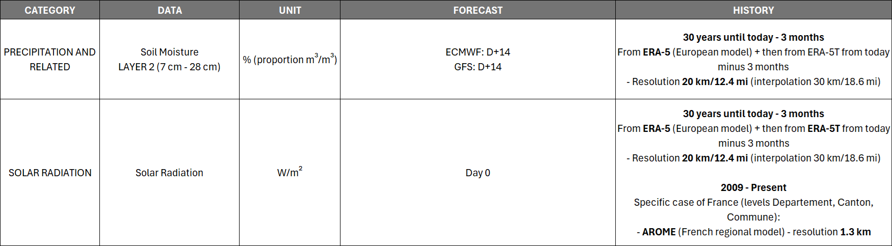
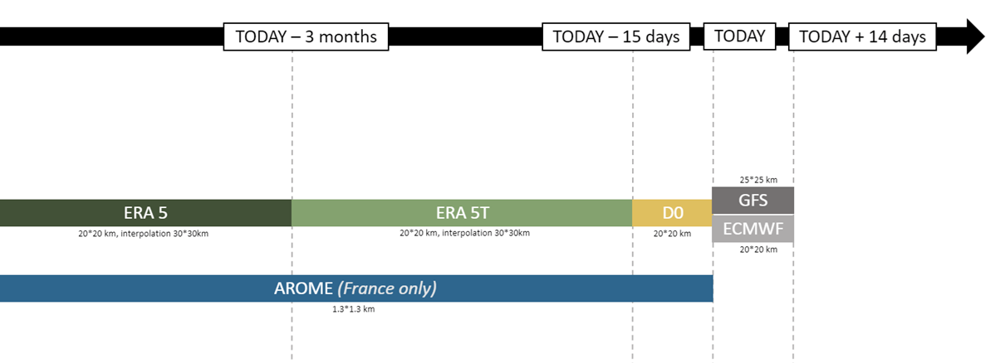
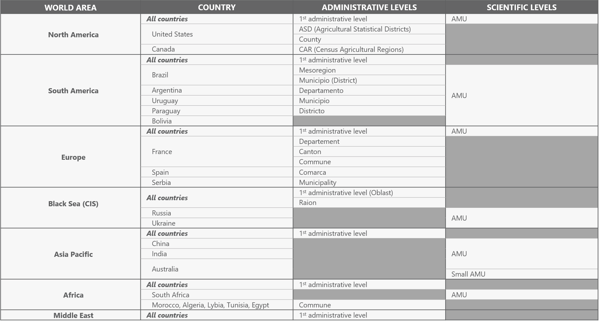

<!-- md:notebook Analytics%20as%20a%20service/EDAgro_regional_analytic_extraction -->

# 🌍 Regional Monitoring API

## 📖 Overview

The **Regional Monitoring API** enables organizations to **observe, analyze, and report** on agricultural or environmental conditions across **large geographic areas**.

This capability is essential for businesses and institutions that need **strategic insights at scale**, such as crop monitoring, risk assessment, and market intelligence.

### How It Works
Regional monitoring leverages **satellite imagery**, **remote sensing data**, and **weather analytics** to provide a comprehensive view of crop and environmental conditions. Key features include:

- **Tracking crop development** and vegetation health across entire regions  
- **Analyzing soil moisture, NDVI, and crop masks** to identify trends and anomalies  
- **Comparing multiple datasets** (e.g., weather, vegetation indices) for regional benchmarking

### Audiences
- **Crop analysts and grain originators** assessing crop conditions and yield potential over large territories  
- **Government agencies and insurers** validating production data and monitoring risks  
- **Market intelligence teams** integrating multiple data sources for strategic planning  

### Why It Matters
Regional monitoring provides a **high-level, data-driven perspective** that supports better decision-making, resource allocation, and risk management across wide areas.


## 🗂️ Baseline Data

### Vegetation and Weather Data



### Additional Datasets



### More Info on Weather Models:

#### **Forecast Weather Models**
- **ENS model** (ECMWF\*, probabilistic, 20 km/12.4 mi resolution, forecast D+14)  
- **GFS model** (NOAA-NCEP\*\*, deterministic, 25 km/15.5 mi resolution, forecast D+14)
- **AROME model** (Météo-France\*\*\*, deterministic, 1.3 km to 2.5 km resolution, forecast D+2.5)

#### **Historical Data**
- Historical data depth from **1990 to 2019** (today minus 15 days)  

#### **Sliding Reprocessing**
- **D - 3 months**, then **D - 15 days**  
- **ERA-5**\*\*\*\* (ECMWF) historical data integrated at the beginning of each month:
    - Current month minus 3 months data  
    - Example: On July 31, the last available data is April 30 (3 months delay)  
- **ERA-5T**\*\*\*\* (ECMWF) historical data integrated **day by day** at D-15 days  
- **ENS** (ECMWF) D0 values (pseudo-analysis) stored from D0 to last ERA-5T historical available data (D-15 days)  



\* **European Center for Weather Forecasts (ECMWF)**, Reading, UK

\*\* **National Oceanic and Atmospheric Administration – National Center for Environmental Prediction (USA)**

\*\*\* **Application of Research to Operations at Mesoscale**, Météo-France, CNRM (National Centre for Meteorological Research / Centre National de Recherches Météorologiques)

\*\*\*\* The data assimilation system


## ⚙️ API

<swagger-ui src="https://api.geosys-na.net/Agriquest/Geosys.AgriQuest.CropMonitoring.WebApi/v0/swagger/docs/v0"/>

### Environment API root

| Environment | URL |
|-------------|-----|
| **Test**    | [https://api-pp.geosys-na.net/Agriquest/Geosys.AgriQuest.CropMonitoring.WebApi/v0]|
| **Prod**    | [https://api.geosys-na.net/Agriquest/Geosys.AgriQuest.CropMonitoring.WebApi/v0]|


## ⚙️ Parameters & Variables

The Regional Monitoring API exposes weather, climate, and crop-progress indicators aggregated at the **Administrative Management Unit (AMU)** level. Most endpoints share a common parameter set; this section defines the building blocks once, then lists the operations available for each variable. Refer to the embedded Swagger UI above for per-endpoint payload examples and the exact response schemas.

### Core Concepts

| **Concept** | **Description** |
|-------------|-----------------|
| **Block** | A geographic coverage area (typically a country or large region). Every query targets a single block via `idBlock`. Examples in active use: `267` (North America), `141` (Europe). Discover the full list available to your subscription via `GET /api/customer-subscriptions/subscription-block`. |
| **AMU** (Administrative Management Unit) | The smallest aggregation unit served by the API. Indicator values are averaged across the masked pixels of each AMU. Referenced via `amuIds` in POST bodies. |
| **Admin Unit** | A higher-level administrative grouping (e.g., state, department) that contains one or more AMUs. Filtered via `adminUnitIds` on GET endpoints. |
| **Pixel Type** | Crop mask category used in aggregation. Selected via `idPixelType`. See **Pixel Type values** below. |
| **Indicator Type** | Indicator computed at the pixel level (vegetation index or weather source). Selected via `indicatorTypeIds`. See **Indicator Type values** below. |
| **Commodity** | Crop identifier used to scope results to a specific crop (`commodityId`). |

#### Pixel Type values

| **ID** | **Name** | **Scope** |
|--------|----------|-----------|
| `1` | All vegetation | Global |
| `2` | Summer crops | Global |
| `3` | Winter crops | Global |
| `7` | Grasslands | Global |
| `8` | All crops | Global |
| `10` | Corn | Global |
| `11` | Soybean | Global |
| `301` | Soybean | Brazil |
| `400` | Corn | Europe |
| `401` | Winter wheat | Europe |
| `402` | Sugarbeet | Europe |
| `406` | Barley | Europe |
| `407` | Rapeseed | Europe |

> Pixel type availability is subscription- and block-scoped. Use `GET /api/customer-subscriptions/subscription-block/pixel?blockCode={code}` to list the pixel types accessible for a given block.

!!! info
    Crop-specific pixel types (Corn, Soybean, Winter wheat, Sugarbeet, Barley, Rapeseed, and the regional variants) are generated from EarthDaily's [**CropID**](/agro/cropid/) product. CropID delivers high-resolution crop identification masks, which are used here to aggregate indicator values over crop-specific pixels only — producing regional time series that reflect the targeted crop rather than generic vegetation. Generic pixel types (`All vegetation`, `Summer crops`, `Winter crops`, `Grasslands`, `All crops`) do not depend on CropID.

#### Indicator Type values

| **ID** | **Name** | **Source / Scope** |
|--------|----------|---------------------|
| `1` | Vegetation Vigor Index (VVI) | All blocks |
| `2` | Weather — observed | ECMWF, all blocks |
| `3` | Weather — observed | AROME, France only |
| `4` | Weather — forecast | ECMWF, all blocks |
| `5` | Weather — forecast | GFS, all blocks |
| `10` | Weather — reanalysis | ERA5-Land |
| `11` | Weather — high-resolution rainfall estimates (CHIRPS) | Specific blocks |

> Indicator type availability is subscription- and block-scoped. Use `GET /api/customer-subscriptions/subscription-block/indicator?blockCode={code}` to list the indicator types accessible for a given block.

### Common Query Parameters

Used by most GET indicator endpoints (`year-of-interest`, `comparison-*`, `historical-frequency`). Operation-specific parameters are listed at the bottom of the table.

| **Parameter** | **Type** | **Required** | **Description** |
|---------------|----------|--------------|-----------------|
| `idBlock` | integer | Yes | Block identifier. |
| `idPixelType` | integer | Yes | Pixel type identifier (crop mask). |
| `indicatorTypeIds` | array[int] | Yes | One or more indicator type identifiers. |
| `startDate` | date-time | Yes | Start of the analysis period. |
| `endDate` | date-time | Yes | End of the analysis period. |
| `adminUnitIds` | array[int] | No | Restrict results to specific admin units. |
| `commodityId` | integer | No | Restrict results to a specific commodity. |
| `cropAreaPercentageThreshold` | float | No | Percentage threshold on the pixel type (1-pixel rule). |
| `cropAreaPixelThreshold` | integer | No | Absolute pixel-count threshold on the pixel type. |
| `numberOfYearToCompare` | integer | Conditional | Required for `comparison-to-average`. Number of historical years to average. |
| `referenceYear` | integer | Conditional | Required for `comparison-to-reference-year`. |
| `thresholdValue` | double | Conditional | Required for `historical-frequency` and threshold day-count endpoints. |
| `aboveThresholdWanted` | boolean | Conditional | `true` to count days above the threshold; `false` for below. (`historical-frequency`) |
| `numberOfConsecutiveDays` | integer | Conditional | Required for `historical-frequency`. Consecutive-day window. |
| `numberOfYearsWanted` | integer | Conditional | Required for `historical-frequency`. Years to look back. |

### Discovery Endpoints

Use these to discover the blocks, pixel types, indicator types, AMUs, and admin units available to your subscription before calling the indicator endpoints.

| **Method** | **Path** | **Purpose** |
|------------|----------|-------------|
| GET | `/api/customer-subscriptions/subscription-block` | List blocks available to the authenticated subscription. |
| GET | `/api/customer-subscriptions/location-amu/subscription-block` | Find subscription blocks by lat/lon using AMU geometry. |
| GET | `/api/customer-subscriptions/location-block/subscription-block` | Find subscription blocks by lat/lon using block geometry. |
| GET | `/api/customer-subscriptions/subscription-block/pixel` | List pixel types available for a block. |
| GET | `/api/customer-subscriptions/subscription-block/indicator` | List indicator types available for a block. |
| GET | `/api/customer-subscriptions/subscription-block/commodity-with-amu` | List commodities (with their AMU IDs) for a block. |
| GET | `/api/amus` | List AMUs in a block. |
| POST | `/api/amus/by-ids` | Resolve AMUs by internal IDs. |
| POST | `/api/amus/by-externalids` | Resolve AMUs by external IDs. |
| GET | `/api/admin-unit/poi-list/{externalID}` | Admin units associated with a list of points of interest. |
| POST | `/api/admin-unit/location-by-coverage` | Find the admin unit with the highest coverage from a list of AMU IDs. |
| POST | `/api/admin-unit/lasso-coverage/{blockCode}` | AMUs in a block that intersect a free-form polygon. |
| GET | `/api/poi-tags/{externalID}` | Tags associated with a POI. |
| GET | `/api/ultimate/fields` | Fields associated with the authenticated user. |
| GET | `/api/block-last-update` | Latest weather and VVI update dates per block. |

### Weather & Climate Indicators

Most variables support a consistent set of operations. Find your variable in the row, then append the operation suffix to the base path. Combine with the **Common Query Parameters** above.

Operations:

- **YOI** — `GET {base}/year-of-interest` — values for the selected period
- **CTA** — `GET {base}/comparison-to-average` — vs. historical N-year average
- **CTR** — `GET {base}/comparison-to-reference-year` — vs. a specific past year
- **HF** — `GET {base}/historical-frequency` — count of threshold-crossing events
- **Series** — `POST {base}` — daily/period time series for graph rendering
- **Graph export** — `POST {base}/export-graph` — CSV export of the series
- **Map exports** — `POST {base}/export-map/{operation}` — CSV export of the map (one path per supported operation)

| **Variable** | **Base path** | **YOI** | **CTA** | **CTR** | **HF** | **Series** | **Graph export** | **Map exports** |
|--------------|---------------|:---:|:---:|:---:|:---:|:---:|:---:|---|
| Vegetation Vigor Index (VVI) | `/api/vegetation-vigor-index` | — | — | — | — | ✅ | — | — |
| Surface temperature | `/api/surface-temperature` | — | — | — | — | ✅ | — | — |
| Average temperature | `/api/average-temperature` | ✅ | ✅ | ✅ | — | ✅ | ✅ | YOI, CTA, CTR |
| Max temperature | `/api/max-temperature` | ✅ | — | — | ✅ | ✅ | ✅ | YOI, HF |
| Min temperature | `/api/min-temperature` | ✅ | — | — | ✅ | ✅ | ✅ | YOI, HF |
| Cumulative precipitation | `/api/cumulative-precipitation` | ✅ | ✅ | ✅ | ✅ | ✅ | ✅ | YOI, CTA, CTR, HF |
| Daily precipitation | `/api/daily-precipitation` | — | — | — | — | ✅ | ✅ | — |
| Monthly precipitation | `/api/monthly-precipitation` | — | — | — | — | ✅ | ✅ | — |
| Snow depth | `/api/snow-depth` | ✅ | ✅ | — | ✅ | ✅ | ✅ | YOI, CTA, HF |
| Soil moisture | `/api/soil-moisture` | ✅ | ✅ | ✅ | — | ✅ | ✅ | YOI, CTA, CTR |
| Relative humidity | `/api/relative-humidity` | ✅ | — | — | — | ✅ | ✅ | YOI |
| Max wind speed | `/api/max-wind-speed` | ✅ | — | — | — | ✅ | ✅ | YOI |
| Solar radiation | `/api/solar-radiation` | ✅ | — | — | — | ✅ | ✅ | — |
| Evapotranspiration (ETP) | `/api/etp` | — | — | — | — | ✅ | ✅ | — |
| Precipitation − ETP (P-ETP) | `/api/p-etp` | ✅ | ✅ | ✅ | — | ✅ | ✅ | YOI, CTA |
| Growing Degree Days (custom) | `/api/gdd-custom-degrees` | ✅ | — | — | — | ✅ | ✅ | YOI |

> **GDD endpoints** additionally require `baseTemperature` (double) and `maxTemperature` (double) on every call.

### Threshold-Based Day Counts

Count days meeting a threshold condition over the analysis period. All require `thresholdValue` plus the common query parameters.

| **Variable** | **Year-of-interest (GET)** | **Map export (POST)** |
|--------------|-----------------------------|-------------------------|
| Number of dry days (precipitation below threshold) | `/api/number-of-dry-days/year-of-interest` | `/api/number-of-dry-days/export-map` |
| Number of wet days (precipitation above threshold) | `/api/number-of-wet-days/year-of-interest` | `/api/number-of-wet-days/export-map` |
| Number of hot days (temperature above threshold) | `/api/number-of-hot-days/year-of-interest` | `/api/number-of-hot-days/export-map` |
| Number of cold days (temperature below threshold) | `/api/number-of-cold-days/year-of-interest` | `/api/number-of-cold-days/export-map` |

### Crop Progress Statistics

!!! danger "Deprecated"
    This feature is **deprecated** and will be removed in a future release.
    It is not maintained and will be removed in a future release.
    Please do not use.

Compare official crop progress reports against historical baselines.

| **Method** | **Path** | **Purpose** |
|------------|----------|-------------|
| GET | `/api/statistic/crop-progress/year-of-interest` | Crop progress for a given week and growth stage. |
| GET | `/api/statistic/crop-progress/comparison-to-average` | vs. N-year historical average. |
| GET | `/api/statistic/crop-progress/comparison-to-reference-year` | vs. a specific past year. |

All three require: 
- `weekEnding` (date-time), 
- `growthStageId` (int), 
- `countryCode` (string), 
- `level` (int), 
- `commodityStatsId` (int), 
- `statisticTypeId` (int). 

Comparison endpoints add `nbYearsWanted` (CTA) or `referenceYear` (CTR).

### Request Body Schemas (POST endpoints)

POST series, graph-export, and map-export endpoints accept structured bodies. Each body carries the same fields as the GET equivalent, encoded as JSON. The reused schemas are:

| **Schema** | **Used by** |
|------------|-------------|
| `SerieRequest` | All `POST {base}` series endpoints. |
| `SerieGddRequest` | `POST /api/gdd-custom-degrees` (adds `baseTemperature`, `maxTemperature`). |
| `ExportGraphDataSerieRequest` | All `POST {base}/export-graph` endpoints. |
| `ExportGddGraphDataSerieRequest` | `POST /api/gdd-custom-degrees/export-graph`. |
| `AmuDurationWeatherRequest` | `POST {base}/export-map/year-of-interest`. |
| `AmuComparisonWeatherRequest` | `POST {base}/export-map/comparison-to-average`. |
| `AmuReferenceYearWeatherRequest` | `POST {base}/export-map/comparison-to-reference-year`. |
| `AmuHistoricalFrequencyWeatherRequest` | `POST {base}/export-map/historical-frequency`. |
| `AmuThresholdWeatherRequest` | `POST /api/number-of-*-days/export-map`. |
| `AmuGddWeatherRequest` | `POST /api/gdd-custom-degrees/export-map`. |

See the embedded Swagger UI for the full field-by-field schema and example payloads.

**Example `SerieRequest` payload** (used for `POST {base}` series endpoints):

```json
{
  "amuIds": [123456],
  "idBlock": 267,
  "idPixelType": 8,
  "indicatorTypeIds": [1],
  "startDate": "2025-01-01",
  "endDate": "2025-12-31",
  "fillYearGaps": false
}
```

Where:

- `amuIds` — list of AMUs to extract (resolved via the **Discovery Endpoints** above).
- `idBlock`, `idPixelType`, `indicatorTypeIds` — see **Core Concepts**.
- `fillYearGaps` — when `true`, the API back-fills missing dates within the requested period using historical climatology.

### Response Shapes

| **Schema** | **Returned by** | **Notes** |
|------------|------------------|-----------|
| `AmuResponse` | GET aggregation endpoints (`year-of-interest`, `comparison-*`, `historical-frequency`) | AMU-keyed indicator values. |
| `SerieData` | POST series endpoints | Time-indexed values for graph rendering. |
| `AdminUnitResponse` | Crop progress statistics | Admin-unit-keyed values. |
| Array of `BlockData` / `BlockAggregateData` | Block discovery | Block metadata. |
| Array of `AmuDataWithGroup` | AMU lookups | AMU metadata with grouping. |
| Array of `AdminUnitData` / `AdminUnitTreeData` | Admin unit lookups | Hierarchy of admin units. |
| Array of `PixelTypeData` / `IndicatorTypeData` / `CommodityAmuData` | Subscription discovery | Subscription-scoped metadata. |
| Array of string arrays | All `export-*` endpoints | CSV rows for direct download. |

---

## ⚠️ Error management

| Status Code | Error Type | Description | Example Response |
|-------------|------------|-------------|------------------|
| 400 | Bad Request | Invalid or missing query/body parameters. | `{"detail": "Block identifier is required."}` |
| 401 | Not Authenticated | Missing or invalid OAuth 2.0 token. | `{"detail": "Not authenticated"}` |
| 403 | Forbidden | Token is valid but the subscription does not grant access to the requested block, AMU, or indicator. | `{"detail": "Subscription does not include this block."}` |
| 422 | Validation Error | Request body failed schema validation. | `{"detail": [{"loc": ["body","request","startDate"], "msg": "field required", "type": "value_error.missing"}]}` |
| 500 | Internal Server Error | Unexpected error during indicator computation. | `{"detail": "Error while computing indicator values."}` |


## 📊 Performance and Accuracy

### Coverage

The Regional Monitoring service provides **global / worldwide coverage** for vegetation and weather indicators. Crop-specific outputs are **regionalized** and cover most commodity crops out of the box — see the [Pixel Type values](#pixel-type-values) table for the catalog currently delivered (corn, soybean, winter wheat, barley, rapeseed, sugarbeet, with global and regional variants for Europe and Brazil).

Additional crop masks can be **added on demand** through the [CropID](/agro/cropid/) product, which is the source of all crop-specific pixel types exposed here.

### Aggregation


## 💼 Use Case and Product Integration

This analytic is used in:

- [Crop Intelligence](/agro/commodities_intelligence/)


--8<-- "snippets/contact-footer.md"

