# Postman Examples

Before you try out the various endpoints, you need to set up the authentication for Postman. [Authentication Page](../../getting-started/authentication.md#postman) describes how it is done.

## Collections

Return list of all Collections

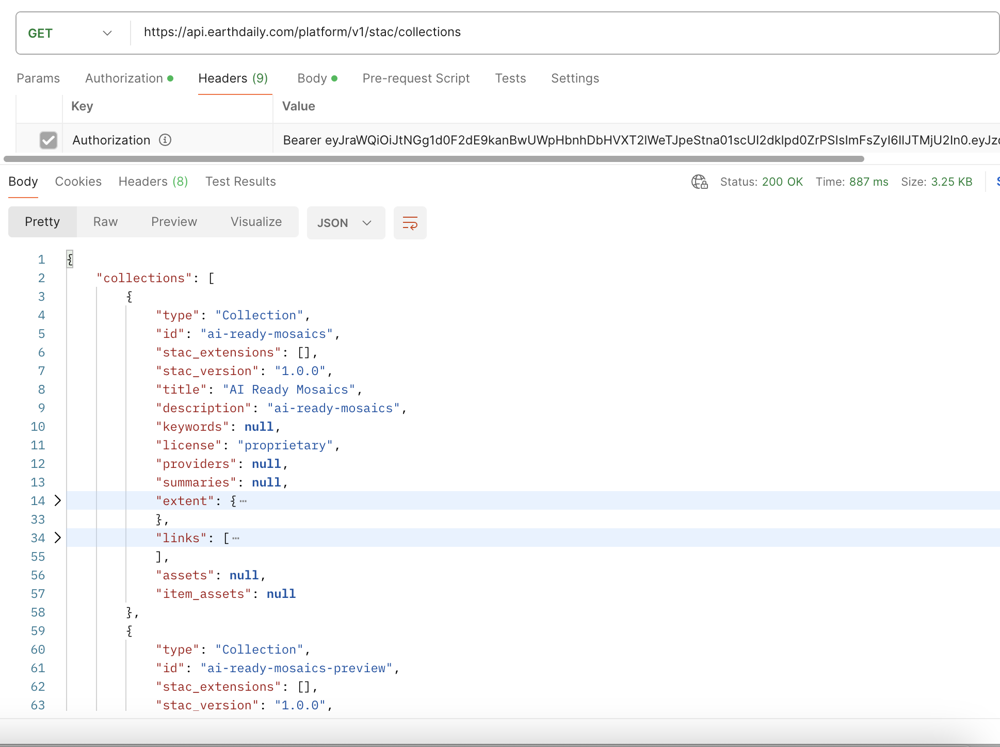

## Collection

Return specific Collection

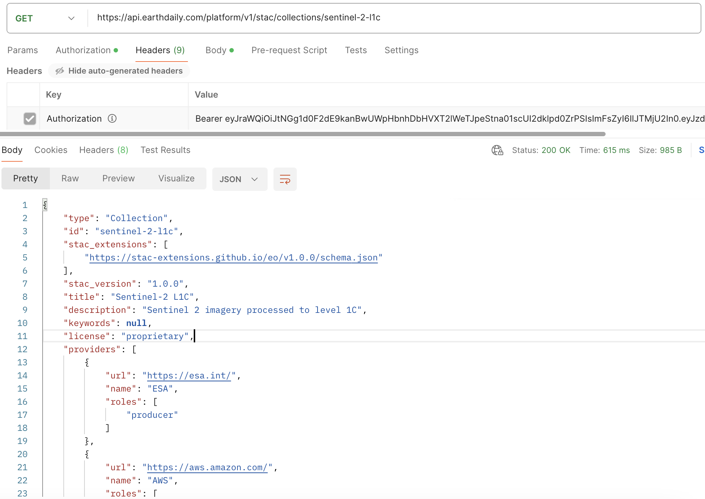

## Items

Return paged Items ordered by datetime descending

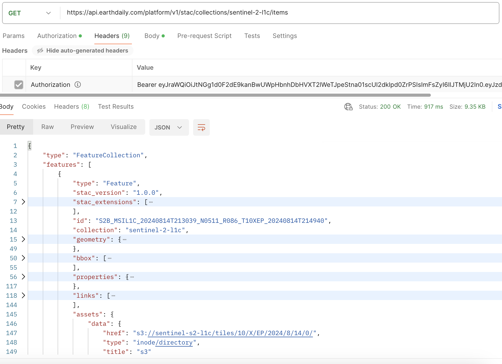

## Item

Returns a single Item for a given Collection and Item ID

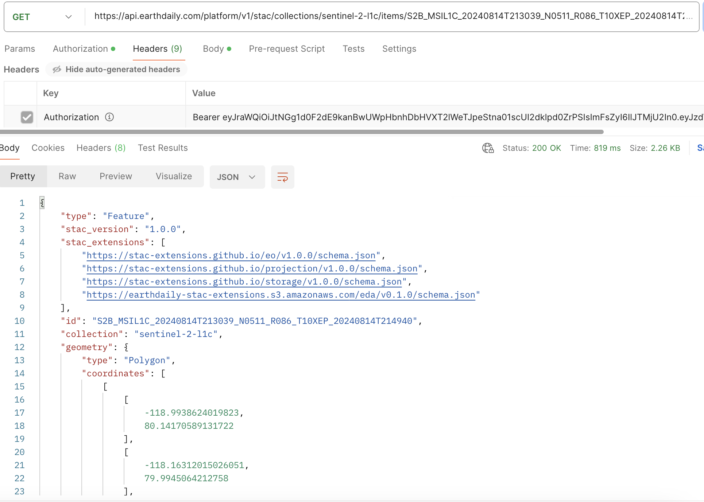

## Queryables

Returns the queryable names for the STAC API Item Search using Query Extension

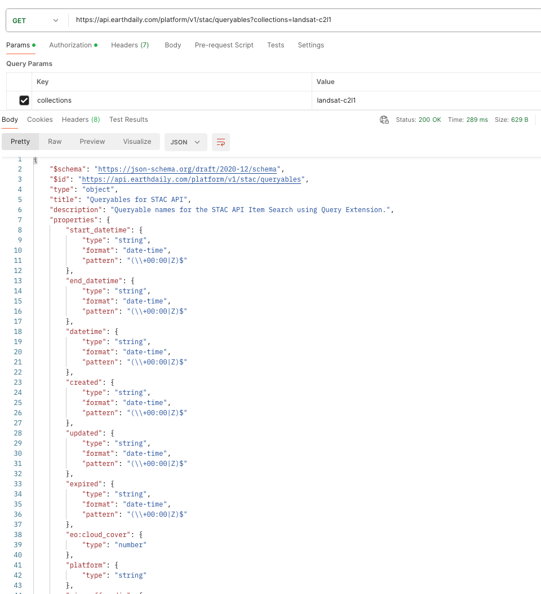

## Search

Implements STAC basic Item search functionality + extensions

Ensure the **content-type** header is **application/json**

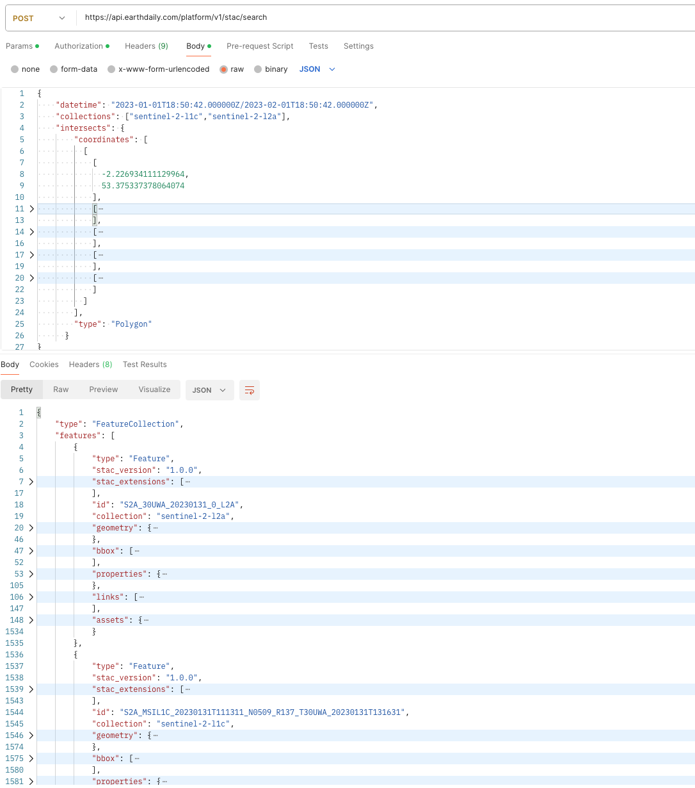

### Query Extension via POST Method

!!! note
    EarthPlatform STAC API supports the [Query Extension](https://github.com/stac-api-extensions/query). It currently does not support the Filter Extension.

Advanced searching can be performed using a `query` object.

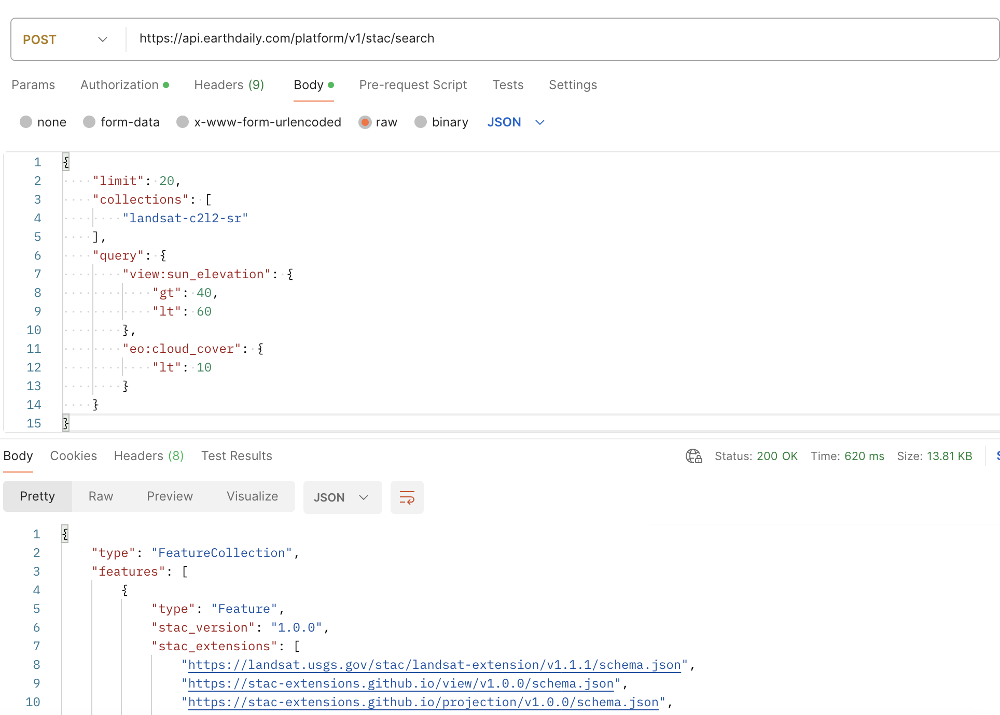

### Fields Extension

The Fields Extension allows you to specify which fields are returned from the API, reducing data transfer size.

Include:

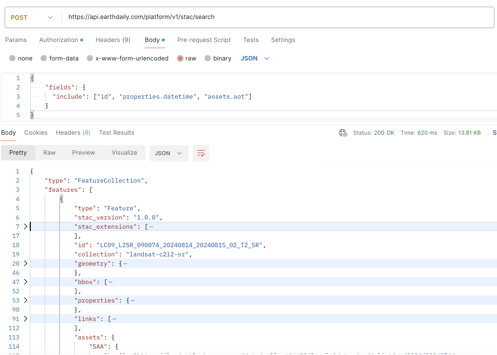

Exclude:

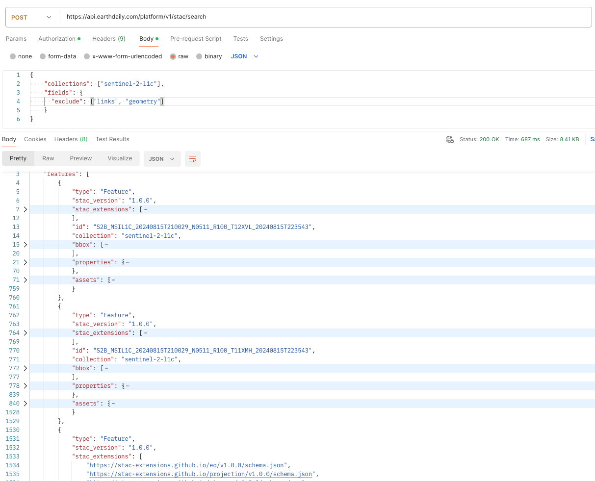

### Sortby Extension

By default, Items are returned by `datetime` descending. Then by `id` ascending.

Sorting by property `eo:cloud_cover` is also supported on the `/search` endpoint:

| Ascending | Descending |
|-----------|-----------|
| 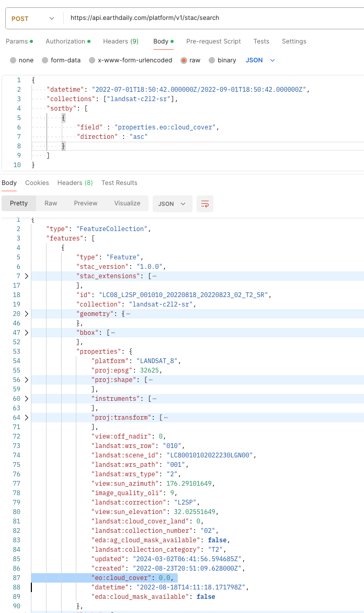 | 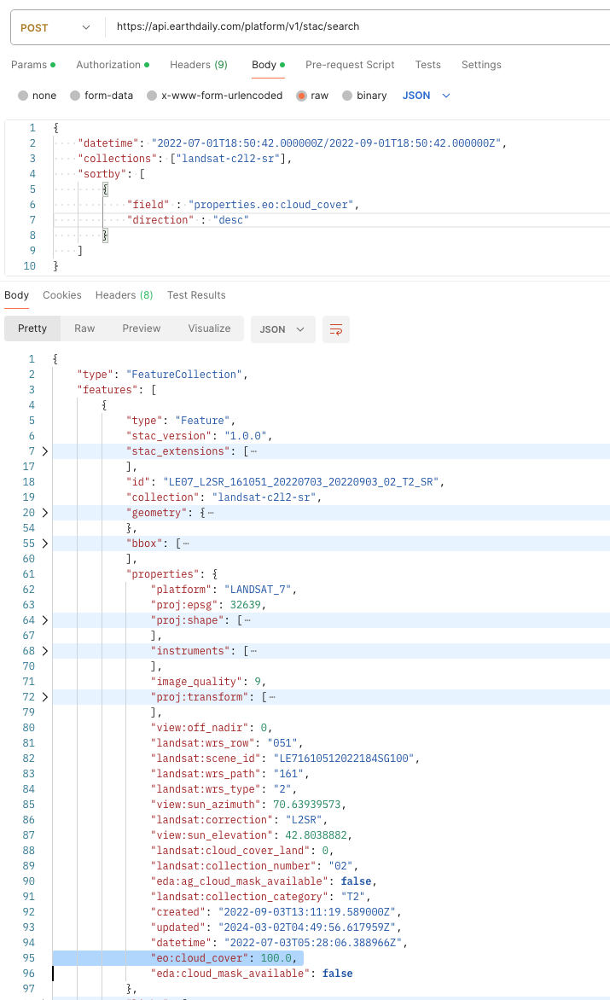 |

## Downloading Assets

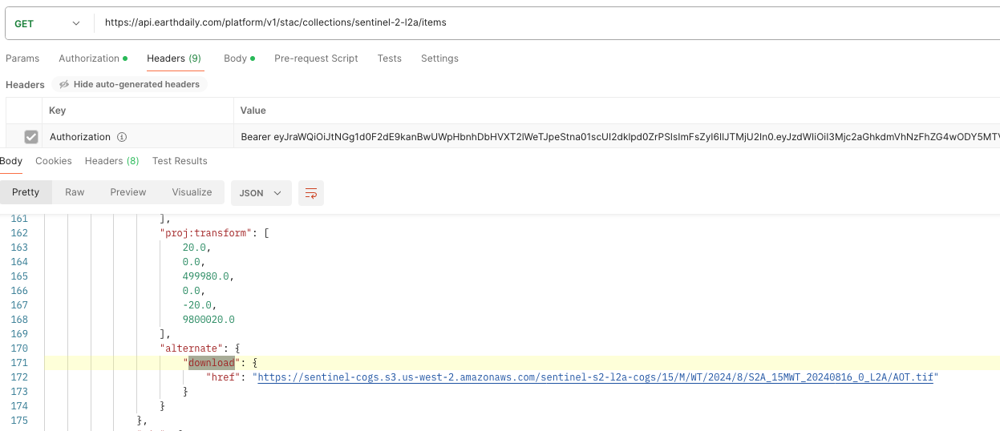

## CloudMasks

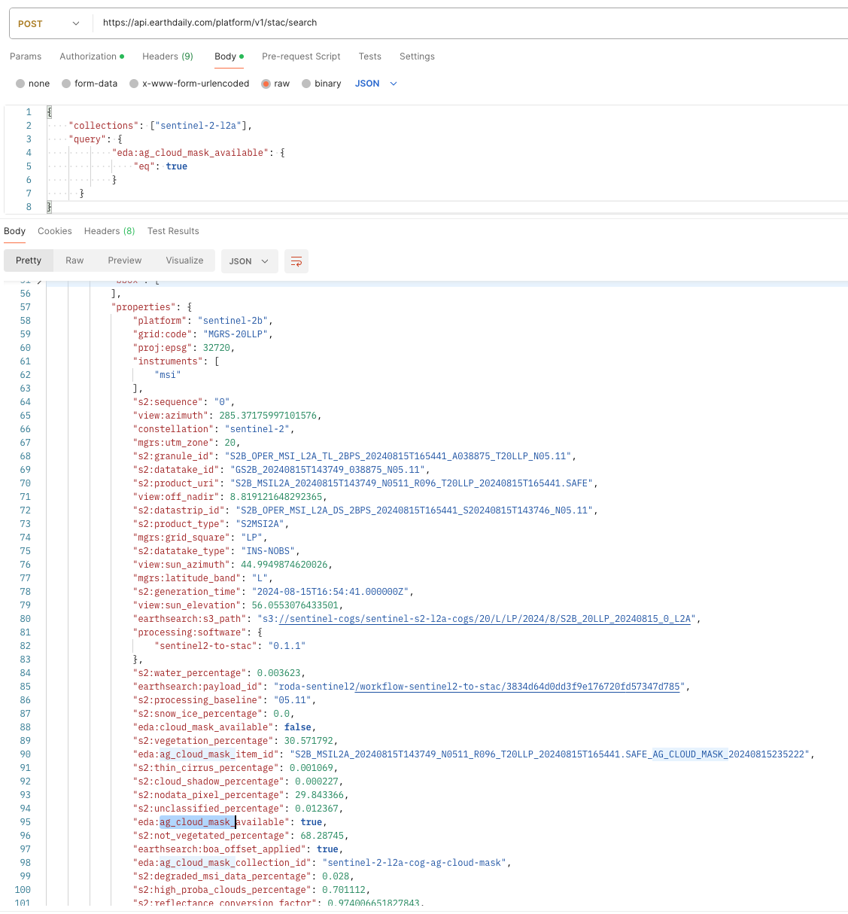
