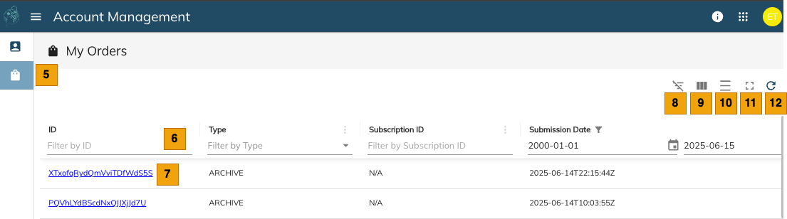

# Account Information

## Introduction

The Account Information page is the landing page for each user of the customer account when they login to [Account Information](https://console.earthdaily.com/account). It allows the user to check their own account details, orders, and more. It also has links to other applications like EarthPlatform and EarthMosaics.

## General Information

On the upper right hand side of the window, you will see three small icons:

| Icon | Description |
|------|-------------|
|  | About page that shows the EarthDaily version |
|  | Shows a list of hosted applications from EarthDaily; use it to switch between different applications |
|  | Quick information about the signed-in user along with their account and an option to sign out |

## My Account

| S. No | Label | Description |
|-------|-------|-------------|
|  | User | Logged in user details |
|  | Account | Details of the account that the user belongs to |
|  | API Credentials | Token URL to generate "Bearer Token" for API authentication. [Details of How to Provision](../getting-started/authentication.md) |
|  | Hosted Apps | Use this to switch between various apps available |

## My Orders

My Orders section allows you to see all the orders placed by the users on the account. You can see the Order details and the order state.

## Order State

| State | Description |
|-------|-------------|
| Pending | Order is being validated and will be accepted for processing once validation passes |
| Accepted | Order has been accepted and will be processed |
| Failed | Order has failed, usually due to a downstream outage. You may retry. |
| Succeeded | Order has completed successfully. Ready for download. |
