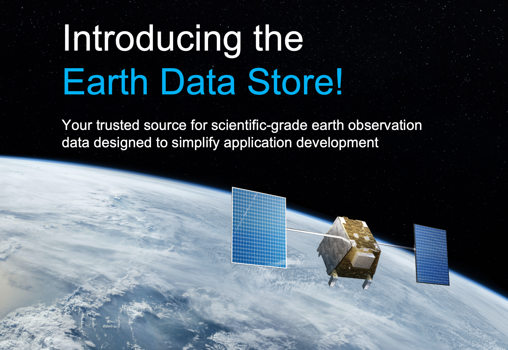

# Earth Data Store (EDS)

EDS is an ecosystem by EDA (EarthDaily Analytics) that can connect to and integrate with other geospatial platforms. It offers a growing suite of services, such as EarthMosaics, that help remove the complexity in developing geospatial applications.

This documentation aims to provide our users (having different needs) the guidance required to be able to use the EDS platform and get the best out of it.

- Tips to help you [get started](getting-started/index.md)
- Details of our [STAC endpoints](api/index.md) for users who wish to use our data in their software applications
- How-to guidance for the effective navigation of our [user interfaces](console/index.md)
- [Collections](collections/index.md) made available through EDS which includes some samples of our platform's value add
