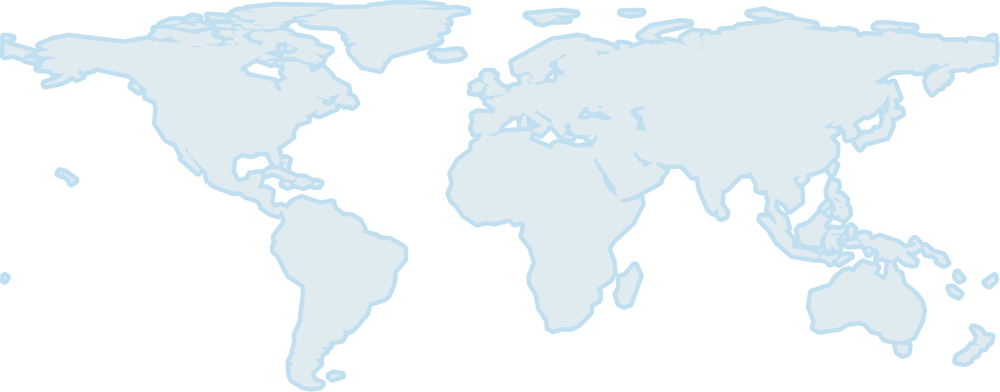

# EarthDaily Constellation Product Specification

!!! info "Document information"
    **Version:** 1.0 · **Scope:** Technical Documentation — Products · **Date:** 2026-09-03

## 1. Mission Overview

### 1.1 Platform Characteristics

EarthDaily Constellation (EDC) is a systematic, global change-detection mission delivering scientific-quality, analysis-ready imagery optimized for cross-time and cross-sensor consistency.  Data quality is achieved with comprehensive calibration and validation processes, precisely maintained and stable acquisition conditions. EDC is powered by the automated cloud-native ground segment, EarthPipeline.

- **Scientific quality.** Stable radiometry and geometry with high signal-to-noise.
- **Systematic coverage.** Nadir, same-local-time imaging for daily global observations.
- **Spectral diversity.** 22 calibrated bands spanning VNIR, SWIR, and TIR.
- **Scalable access.** Automated cloud detection, atmospheric characterization, and API-first delivery of imagery.

*Key EDC EarthDaily Constellation Characteristics*

| Characteristic | Value |
|---|---|
| Number of Satellites | 9 (+ 1 in-orbit spare) |
| Orbit | Sun-synchronous; <br> Local Equatorial Crossing Time (at the equator): 10:15 a.m. and 10:45 a.m. (E) |
| Orbit Control | Precisely maintained for consistent viewing over mission life |
| Ground Sample Distance <br> (At Reference Altitude) | VNIR: 5 m · SWIR: 95 m · TIR: 120 m |
| Swath Width | 240 km VNIR, SWIR, TIR |
| Spacecraft Mass | 215 kg |
| Nominal Altitude | 608 km |
| Inclination | 97.7 degrees at reference altitude |
| Viewing Angle | < 12 degrees across track (E) |
| Collection Bit Depth | 12-Bits |
| Coverage and Revisit | Average daily systematic coverage of >90% (9 Satellites) of Earth's landmass (excluding Antarctica) and select maritime areas, no tasking. |

#### 1.1.1 Sensors

##### 1.1.1.1 Spectral Bands

EarthDaily satellites carry 22 bands imaged at nadir:

- **11 visible and near-infrared (VNIR) bands** at 5 m native GSD, designed for vegetation monitoring, land use classification, and water quality assessment.
- **6 shortwave infrared (SWIR) bands** at 95 m native GSD, optimized for soil and moisture characterization, atmospheric correction, and mapping of snow, ice, and minerals.
- **5 thermal infrared (TIR) bands** at 120 m native GSD, used for land surface temperature retrievals, wildfire detection, and emission monitoring.

EarthDaily employs a push-broom sensor with time-delayed integration to improve the Signal-to-Noise (SNR) ratio. Additionally, to further enhance the SNR, several bands are binned to improve the overall pixel SNR.


### 1.2 Constellation, Revisit, and Systematic Collections

EDC uses a systematic collection strategy to image the entire Earth's landmass (except Antarctica and select small islands) and the coastal regions up to 100 km offshore from the coastal land area.

<!-- from a file in docs/data/ -->


*Figure 1.  EDC's systematic collection strategy: (Grey) landmass and (Blue) coastal regions*

### 1.3 Calibration & Validation

Pre-launch calibration of the EDC sensors was performed using tunable lasers to characterize detector response.

To improve the geometric and radiometric quality of EDC products, post-launch calibration is performed by regularly monitoring calibration sites around the world. Geometric calibration sites have well-known and highly distributed features suitable for different types of geometric calibration: interior orientation (optical distortion) and exterior orientation (camera alignment). Radiometric and atmospheric calibration sites have well-known features suitable for different types of radiometric and atmospheric calibration: vicarious calibration, trending and inter-imager calibration, etc. Cross calibration with science-grade missions at these calibration sites is the key strategy to achieving and maintaining science-grade products from the EDC and EarthPipeline customer missions.

## 2. Product Specifications

### 2.1 EDC Product Overview

#### 2.1.1 Framing

EDC imagery products are delivered as **orthorectified scenes**, where each pixel is projected onto a map grid using precise satellite orbit, sensor geometry, and a vertical reference (DEM). This ensures accurate geolocation and compatibility across multi-temporal datasets.

Products are framed to the **native scene footprint** of each acquisition, rather than a static tile definition. Long acquisitions may be segmented into multiple overlapping scenes in the along-track direction, preserving coverage continuity.

#### 2.1.2 Geometric Correction

All EDC products are generated using a rigorous sensor model that uses knowledge of the satellite orbit and attitude, together with a geometric reference, to geolocate pixels on the Earth's surface.

EDC products are delivered with two levels of geometric processing:

1. **Precision Correction** – Applies geometric refinement in which ground control points (GCPs) and digital elevation models (DEMs) are used to refine the satellite image geometry. This process corrects for orbital, attitude, and terrain-related distortions, ensuring that pixels are accurately placed on the Earth's surface. Products corrected in this manner are suitable for applications requiring high geolocation accuracy, such as time-series analysis, land cover change detection, and sensor fusion.
2. **Systematic Correction** – Satellite orbit and attitude knowledge is derived from satellite telemetry. GCPs are not used. A digital elevation model (DEM) may be applied if available. Products corrected in this manner (e.g., Maritime) are suitable for rapid-response applications where speed is prioritized over high-precision geolocation.

#### 2.1.3 Radiometric Interpretation

EDC instruments sense Top-of-Atmosphere (TOA) radiance at particular spectral bandwidths. Through processing, EDC products are delivered with the following radiometric interpretations:

1. **Top-of-Atmosphere Reflectance** – TOA radiance is converted to reflectance by taking into account the Earth-Sun distance, extraterrestrial solar spectrum, and solar-zenith angle.
2. **Surface Reflectance** – Surface reflectance is estimated from TOA radiance by accounting for the contribution of the atmosphere.

#### 2.1.4 Product Levels and Processing Tiers

The table below summarizes EDC product levels.

| Product | Level | Correction | Radiometry | Subscription Options | Description | Usage |
|---|---|---|---|---|---|---|
| AI-Ready Data / AIRD | L2A | Precision | Surface reflectance | Flex, <br> Everywhere Everyday | BOA surface reflectance product standardized with stable radiometry, consistent geolocation, and automated QA. 9 bands, precision corrected, 16-bit | Science-grade monitoring, time-series analysis, and fusion with heritage sensors (Landsat, Sentinel-2) |
| Maritime | L1C | Systematic | TOA reflectance | Flex, <br> Everywhere Everyday | Scaled TOA reflectance. Consists of 4 spectral bands, processed using systematic correction, 8-bit | Delivers the spectral signatures essential for vessel detection, wake analysis, and coastal change identification. Monitor oil slicks and related parameters, sediment plumes, algal blooms, port infrastructure, and anomaly heat signatures.  |
| Science | L1C | Precision | TOA reflectance | Flex, <br> Everywhere Everyday | Scaled TOA reflectance product. Consists of 20 spectral bands, processed using precision correction. 16-bit | Scientific users who require access to calibrated TOA reflectance prior to atmospheric correction |

### 2.2 AI Ready Product Specification

The AI-Ready Data (AIRD) product delivers pre-calibrated, standardized, and analysis-ready imagery engineered for seamless integration into artificial intelligence and machine learning workflows. With harmonized radiometry, consistent acquisition geometry, and embedded quality masks, this product eliminates preprocessing burdens, enabling faster model training, operational automation, and large-scale deployment across industries such as agriculture, energy, insurance, and climate risk monitoring.

| Field | Value |
|---|---|
| Processing Level | L2A |
| Processing Method | Precision Correction |
| Radiometric Interpretation | Surface Reflectance |
| Product Components | Image Files (Cloud-optimized GeoTIFF) — one per band<br>Thumbnail File (PNG)<br>Quality Mask File (Cloud-optimized GeoTIFF)<br>Saturation Mask Files (Cloud-optimized GeoTIFF, one per band)<br>Atmospheric Parameters File (Cloud-optimized GeoTIFF)<br>Pixel Processing File (Cloud-optimized GeoTIFF)<br>Solar Angles File (Cloud-optimized GeoTIFF)<br>View Angles File (Cloud-optimized GeoTIFF)<br>README File (Text) |
| Included Bands and Product Sampling | 5 m — Blue, Green, Red, Near Infrared<br>10 m — Aqua, Yellow, Red Edge 1, Red Edge 2, Red Edge 3 |
| Data Type | 16-bit unsigned integer |
| Product Size | 20×120 = 2400 km² |
| Compression | LZW |
| Blackfill | Products are black-filled in areas where not all bands overlap |
| Resampling Kernel | Cubic Convolution |
| Horizontal Datum | WGS84 |
| Map Projection | UTM |
| Quality Mask Layers | Data<br>Cloud<br>Cloud Shadow<br>Thin Cirrus<br>Snow<br>Water |

### 2.3 Maritime Product Specification

The Maritime product is an L1C scaled Top-of-Atmosphere reflectance orthoimagery product designed for maritime monitoring and rapid situational awareness across EDC's coastal and selected offshore collection areas. It uses systematic geometric correction, relying on satellite orbit and attitude telemetry rather than GCP-based refinement, so it prioritizes production speed and operational availability over precision geolocation.

| Field | Value |
|---|---|
| Processing Level | L1C |
| Processing Method | Systematic Correction |
| Radiometric Interpretation | Top-of-Atmosphere Reflectance |
| Product Components | Solar Angles File (Cloud-optimized GeoTIFF)<br>View Angles File (Cloud-optimized GeoTIFF)<br>README File (Text) |
| Included Bands and Product Sampling | 5 m resolution — Blue, Green, Red, Near Infrared |
| Data Type | 8-bit unsigned integer |
| Product Size | 20×120 = 2400 km² (5 m, 10 m, and 20 m bands) |
| Compression | LZW |
| Blackfill | Products are black-filled in areas where not all bands overlap |
| Resampling Kernel | Cubic Convolution |
| Horizontal Datum | WGS84 |
| Map Projection | UTM |

### 2.4 Science Product Specification

The Science product is a Scaled, Top-of-Atmosphere (TOA) Reflectance Product. The baseline includes 11 bands, with optional add-ons for SWIR and TIR bands, processed to TOA reflectance and brightness temperature, respectively. This product is intended for **scientific and engineering users** who require calibrated TOA reflectance prior to atmospheric correction.

| Field | Value |
|---|---|
| Processing Level | L1C |
| Processing Method | Precision Correction |
| Radiometric Interpretation | Top-of-Atmosphere Reflectance |
| Product Components | Image Files (Cloud-optimized GeoTIFF, one per band)<br>Thumbnail File (PNG)<br>Quality Mask File (Cloud-optimized GeoTIFF)<br>Saturation Mask Files (Cloud-optimized GeoTIFF, one per band)<br>Solar Angles File (Cloud-optimized GeoTIFF)<br>View Angles File (Cloud-optimized GeoTIFF)<br>README File (Text) |
| Included Bands and Product Sampling | 5 m resolution — Blue, Green, Red, Near Infrared<br>10 m resolution — Aqua, Yellow, Red Edge 1, Red Edge 2, Red Edge 3<br>20 m resolution — Coastal, Water Vapour 1 |
| Data Type | 16-bit unsigned integer |
| Product Size | 20×120 = 2400 km² (5 m, 10 m, and 20 m bands) |
| Compression | LZW |
| Blackfill | Products are black-filled in areas where not all bands overlap |
| Resampling Kernel | Cubic Convolution |
| Horizontal Datum | WGS84 |
| Map Projection | UTM |
| Quality Mask Layers | Data<br>Cloud |


## 3. Data Formats

EDC products consist of an image file or set of files, and a set of metadata files. This section describes those files.

### 3.1 File Name Conventions

Product files, excepting Single-Band Image Files, adhere to the following naming convention:

```
Optical_EO_<Datetime>_<Satellite><Cat>_<Product>_<Level>_<Type>_<PID><Extension>
```

Where the filename elements are:

- `<Datetime>`: The earliest UTC acquisition time in the product, in the form `YYYYMMDDThhmmssZ`
- `<Satellite>`: The satellite ID (e.g. `EarthDaily01`)
- `<Cat>`: The file category: `VNIR`, `SWIR`, or `TIR`
- `<Product>`: The product name (e.g. `Land`)
- `<Level>`: The product level: `L1C`, `L2A`
- `<Type>`: The product type:
    - `TOA`: Top of Atmosphere Reflectance
    - `BOA`: Bottom of Atmosphere Reflectance
- `<PID>`: A system-generated product ID
- `<Extension>`: The filename extension:
    - Browse/Thumbnail File: `_BROWSE.png`
    - Quality Mask: `_MASK.tif`
    - Saturation Mask: `_SATURATION.tif`
    - Atmospheric Parameters: `_ATM.tif`
    - Pixel Processing: `_PIXEL_PROCESSING.tif`
    - Solar Angles: `_SOLAR.tif`
    - View Angles: `_VIEW.tif`
   
    - README: `_README.txt`

Single-Band Image Files adhere to the following naming convention:

```
Optical_EO_<Datetime>_<Sensor><Cat>_<Product>_<Level>_<Type>_<Band>_<PID>.tif
```

Where `<Band>` is the identifier for the band included in this file, using the following abbreviations:

| Abbreviation | Band |
|---|---|
| C | Coastal |
| B | Blue |
| A | Aqua |
| G | Green |
| Y | Yellow |
| R | Red |
| RE1 | Red Edge 1 |
| RE2 | Red Edge 2 |
| RE3 | Red Edge 3 |
| NIR | Near Infrared |
| WV1 | Water Vapour 1 |
| WV2 | Water Vapour 2 |
| SWIR1 | SWIR 1 |
| CIR | Cirrus |
| SWIR2 | SWIR 2 |

### 3.2 Image File

EDC image files contain reflectance or temperature data, depending on the product type. Products may be delivered as a single multi-band GeoTIFF (e.g., RGB visual products) or as a set of single-band GeoTIFFs (e.g., Science).

Image files are GeoTIFF files with integer pixel values (DN — digital numbers). To convert these DN values to reflectance or temperature, as applicable, a scale and offset must be applied:

```
OUTPUT = DN * scale + offset
```
Consider an example in which the band scale is 0.0001, the offset is -0.1, and the
pixel DN is 5000:

```
OUTPUT = 5000 * 0.0001 - 0.1 = 0.4
```
i.e. 40% surface reflectance

The scale and offset values are available in the `raster:bands` properties of the STAC asset, and are also embedded in the GeoTIFF file metadata.

Blackfill is represented with DN value `0` and should not be interpreted as valid data.

### 3.3 Thumbnail File

The thumbnail file is a PNG file that provides a low-resolution overview of the product. It does not include geolocation metadata.

### 3.4 Quality Mask

The EDC quality mask uses per-band categorical values for clarity and ease of use. The mask is provided as a multi-band GeoTIFF. Each band encodes a specific quality condition as categorical values.

**Encoding convention:**

- `0` = blackfill or no assessment available
- `1` = clear (condition not present)
- `2` = feature present (e.g., cloud, snow, water)

| Band Number | Description | Definition |
|---|---|---|
| 1 | Data | `1` = valid imagery; `0` = blackfill |
| 2 | Cloud | `2` = cloud; `1` = clear; `0` = blackfill/no assessment |
| 3 | *(Future Use)* | Reserved; currently set to `0` |
| 4 | Cloud Shadow | `2` = shadow; `1` = clear; `0` = blackfill/no assessment |
| 5 | Thin Cirrus | `2` = cirrus; `1` = clear; `0` = blackfill/no assessment |
| 6 | Snow | `2` = snow; `1` = clear; `0` = blackfill/no assessment |
| 7 | Water | `2` = water; `1` = clear; `0` = blackfill/no assessment |

### 3.5 Saturation Mask

The saturation mask identifies pixels that are radiometrically saturated in each spectral band. It is provided as one GeoTIFF file per band (8-bit unsigned integer), aligned pixel-for-pixel with the corresponding image band.

**Encoding convention:**

- `0` = blackfill or no assessment available
- `1` = valid, unsaturated
- `2` = saturated

These masks allow users to filter out pixels where reflectance or radiance values exceed the sensor's dynamic range, ensuring higher confidence in quantitative analysis. There is one saturation mask file per band.

### 3.6 Atmospheric Parameters

The atmospheric parameters file provides per-pixel atmospheric variables used in the generation of the product. These parameters are delivered as a multi-band GeoTIFF aligned pixel-for-pixel with the imagery.

| Band Number | Description | Units | Definition |
|---|---|---|---|
| 1 | Aerosol optical thickness | Unitless fraction | `0` = blackfill; valid values scaled |
| 2 | Total Column Water vapour | g/cm² | `0` = blackfill; valid values scaled |

For non-blackfill values, a scale and offset must be applied:

```
OUTPUT = DN * scale + offset
```

The scale and offset values are available in the `raster:bands` properties of the STAC asset, and are also embedded in the GeoTIFF file metadata.

### 3.7 Solar Angles

The solar angles file provides per-pixel solar geometry over a grid covering the product. It is delivered as a two-band GeoTIFF (16-bit unsigned integer).

| Band Number | Description | Units | Definition |
|---|---|---|---|
| 1 | Sun Azimuth | Degrees (0–360, clockwise from North) | `0` = blackfill; valid values scaled |
| 2 | Sun Zenith | Degrees (0–90, from vertical) | `0` = blackfill; valid values scaled |

For non-blackfill values, a scale and offset must be applied (`OUTPUT = DN * scale + offset`). The scale and offset values are available in the `raster:bands` properties of the STAC asset and embedded in the GeoTIFF file metadata.

### 3.8 View Angles

The view angles file provides per-pixel sensor geometry over a grid covering the product. It is delivered as a two-band GeoTIFF (16-bit unsigned integer) aligned with the imagery.

| Band Number | Description | Units | Definition |
|---|---|---|---|
| 1 | View Azimuth | Degrees (0–360, clockwise from North) | `0` = blackfill; valid values scaled |
| 2 | View Incidence | Degrees (0–90, from vertical) | `0` = blackfill; valid values scaled |

For non-blackfill values, a scale and offset must be applied (`OUTPUT = DN * scale + offset`). The scale and offset values are available in the `raster:bands` properties of the STAC asset, and are also embedded in the GeoTIFF file metadata.

### 3.9 Pixel Processing

The pixel processing file provides per-pixel flags describing which atmospheric and geometric corrections were applied during product generation. Each band in the file indicates a specific correction applied, according to the table below. Note that a thematic interpretation is used.

**Encoding convention:**

- `2` = correction applied
- `1` = correction not applied
- `0` = blackfill or no assessment

| Band Number | Description | Definition |
|---|---|---|
| 1 | Aerosol Reference | Whether used as aerosol reference pixel |
| 2 | Water Vapour Reference | Whether used as water vapour reference pixel |
| 3 | Haze Corrected | Whether haze correction was applied |
| 4 | Cirrus Corrected | Whether cirrus correction was applied |
| 5 | Cloud Shadow Corrected | Whether cloud shadow correction was applied |
| 6 | Terrain Shadow Corrected | Whether terrain shadow correction was applied |
| 7 | Adjacency Effect Corrected | Whether adjacency effect correction was applied |
| 8 | BRDF corrected | Whether BRDF correction was applied |

### 3.10 Metadata Structure

EDC products are STAC compliant. For products accessed through the STAC API, metadata is associated with each STAC item returned through the API. For delivered products, the STAC item metadata is saved as a sidecar JSON file.

EDC products conform to STAC version 1.0.0. The following STAC extensions are used:

| Extension | Field name prefix |
|---|---|
| Electro-Optical | `eo` |
| View Geometry | `view` |
| Raster | `raster` |
| Classification | `classification` |
| Processing | `processing` |
| Projection | `proj` |
| File | `file` |
| Sat | `sat` |
| CEOS ARD | `ceosard` |
| EarthDaily | `eda` |

The EarthDaily (`eda`) STAC extension is a custom STAC extension which is described in the table below.

| Field | Type | Description |
|---|---|---|
| `eda:sensor_type` | String | The sensor type, e.g. "OPTICAL" |
| `eda:mtf_enhancement_applied` | Boolean | Indicates whether MTF enhancement was applied |
| `eda:auxiliary_atmospheric_sources` | Object | Auxiliary atmospheric retrieval sources that were used for surface product generation (empty if none were used) |
| `eda:unusable_cover` | Number | Estimate of unusable cover (cloud, water, and snow) |
| `eda:area_km2` | Number | The approximate area in km² of the non-blackfill region of the product |
| `eda:geometric_accuracy_rmse` | Number | Radial RMSE, in meters |
| `eda:band_to_band_accuracy_rmse` | List of Objects | The band-to-band accuracy, in pixels |
| `eda:altitude` | Number | Altitude at the center of the product |
| `eda:bearing` | Number | Satellite ground track bearing |
| `eda:start_attitude` | List of numbers | Satellite attitude at the start of the acquisition |
| `eda:end_attitude` | List of numbers | Satellite attitude at the end of the acquisition |
| `eda:mean_attitude` | List of numbers | Mean satellite attitude |
| `eda:source_l0_ids` | List of Strings | Archive IDs of the source level-0 datasets |
| `eda:source_l0_scene_ids` | List of Strings | Scene IDs of the source Level-0 datasets |
| `eda:segment_id` | String | Identifier for the acquisition used to generate the product |

## 4. Processing Overview

This section provides information about the algorithms and processes used in generating EDC products.

### 4.1 Processing Baseline

The processing baseline defines the processing configuration and auxiliary datasets used to generate EDC products. Each product carries a `processing_version` field in its metadata, allowing users to track which baseline was applied.

When interpreting products, users may compare the metadata version against the table below to determine the applicable baseline. The **"First Applicable Version"** identifies the lowest baseline version number that applies to a product; if multiple baselines exist, the most recent version less than or equal to the product's version should be used.

| First Applicable Version | Applicable Product Generation Date | Description |
|---|---|---|
| 17.0 | TBD | Initial Processing Baseline for EDC products |

### 4.2 Auxiliary Data

| Auxiliary Dataset | Source / Provider | Purpose in Processing |
|---|---|---|
| Geometric Reference | EDA uses an internally-developed geometric reference image derived from Sentinel-2 and Landsat scenes | Absolute geolocation control, inter-satellite alignment, co-registration |
| Vertical Reference | Copernicus DEM (COPDEM), EGM2008 geoid | Orthorectification, terrain correction, elevation normalization |
| Water Mask | MODIS Water Mask (MOD44W) | Land/water discrimination, coastal definition, cloud/water separation |
| Landcover Classification | ESA WorldCover | Scene-based correction strategies, adjacency effect modeling, QA context |
| Atmospheric Retrieval | ECMWF real-time forecast and analysis, MODIS Aerosol Profile (MOD04) and Atmospheric Profiles (MOD07) | Aerosol optical thickness, water vapour, ozone, and other atmospheric state variables for radiometric correction |

### 4.3 Raw Data Processing

Raw satellite imagery undergoes per-pixel gain and offset corrections to account for photo-response non-uniformities and dark current offsets. This correction ensures that each detector element contributes consistently to earth measures.

### 4.4 Geometric Refinement

Geometric refinement is applied to improve geolocation accuracy beyond the nominal satellite model. This process refines knowledge of the satellite position, velocity, and orientation (ephemeris and attitude) by automatically identifying ground control points against a geometric reference.

Corrections include:

- **Orbit/attitude residuals** — reducing offsets from predicted satellite position.
- **Lens and Optical Effects** — correcting geometric distortions introduced by the imaging system.
- **Band-to-band alignment** — tie points between overlapping spectral bands are used to ensure consistent co-registration, producing sub-pixel band-to-band accuracy across the image.

### 4.5 Orthorectification

Orthorectification produces map-projected images by correcting for geometric distortions caused by sensor perspective, satellite motion, and terrain relief. Every pixel is geolocated to its correct position on the Earth's surface.

The orthorectification involves the following steps:

- **Definition of the target grid** — establish a uniform pixel grid aligned with the desired map coordinate system in a UTM projection. EDC products use a consistent pixel grid to avoid sub-pixel shifts between independent products covering the same map projection and target pixel size.
- **Geolocating source data** — for each pixel in the target grid, determine its corresponding location in the raw satellite image using the rigorous sensor model that incorporates satellite attitude, ephemeris, and the vertical reference DEM.
- **Resampling** — compute the target pixel value by applying a resampling kernel to pixels surrounding the location in the raw satellite image data.

Orthorectification removes terrain displacement and perspective distortions, ensuring that features such as roads, rivers, and field boundaries appear in their true geographic positions.

### 4.6 Top-of-Atmosphere (TOA) Reflectance

Corrected digital numbers (DNs) are converted to at-sensor radiance by applying a linear function (gain and offset), with coefficients determined empirically through calibration:

$$
L = DN \times \text{gain} + \text{offset}
$$

At-sensor radiance values, \(L\), are converted to top-of-atmosphere (TOA) reflectance by applying a scene-specific conversion factor:

$$
\rho = \frac{\pi d_s^2 L}{E_s \cos(\theta_s)}
$$

where \(d_s\) is the Earth-Sun distance, \(E_s\) is the extraterrestrial solar spectrum, and \(\theta_s\) is the solar zenith angle.

The resulting TOA reflectance is unitless (0 – 1) and normalized for solar distance and illumination geometry. Blackfill pixels (DN = 0) are excluded from the reflectance calculation.

### 4.7 Mask Computation

EDA has developed a proprietary machine-learning based cloud mask which is used to populate the Cloud, Cloud Shadow, and Thin Cirrus bands in the quality mask file.

Heuristics-based methods are used to determine the Snow and Water bands in the quality mask file. These heuristics incorporate common indices such as the Normalized Difference Snow Index (NDSI) and Modified Normalized Difference Water Index (MNDWI) with proprietary thresholds on various bands.

### 4.8 Atmospheric Correction

Atmospheric correction describes the process of estimating surface reflectance (SR) from top-of-atmosphere (TOA) reflectance by accounting for the contribution of the atmosphere. At a high level, atmospheric correction is performed by:

- Estimating the atmospheric composition (atmospheric retrieval)
- Modelling the atmospheric contribution to the light observed by the sensor (due to emission / scattering / absorption)
- Removing the atmospheric contribution to derive SR

The EarthPipeline algorithm used to generate SR products from TOA imagery is based on the algorithm described in (Richter & Schläpfer, 2019).

#### 4.8.1 Atmospheric Model

Atmospheric correction depends on the ability to model atmospheric radiative transfer. For EDC products, the libRadtran software package (Emde, et al., 2016) is used to provide an approximation of the radiative transfer equations.

#### 4.8.2 Atmospheric Retrievals

**Aerosol Retrieval**

The aerosol optical thickness (AOT) over land is estimated using reference pixels with known reflectance behaviour, such as dark dense vegetation (DDV) (Kaufman & Sendra, 1988). EDC VNIR and SWIR bands are used both to identify reference pixels and to estimate the atmospheric AOT content.

If the scene content does not allow for aerosol retrieval, the AOT map is modeled using a default AOT value, or the mean AOT value from an atmospheric auxiliary reference if available, with an elevation correction using the elevation auxiliary reference.

**Water Vapour Retrieval**

The water vapour (WVP) over land is estimated using spectral bands in the water vapour absorption region (Water Vapour 1 and Water Vapour 2 for EDC) and a reference NIR band not influenced by water vapour (Schläpfer, Borel, Keller, & Itten, 1998).

If the scene content does not allow for water vapour retrieval, the WVP map is modeled using a default WVP value, or the mean WVP value from an atmospheric auxiliary reference if available, with an exponential elevation correction using the elevation auxiliary reference.

**Others**

For ozone and surface pressure, values from an auxiliary reference are used.

#### 4.8.3 Atmospheric Correction

As described by Moran, Jackson, Slater, & Teillet (1992), the surface reflectance, \(\rho\), is given by:

$$
\rho = \frac{\pi (L(\rho) - L_p(\rho))}{(\tau_{dir} + \tau_{diff}) E_g(\rho)}
$$

where \(L(\rho)\) is the TOA radiance, \(L_p(\rho)\) is the path radiance, \(\tau_{dir}\) and \(\tau_{diff}\) are the direct and diffuse transmittance, respectively, and \(E_g(\rho)\) is the global downwelling irradiance.

## 5. Glossary

**Across Track**
: The across-track direction is perpendicular to the flight direction of the satellite.

**Along Track**
: The along-track direction is parallel to the flight direction of the satellite.

**Binning**
: The addition of signal from neighbouring pixels to form an aggregate pixel with increased signal-to-noise ratio. For EDC imaging, binning occurs in both the along- and across-track directions.

**Blackfill**
: Blackfill is used in an image file to indicate pixels which do not contain data. EDC product image files use the value `0` to indicate blackfill. This value should not be interpreted numerically; it has no radiometric interpretation.

**Brightness Temperature**
: A measure of the thermal energy emitted by a surface, expressed as the temperature of a blackbody that would emit the equivalent intensity.

**Digital Elevation Model (DEM)**
: A model that represents the topographic surface of the Earth.

**Digital Number (DN)**
: EDC product image files have integer pixel values, referred to as DNs. To retrieve a meaningful quantity, DNs must be converted by applying a scale and offset: `OUTPUT = DN * scale + offset`.

**Ground Control Points (GCP)**
: Ground features identified in a remote sensing image, whose geographic location is known, to within some uncertainty, from some ground truth such as a reference image.

**Ground Sample Distance**
: The distance between adjacent pixels in acquired imagery, as measured on the ground. It is an intrinsic quality of the imagery that depends on the characteristics of the imager and the position and orientation of the remote sensing platform.

**Nadir**
: The location on the Earth's surface through which the line from the centre of the satellite to the centre of the Earth runs.

**Orthorectification**
: The process of projecting remote sensing imagery onto a map grid so that pixels appear as though they are viewed from a point normal to the Earth's surface.

**Product Sampling**
: The distance between adjacent pixels in a map-projected file. It is a characteristic of the processed product and not an intrinsic quality of the acquired imagery.

**Pushbroom Imaging**
: A paradigm for acquiring satellite imagery in which a line of sensors in the across-track direction scans the along-track direction as the spacecraft proceeds along its orbit.

**Radiance**
: The radiant flux emitted or reflected by a surface, per unit solid angle and unit projected area.

**Radiative Transfer**
: Describes the passage of radiation through a medium that scatters and absorbs the radiation.

**Radiometric Interpretation**
: Describes what the pixel values in an image file represent.

**Reflectance**
: The ratio of the intensity of incident radiation that is reflected from a surface.

**Scene**
: A standard unit of imagery acquired by EDC satellites.

**Spectral Band**
: A wavelength or wavelength range in the electromagnetic spectrum over which a remote sensing instrument measures incoming radiance.

**Time-Delayed Integration**
: An imaging technique used in pushbroom sensors to improve imaging signal, where the charge from detector stages is shifted synchronously with the satellite's motion.

## 6. Bibliography

- Emde, C., Buras-Schnell, R., Kylling, A., Mayer, B., Gasteiger, J., Hamann, U., . . . Bugliaro, L. (2016). The libRadtran software package for radiative transfer calculations (version 2.0.1). *Geoscientific Model Development, vol. 9 (5)*, 1647–1672.
- Kaufman, Y. J., & Sendra, C. (1988). Algorithm for automatic atmospheric corrections to visible and near-IR satellite imagery. *International Journal of Remote Sensing vol. 9 (8)*, 1357–1381.
- Moran, M. S., Jackson, R. D., Slater, P. N., & Teillet, P. M. (1992). Evaluation of simplified procedures for retrieval of land surface reflectance factors from satellite sensor output. *Remote Sensing of Environment, vol. 41 (2-3)*, 169-184.
- Richter, R., & Schläpfer, D. (2019). Atmospheric and topographic correction (ATCOR theoretical background document). *DLR IB, vol. 1*, 0564-03.
- Schläpfer, D., Borel, C. C., Keller, J., & Itten, K. I. (1998). Atmospheric precorrected differential absorption technique to retrieve columnar water vapor. *Remote Sensing of Environment, vol. 65(3)*, 353-366.
