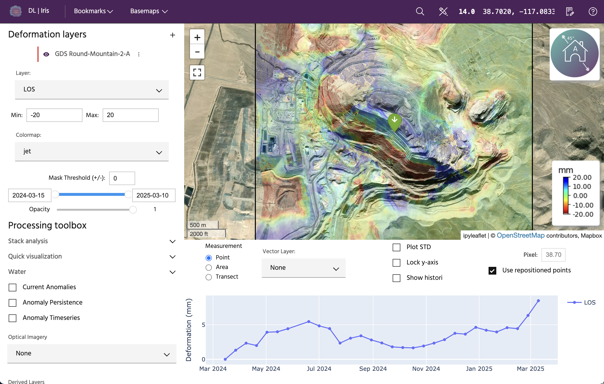

# What is Iris?

At the core of Iris lies the innovative use of Interferometric Synthetic
Aperture Radar (InSAR) technology. This groundbreaking technology transcends
geographical boundaries to monitor assets consistently and comprehensively.

With its seamless integration of cutting-edge technology, Iris is an
indispensable tool for proactive risk management, precise decision-making, and
the preservation of critical assets.

## Working with Iris

Iris allows you to quickly and interactively access deformation over assets of
interest, allowing you to make quick decisions regarding the stability and
health of infrastructure and terrain.

### Fast

Iris utilizes data created in our state-of-the-art InSAR pipeline, the
only automated commercial InSAR pipeline, allowing speedy delivery and
the ability to scale to monitor hundreds of sites very quickly.

### Streamlined

All the tools you need are all in a single, easy to use interface. No more
switching between applications or working with complex bits of code.

### Global

Sentinel-1 global coverage allows users to have continuous monitoring anywhere
on the planet, or to run one-off analyses to understand where and when motion
may be occurring.

## Getting started with Iris

### New to InSAR?

If you're new to the world of InSAR, learn about some basics to understand
how active-source measurements taken from space can resolve mm-scale ground
motions, even when it's cloudy or dark out.

### Looking to jump in?

Hit the ground running by accessing Iris, adding a demo or customer analysis,
and querying points and areas to discover deformation and anomolous motion.

### Ready to keep learning?

Follow along in some of our case studies to see different examples of
how motion can be tracked, as well as interpretation tips and caveats.

--8<-- "snippets/contact-footer.md"
