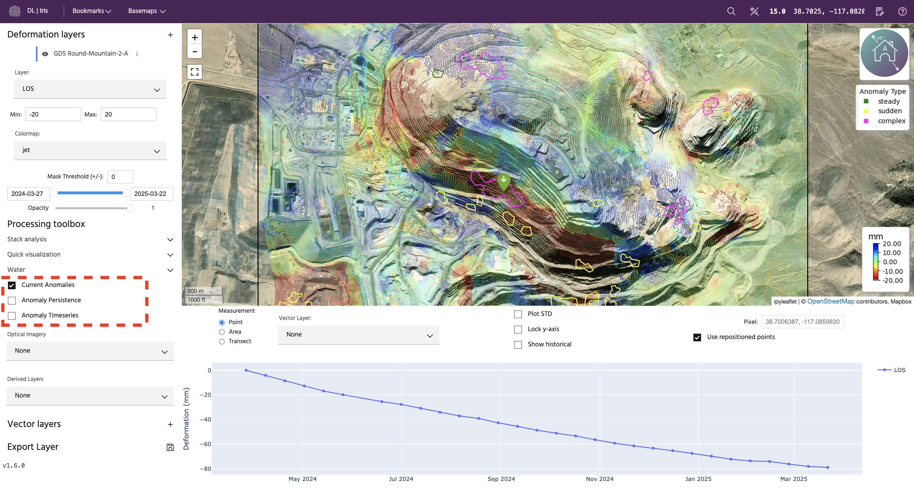
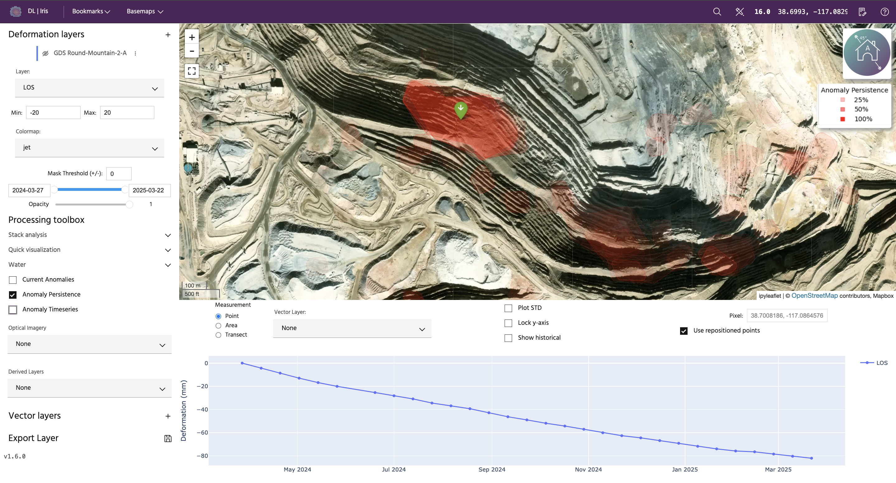
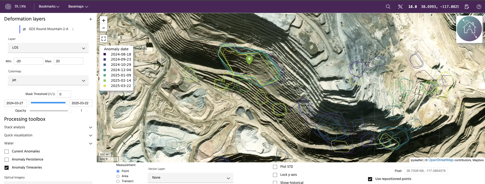

## Deformation anomalies

The goal of **anomaly detection** is to identify behaviors that may indicate potential issues, and to identify regions where there has been a change from the historical trend that may require attention. These trends are meant to easily highlight areas that are deforming rapidly or anomalously, but do not predict any type of future motion or the overall stability of an area.

<!-- prettier-ignore-start -->

!!! Tip
    To read more about deformation anomalies in Iris, check out our Knowledge Base article [here](https://mining.earthdaily.com/knowledge-base/knowledge/anomaly-detection).

<!-- prettier-ignore-end -->

Click the checkboxes in the left panel to add anomalies to the current analysis. There three are ways to visualize deformation anomalies.

<!-- prettier-ignore-start -->
!!! Note
    Multiple types of anomalies can be plotted at the same time
<!-- prettier-ignore-end -->

### **Current anomalies**

Current anomalies are areas for the latest collect in the analysos that are classified as one of three types (see legend):

1. Steady: deformation with a linear trend over the last 120 days and a velocity above 0.05 mm/day
2. Sudden: deformation with statistically anomalous increase in velocity within the last 4 collects
3. Complex: both steady and sudden behavior within a contigious area

### **Anomaly persistence**

Regardless of type, anomalies for all collects are plotted with a low opacity. Therefore, high opacity areas have more persistant anomalous deformation than low-opacity features.

### **Anomaly time series**

Anomalies for all collects are plotted, colored by date. This allows users to see how features have changed over time.

--8<-- "snippets/contact-footer.md"
