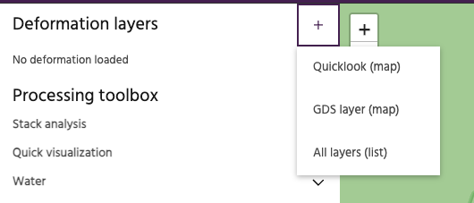
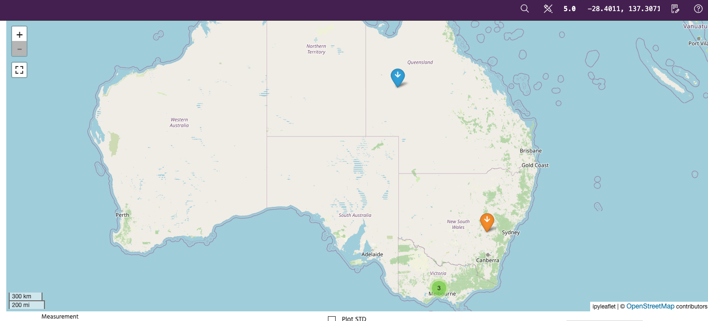
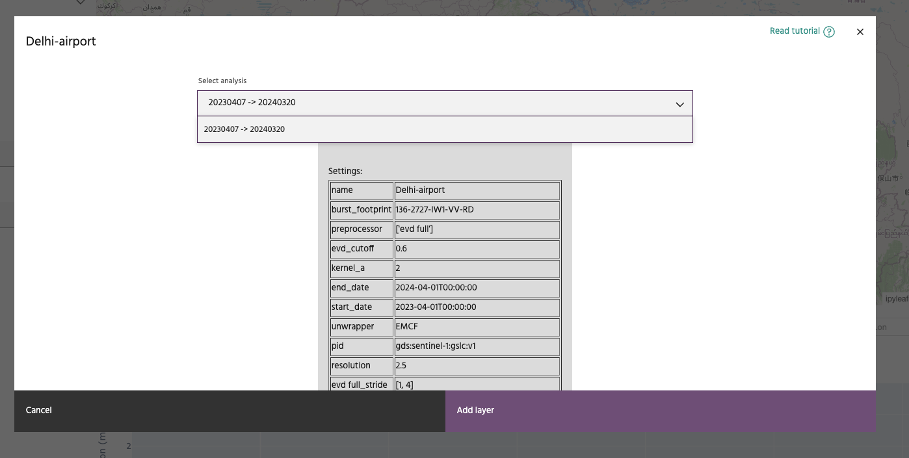
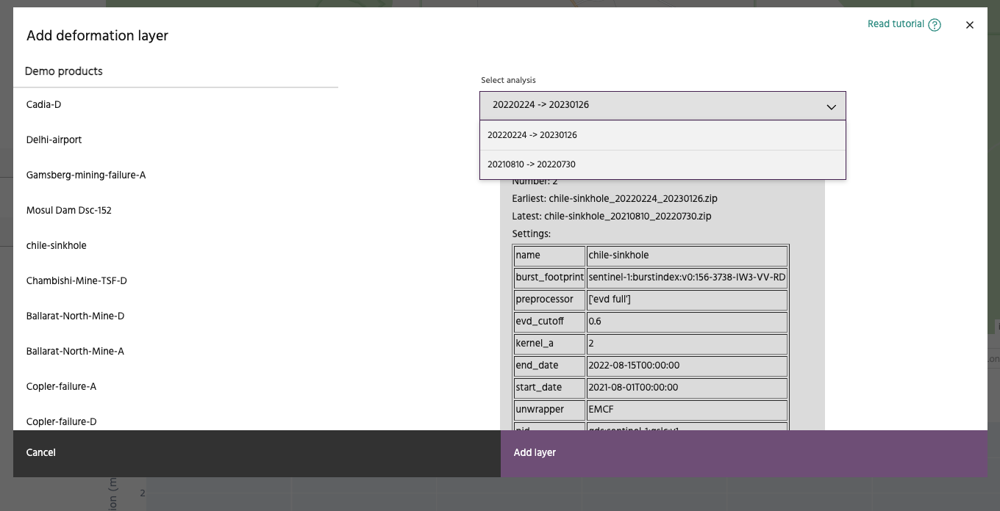

## Add deformation layers for visualization

Click the plus sign next to Deformation layers and select the method to choose AOIs to load.

### **Add a deformation layer via Map view**

When you select `GDS layer (map)`, the map in the visualization window is updated with markers to show AOIs available to the user.
**Demo** sites are indicated by orange markers and **Customer** sites by blue markers. The icon of the marker indicates the imaging geometry of the stack used for the analysis: An up arrow to indicate an ascending track, a down arrow to indicate a descending track and a cross to indicate East-West-Up analysis.

The image below is representative and the actual sites available to the user may differ.

Click on an icon to open up the detailed view of the AOI. In this view, pick an analysis spanning
the time period of interest from the drop down labeled `Select analysis` and hit `Add layer` to
load the analysis.

### **Add a deformation layer via List view**

When you select `All layers (list)`, it will open a text dialog with all analyses available to the user. The sites available to the user are organized by categories - **Demo**, **Customer** and **Quicklook**. Click on the AOI of interest and details pertaining to the AOI are shown alongside. In this view, pick an analysis spanning
the time period of interest from the drop down labeled `Select analysis` and hit `Add layer` to
load the analysis.

--8<-- "snippets/contact-footer.md"
