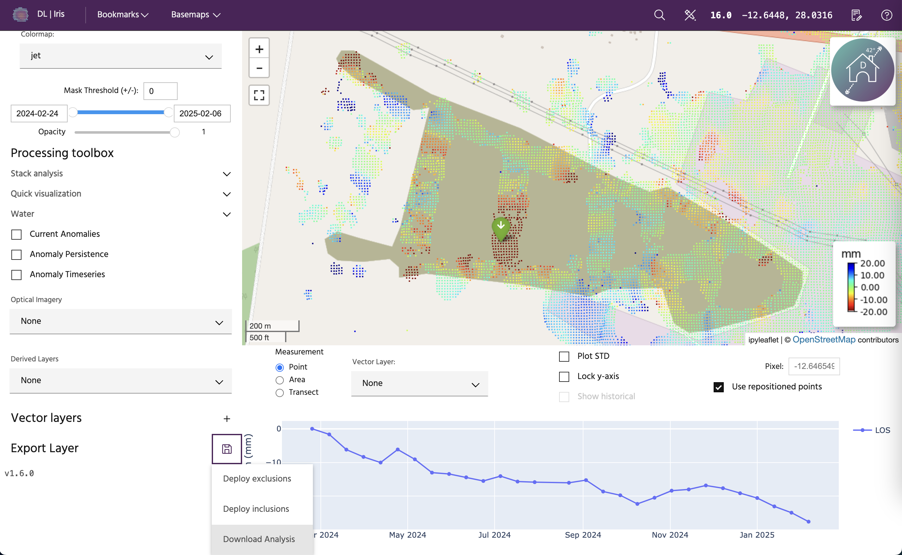
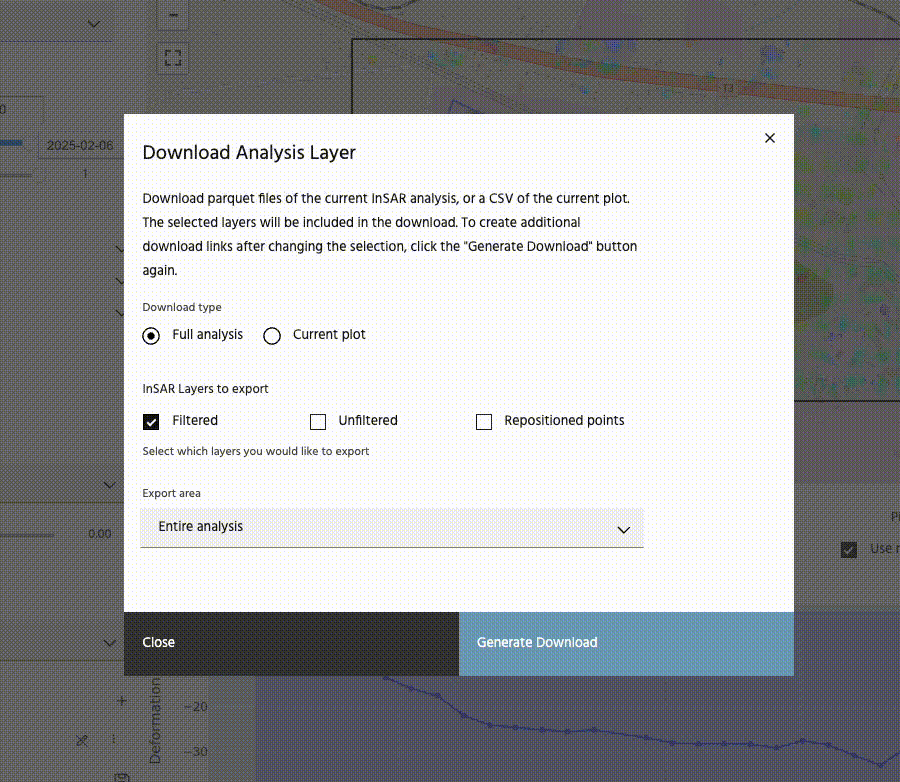
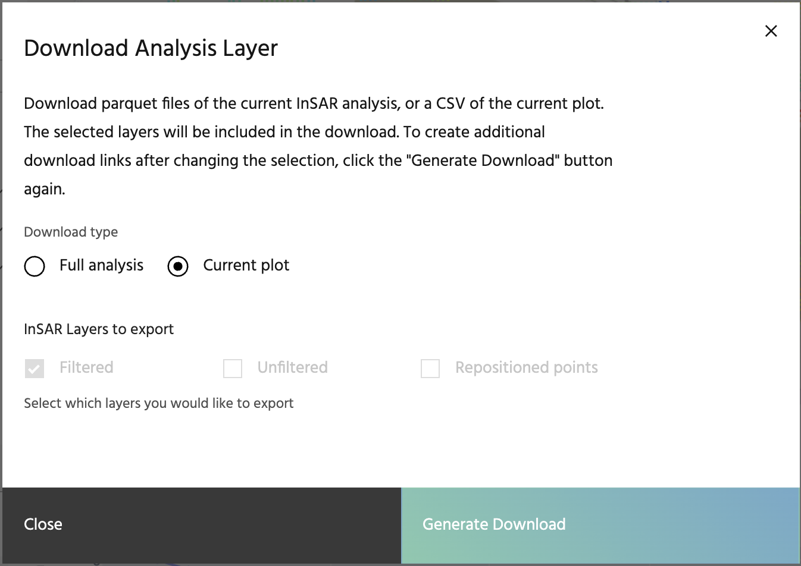

# Export data

Data available in iris can be downloaded for use in other software. To download data, scroll to the bottom of the left panel and click the save icon next to the `Export Layer` label.

## Download .parquet file

To download the entire analysis as a parquet file, first select the layers you would like (`Filtered`, `Unfiltered`, and/or `Repositioned points`), then select the area you would like under the `Export area` dropdown. If you choose `Entire analysis`, all of the points will be downloaded. Next, click on the `Generate Download` button. This will create a link that you can click on to start your download. **MGRS**, **EASTING**, **NORTHING**, **VEL**, **ACC**, **STDDEV**, **ALERT**, **COHERENCE**, **LAT**, **LON**, and **geometry** will be downloaded as well as the layers you have selected, when available.

<!-- prettier-ignore-start -->
!!! tip
    If you'd like to download a different set of data, click the `Generate Download` button a second time to recreate the download link.
<!-- prettier-ignore-end -->

## Download current plot

To download the current data shown on the plot, toggle the button to the `Current plot` option. Selecting `Generate Download` will automatically download a .csv file containing whatever data is currently on the plot. If point data is selected, the latitude and longitude will be included in the file name. If a transect or area is selected, the name of the polyline/polygon will be included in the file name. All data shown on the map, including deformation, historical data, standard deviation, etc. will be included in the output, with the exception of velocity and acceleration. In the case of point and area plots, dates will be included for each point. In the case of transect data, the latitude and longitude of each point will be included.

--8<-- "snippets/contact-footer.md"
