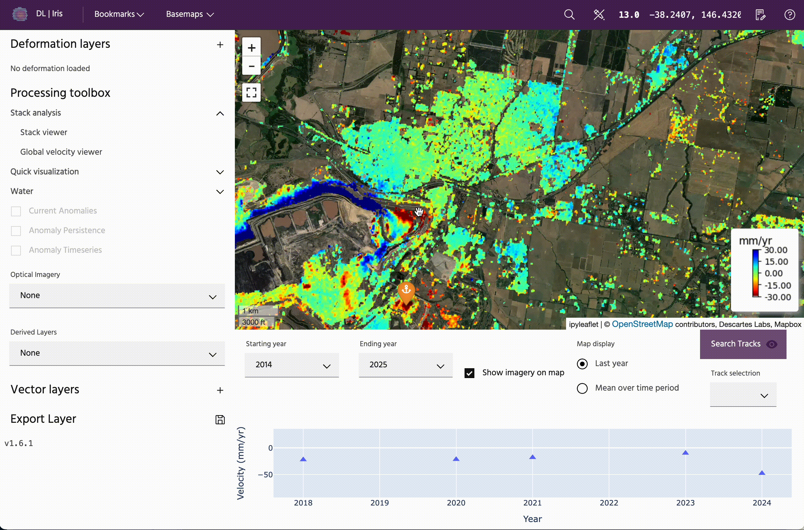
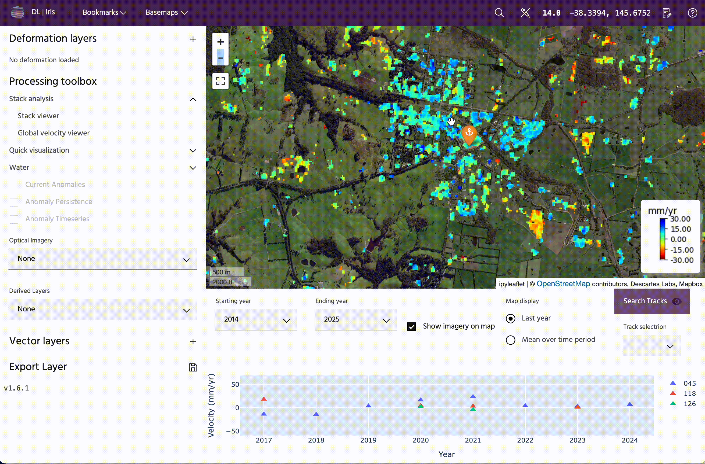

## Global velocity viewer

The **Global velocity viewer** is a tool to work with our **Global InSAR Velocity Layer** within Iris.

### **Usage**

To query points, click on the map to view the velocity data for the selected point. Velocities represent the average velocity over the calendar year displayed. To get exact values, toggle over the points.

### Starting and ending year

To update the starting and ending year, use the respective dropdowns to update what will be plotted on the time series, and, depending on settings, what will be shown on the map.

### Show imagery on map

Toggle the `Show imagery on map` button to quickly remove the data to view layers underneath. To add the Global Velocity Layer back to the map, simply check the box again.

### Map display

The data on the map can be displayed as just the velocity over the year chosen as the end date, or the cumulative mean over the time period. Looking over the most recent year can be useful for understanding recent trends, while looking at the cumulative values over the entire selected time period can be useful for highlighting long-term trends.

### Search tracks

In some locations, there will be overlapping orbit tracks. When multiple points are present for a specific date, this indicates overlapping orbits are present. The orbit tracks are each processed separately, so it is recommended that the data on the map be visualized separately.

To do so, click on the `Search tracks` button, which will populate the dropdown below. Click on a particular orbit track to view data only from this track. Orbit tracks are labeled in the legend of the velocity vs year plot.

--8<-- "snippets/contact-footer.md"
