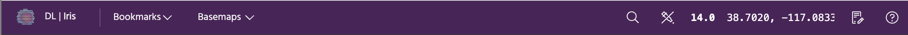
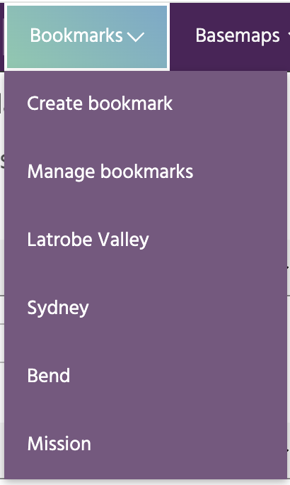
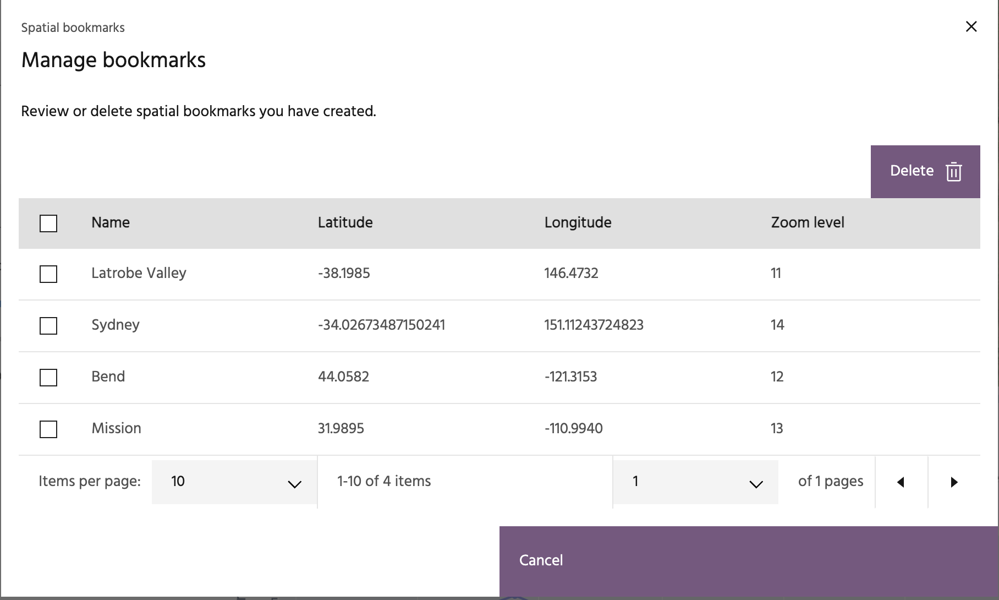
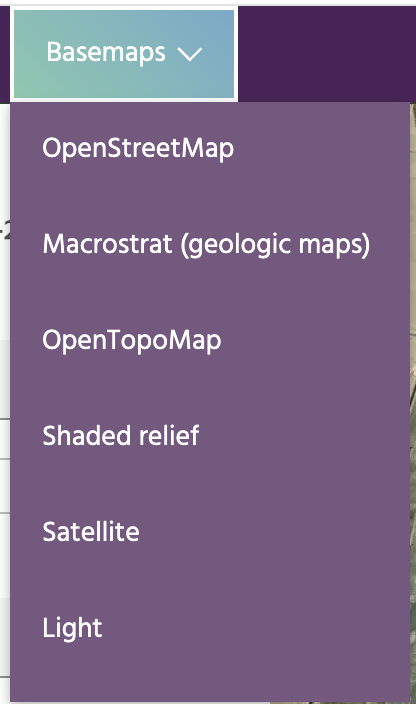
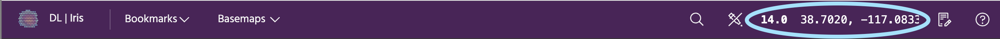
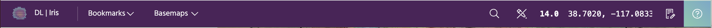

## The Iris header bar

The header bar in Iris contains several tools for adding baselayers,
manipulating the map, and links to further information on Iris itself.

### **Bookmarks**

Bookmarks are a convenient way to store locations that you will return to often.
Each bookmark is defined by a latitude/longitude location and a zoom level.
Clicking on a bookmark will move the map to the defined center and zoom. Click
`Create a bookmark` to add the current map location as a bookmark, or click
`Manage bookmarks` to review and manage your current bookmarks.

### **Basemaps**

Basemaps provide different images underlying the deformation points to
help interpret what you're seeing on the map. These include free optical
imagery, shaded relief, OpenStreetMap, and more.

### **Zoom and center**

Controls the center latitude/longitude value and zoom level of the map.

### **Pixel inspector**

The pixel inspector will extract the pixel values for currently visualized
layers that are from Optical Imagery and Derived Layers. Click the icon to
start an inspector session, and click on the map to extract a point.
Clicking the map in another location will move the inspection point and
recompute the values shown in the box.

### **Changelog**

Click this icon to bring up the release notes for the most recent Iris
version.

### **Help**

The help icon links to this documentation.

--8<-- "snippets/contact-footer.md"
