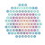

#  Intro to Iris

An overview of the Iris application and the basic processing and visualization tools.

## Basic functionality and adding layers

[Header bar functions]\
[Add deformation layers]\
[Deformation anomalies]\
[Vector layers]\
[Export data]

## Visualization settings

[Map settings]\
[Time-series settings]

## Advanced processing

[Running quicklook]\
[GVM viewer]

---

[header bar functions]: header.md
[add deformation layers]: adding-deformation-layers.md
[map settings]: visualization-settings/map-settings.md
[time-series settings]: visualization-settings/time-series-settings.md
[deformation anomalies]: adding-anomalies.md
[export data]: export-data.md
[running quicklook]: running-quicklook.md
[gvm viewer]: gvm-viewer.md
[vector layers]: vector-layers.md

--8<-- "snippets/contact-footer.md"
