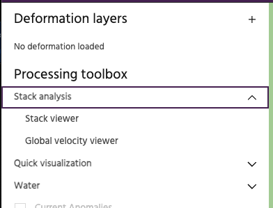
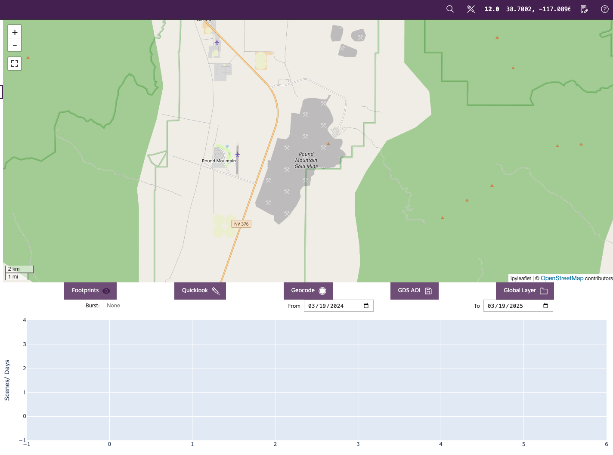
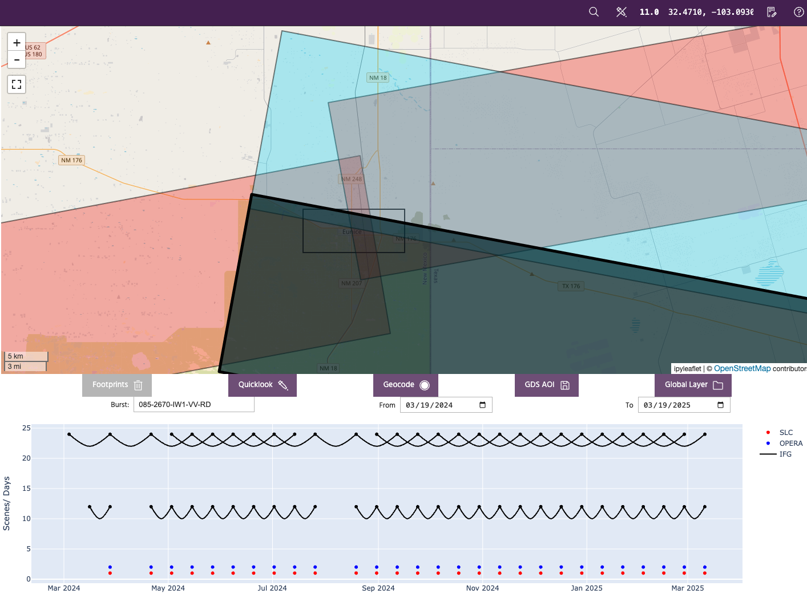
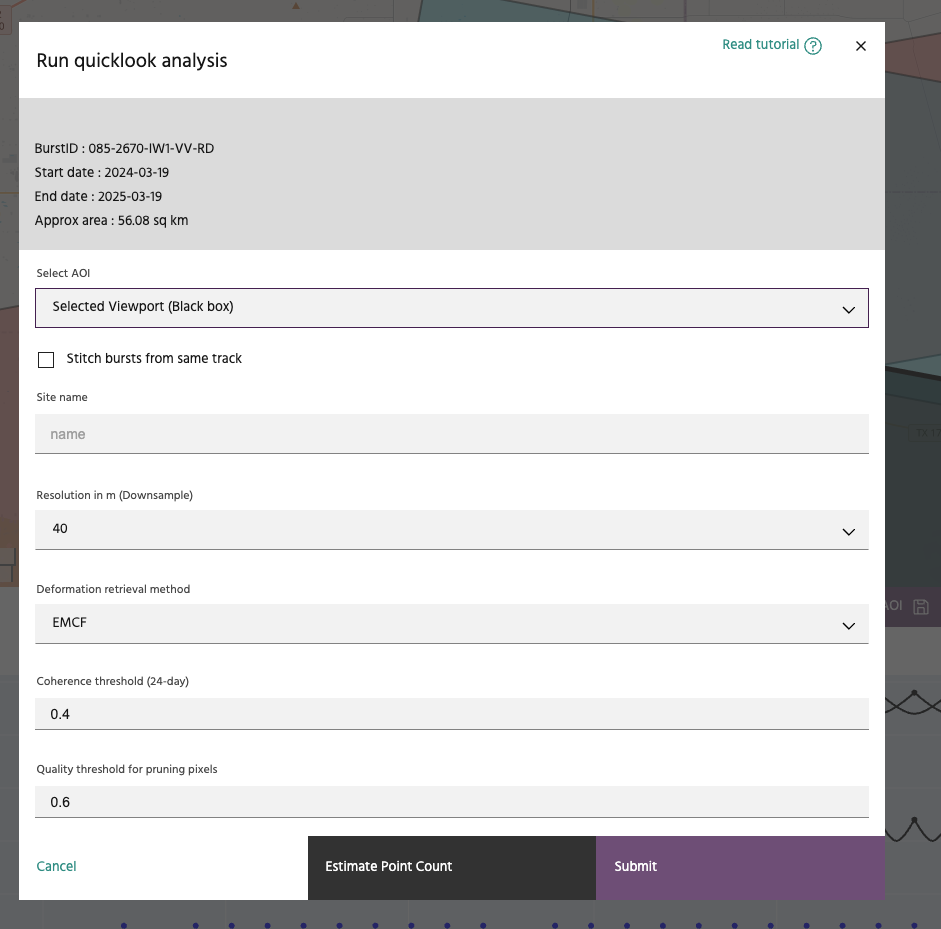
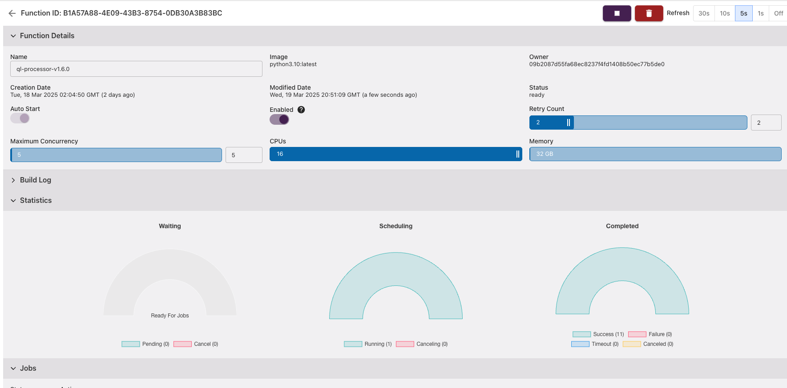

## Running Quicklook analysis

The **Quicklook analysis** tool in **Iris** can be used to quickly generate InSAR time-series over small AOIs interest. The quicklook analysis is very useful in understanding the spatial distribution of reliable scatterers over an AOI and also helps identify key deforming features quickly, when possible. Our quicklook analysis builds on our Global InSAR layer which includes all Sentinel-1 burst interferograms with a temporal baseline less than 24 days.

<!-- prettier-ignore-start -->
!!! tip
    Quicklook Analysis is only available to qualified customers with platform access.
<!-- prettier-ignore-end -->

### **Use stack analysis mode**

Select `Stack Viewer` tool from the `Stack analysis` header on the left panel.

This should change the appearance of the main map area to look like this.

<!-- prettier-ignore-start -->
!!! warning
    The actual buttons available to the user will depend on the subscription privileges.
<!-- prettier-ignore-end -->

### **Search for Sentinel-1 burst footprints**

The tool is set up to analyze the last one year of data by default. The user can modify the time period of interest as needed. Zoom over the AOI of interest and hit the `Footprints` button to look for InSAR data overlapping the area of interest in the given time period. This should update the map view as shown below:

The original search area is shown as black rectangle and is overlaid by polygons representing the Sentinel-1 burst footprints intersecting the search area. User is able to click on the polygons and the timeline plot under the map is updated with a plot of the interferogram network for analysis. This allows the user to select the imaging geometry with best temporal sampling and coverage of their AOI for the quicklook analysis.
After clicking on the burst footprint to use for analysis, hit the `Quicklook` button to open the `Run Quicklook analysis` dialog.

<!-- prettier-ignore-start -->
!!! tip
    If the selected AOI is too large, selection of burst footprints could fail. If the available interferogram network is not connected, Quicklook analysis may not be available over the AOI.
<!-- prettier-ignore-end -->

### **Verify parameters**

The `Run quicklook analysis` dialog should look like above. The user can set or verify the following parameters:

1. **AOI:** If the user has vector polygons available, they can choose a more specific polygon compared to the original search area.
2. **Stitching bursts:** If the user's AOI is not entirely covered by a single burst footprint, they can opt to stitch bursts along track to cover the AOI.
3. **Name:** Pick a meaningful name for the analysis. This field is mandatory.
4. **Resolution:** The global InSAR layer has a posting of 20m. For larger AOIs, we suggest using value of 40m or 80m to speed up the analysis.
5. **Coherence threshold:** This parameter controls the selection of a coherent reference region for time-series estimation.
6. **Quality threshold:** This parameter is similar to temporal coherence for pixel selection, prior to phase unwrapping.

At this stage, the user has an option to estimate the number of points that could potentially be generated by the chosen set of parameters.

### **Launch the analysis and monitor progress**

When ready, hit the `Submit` button and this should start a compute job on the platform. You can check the progress on the [Compute services page](https://earthone.earthdaily.com/compute).

On completion of the processing job, the results are written to the [Storage service](https://earthone.earthdaily.com/storage) and should be available for visualization. The processing time depends on the size of the AOI and the number of usable interferograms in the time period of interest. A typical 5 km x 5km AOI takes about 10 minutes to process for 1 year's worth of data.

### **Visualizing results**

The results should be available to visualize just like [other deformation layers](./adding-deformation-layers.md).

--8<-- "snippets/contact-footer.md"
