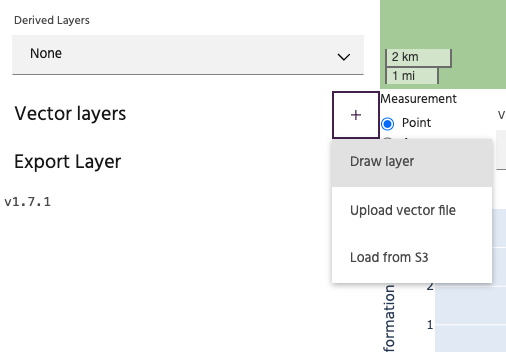
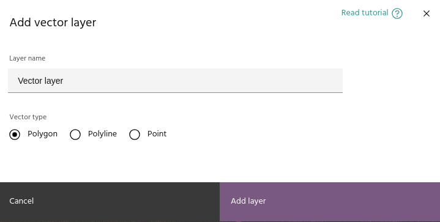
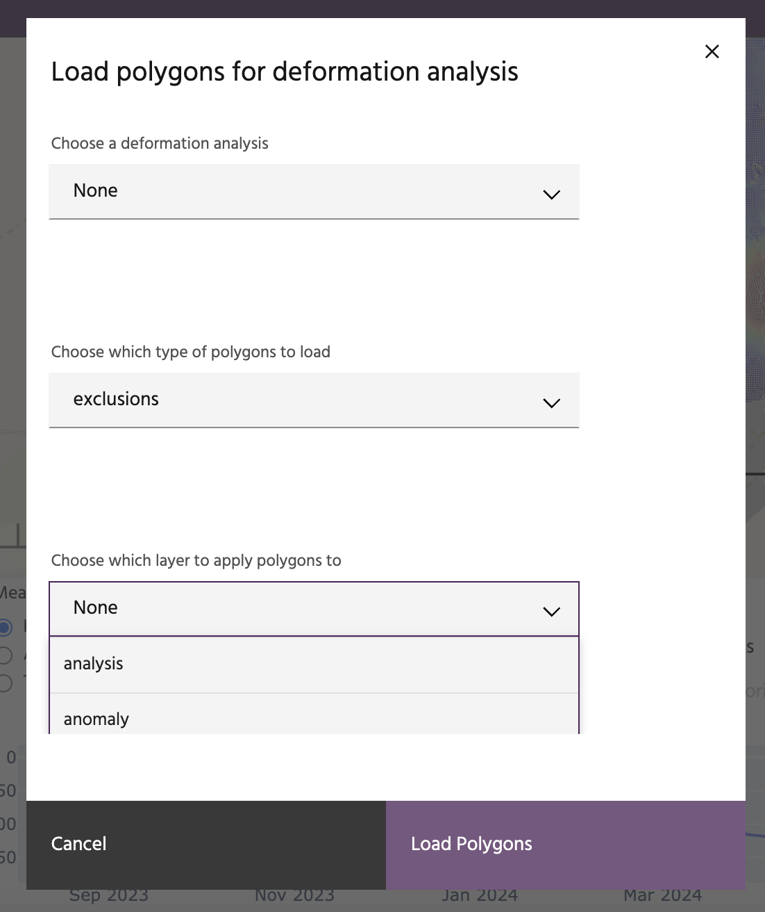

## Add vector layers

Iris supports several methods for adding vector layers to your current viewer.

### **Draw a vector layer**

Select `Draw layer` to create a vector layer by manually drawing one on the map.

The dialog allows you to type a name for the vector and select the geometry
type. Available options are `Polygon`, `Polyline`, and `Points`. After clicking
the `Add layer` button, the new vector will appear in the layer list. Click the
[draw](index.md#toggle-drawing) icon to toggle drawing, then click the new icon
on the map to begin the drawing session.

<!-- prettier-ignore-start -->

!!! tip
    The icon on the map will indicate whether the drawn layer will be a polygon,
    point, or polyline.

<!-- prettier-ignore-end -->

Click on the map to draw the desired vector object.

- For polygons, finalize the polygon by clicking the first point to close the
  polygon.
- For polylines, finalize by clicking the last point.
- For points, each individual point will be drawn separately.

### **Upload a GeoJSON layer**

Select the `Upload vector` option to load a vector layer from your local
computer. Valid formats for loading vectors include:

- GeoJSONs
- Shapefiles (as `.zip` archives)
- GeoPackage (`.gpkg`)
- CSVs
- Parquet
- AutoCAD DXF
- KML/KMZ

<!-- prettier-ignore-start -->

!!! warning
    Vector files have a large amount of variability from one software package to the
    next. Iris attempts to load vectors using the
    [GeoPandas](https://geopandas.org/en/stable/docs/reference/api/geopandas.read_file.html)
    package, which is successful for most vector files from common sources (QGIS,
    Arc, etc). For help loading non-standard vector layers, contact 
    [support](mailto:support@earthdaily.com).

<!-- prettier-ignore-end -->

### **Load from S3**

This is a special option that loads specific polygons associated with customizations requested for a customer site. This option can
only be used after a [deformation layer](./adding-deformation-layers.md) has been added for visualization.
Users will have the option to choose the project, the type of polygons (exclusion or inclusion) and whether to apply it to the current analysis to mask the analysis or alerts.

--8<-- "snippets/contact-footer.md"
