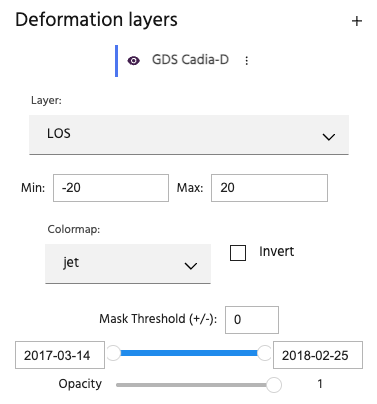
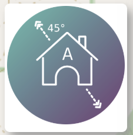
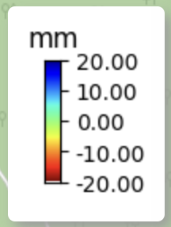
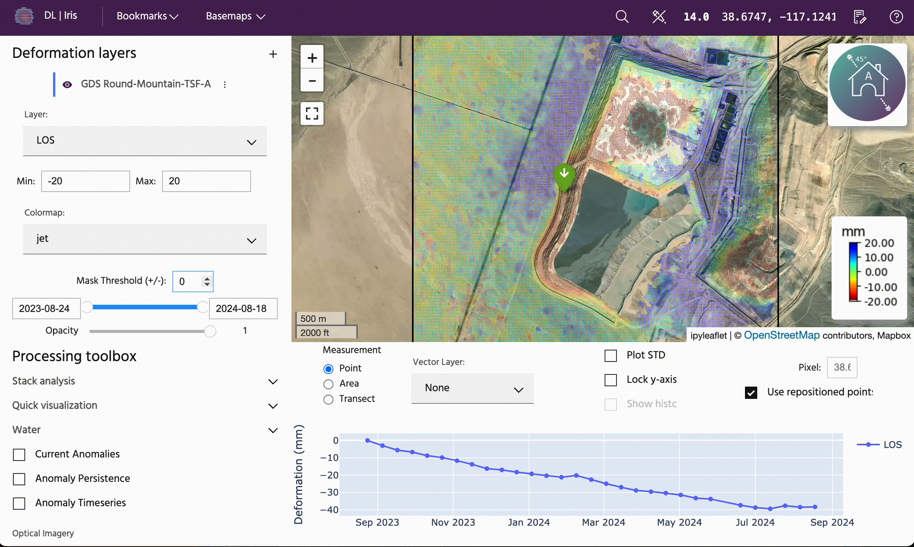
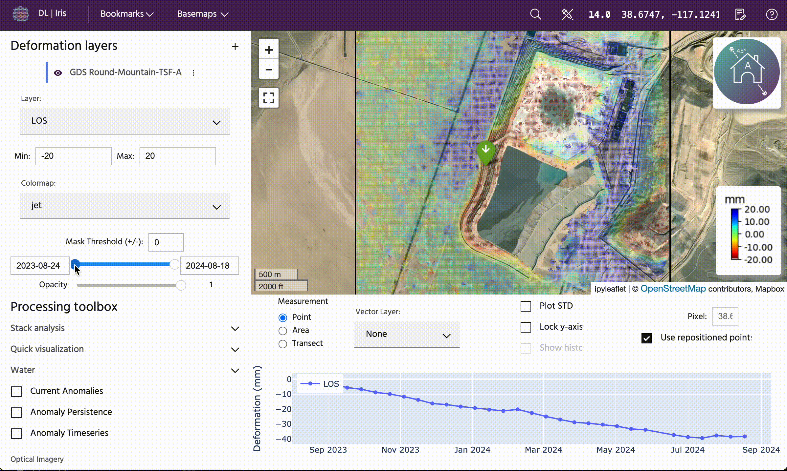

# Map settings

Settings to control what the InSAR points look like on the map.

The eyeball icon allows the points on the map to be toggled on and off without needing to remove the analysis fully.

## Layer

This dropdown allows you to choose the layer you would like to display. For ascending or descending analyses, this will default to **LOS**, which stands for line of site.

<!-- prettier-ignore-start -->

!!! Tip
    More information about Sentinel-1 InSAR, including look direction, can be found [here](https://hyp3-docs.asf.alaska.edu/guides/insar_product_guide/#brief-overview-of-insar).

<!-- prettier-ignore-end -->

The incidence angle is plotted at the top right of the map for easy interpretation of direction of motion.

If the analysis is an east-west-vertical analysis, obtained by combining ascending and descending, the default will be **Up (+) Down (-)**. By selecting the dropdown, you can choose a different layer to display on the map. For line of sight analyses, you will typically find **LOS Uncertainty**, **LOS (Unfiltered)**, **LOS Velocity (180 days)**, **LOS Acceleration (180 days)**, **Coherence**, and in some cases, **Estimated DEM error**. For east-west-vertical analyses, the options will typically include **Up (+) Down (-)**, **Vertical Uncertainty**, **Up (+) Down (-) (Unfiltered)**, **Vertical Velocity (180 days)**, **Vertical Acceleration (180 days)**, **East (+) West (-)**, **East/West Uncertainty**, **East (+) West (-) (Unfiltered)**, **East Velocity (180 days)**, and **East Acceleration (180 days)**. Changing these layers will both change which points are overlain on the map, and will update what is being plotted on the plot below the map. For more information about settings for the plot below the map, visit [time-series settings](./time-series-settings.md).

## Min & Max

The Min and Max values control the colorbar being used to plot the data. Changing these values can be useful for highlighting areas of high amounts of motion. For line of sight analyses, negative motion is motion away from the satellite (e.g. subsidence), and positive motion is motion towards the satellite (e.g. uplift). For east-west-vertical analyses, negative motion is down or west, and positive motion is up or east. This information is provided in the name of the layer.

Changes to the min & max values will be reflected in the colorbar on the bottom right of the map. Numbers can be typed in or changed incrementally using the arrows.

## Colormap

The colormap dropdown allows you to change what color the points are plotted on the map. It defaults to **jet**. Changing this will change the colors on the map and the colorbar.

## Invert colormap

The **Invert colormap** button flips the colormap for the layer, while maintaining the same min and max values.

## Mask Threshold (+/-)

The mask threshold allows you to mask out points below a certain value. This is helpful for quickly identify large areas of motion, while ignoring smaller areas of motion. Numbers can be typed in or changed incrementally using the arrows.

## Time slider

Below the **Mask Threshold** is the **Time Slider**, which allows users to adjust both the start and end date of the analysis. The cumulative deformation over the given time window will be plotted on the map.

## Opacity

The **Opacity** slider allows the user to change the transparency of the points on the map. 1 is the default, and 0 is fully transparent. This can be useful to easily see what is below the points on the map without having to fully toggle on and off the layer.

--8<-- "snippets/contact-footer.md"
