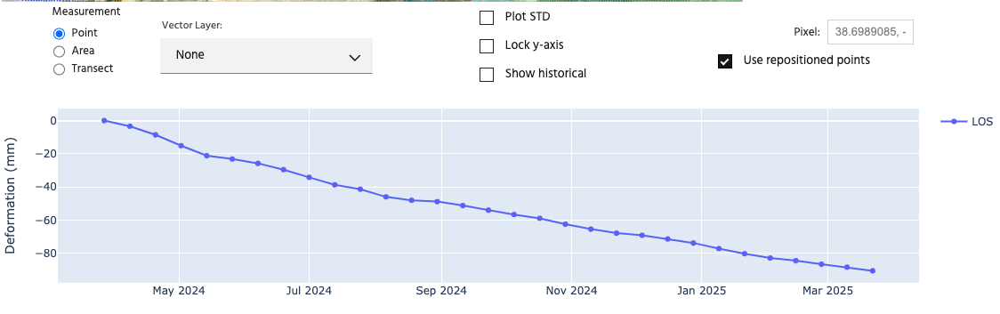
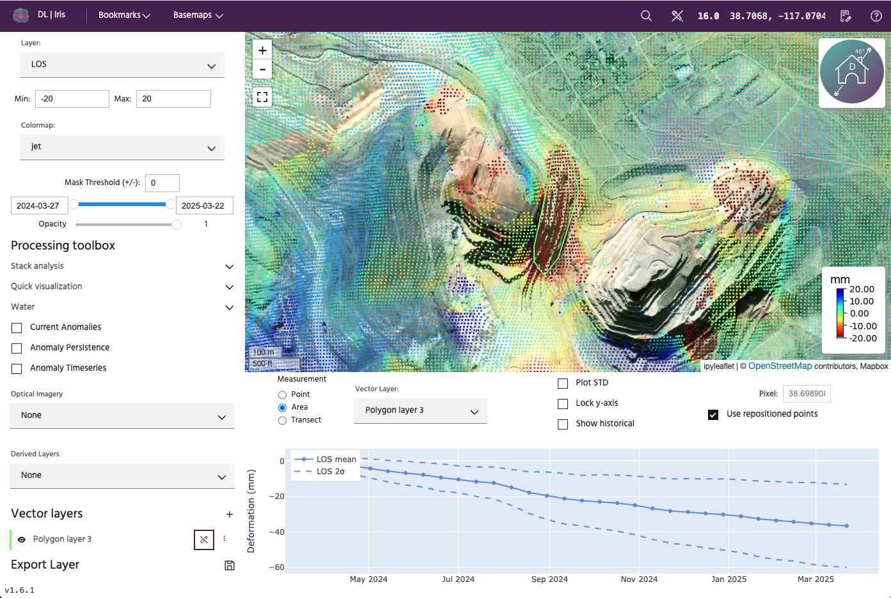
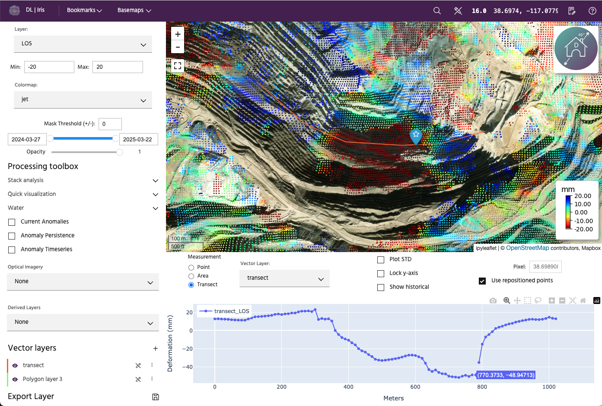
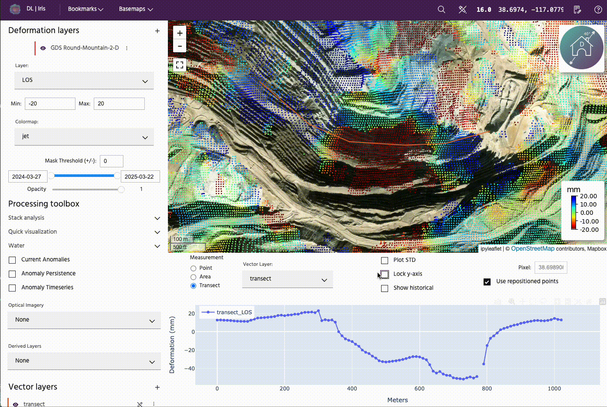
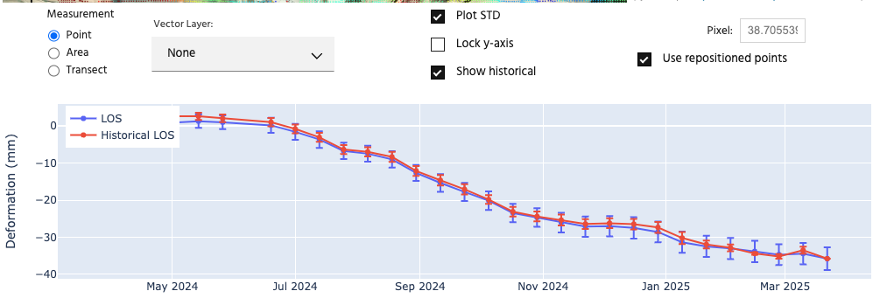
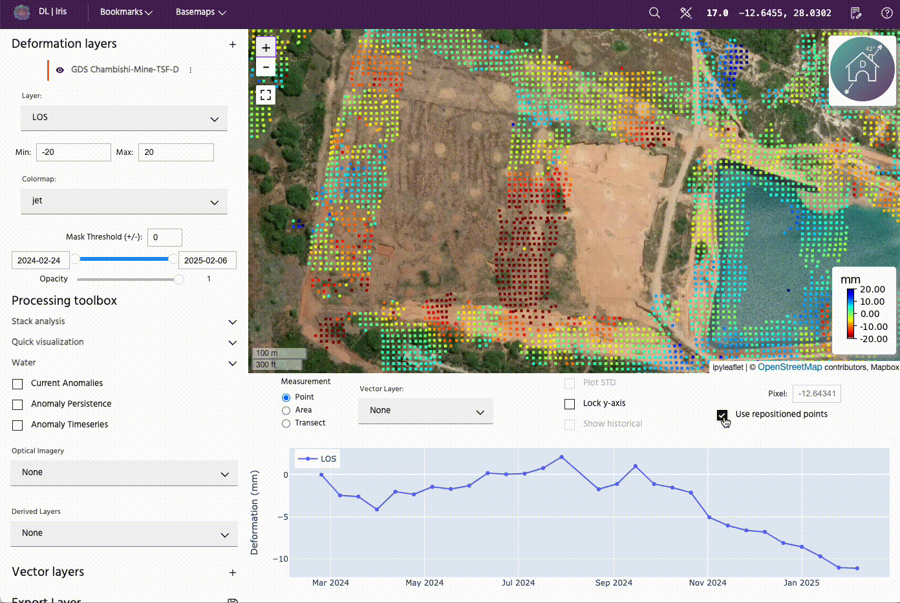

## Time series settings

Controls for data displayed on the time series.

### **Measurement type**

In Iris, you have the ability to plot **Point**, **Area**, or **Transect**. **Point** is the default, and will correspond to the data at the green pointer on the map. To select points, simply drag the pointer to a new location on the map.

**Area** will compute the average area and 2 times the standard deviation over a chosen polygon. To display area, toggle the radio button to the **Area** label, then select polygons using the **Vector Layer** dropdown, which will display the available polygons you have drawn or loaded into the session. Refer to the [Vector layers](../vector-layers.md) page for instructions on adding/creating vectors.

**Transects** will display the data along a transect. The data is from the end epoch selected with the time slider (see [Map settings](map-settings.md) for more information), meaning it will be consistent with what is displayed on the map. The vertical axis will remain as deformation in mm, while the horizontal axis will now be meters along the transect. To display the transect, toggle the radio button to the **Transect** label, then select polylines using the **Vector Layer** dropdown, which will display the available polylines you have drawn or loaded into the session. Refer to the [Vector layers](../vector-layers.md) page for instructions on adding/creating vectors.

<!-- prettier-ignore-start -->

!!! Tip
    To see the exact location a point is on the map, you can hover over the transect data plotted and a blue pointer will show you the location on the transect.

<!-- prettier-ignore-end -->

### **Plot STD**

Clicking the `Plot STD` checkbox will plot the standard deviation for the layer, if it applies to the layer. If it does not apply to the selected layer, the checkbox will be greyed out.

### **Lock y-axis**

The lock y-axis button locks the time series to its current limits, instead of scaling the y-axis as you select different points to display. This can be particularly useful when comparing magnitudes of different points, or to watch the development of deformation over time along a transect.

### **Show historical**

This checkbox can be toggled on and off to look at the historical statistics of the data being plotted, if previous analyses exist. The historical analysis is the mean of all other analyses that were run that included this particular point.

<!-- prettier-ignore-start -->

!!! Tip
    To read more about DEM-error corrected points in Iris, check out our Knowledge Base article [here](https://mining.earthdaily.com/knowledge-base/knowledge/historical-consistency).

<!-- prettier-ignore-end -->

If `Show historical` is checked as well as `Plot STD`, the standard deviation for the current analysis is calculated from only this analysis, while the historical standard deviation is calculated from all of the other analyses included for this point. If no historical analyses exist for a dataset, the box will be greyed out.

### **Pixel**

This box gives the exact pixel location of the point you have selected in lat/long coordinates.

### **Use repositioned points**

The **Use repositioned points** button allows the points to be displayed either using their regularly-gridded locations at the given posting, our with point locations that have been corrected for DEM-errors.

<!-- prettier-ignore-start -->

!!! Tip
    To read more about DEM-error corrected points in Iris, check out our Knowledge Base article [here](https://mining.earthdaily.com/knowledge-base/knowledge/dem-error-corrected-point-locations).

<!-- prettier-ignore-end -->

The default behavior is to use the repositioned points. If DEM-error corrected points do not exist for a dataset, the box will be greyed out.

--8<-- "snippets/contact-footer.md"
