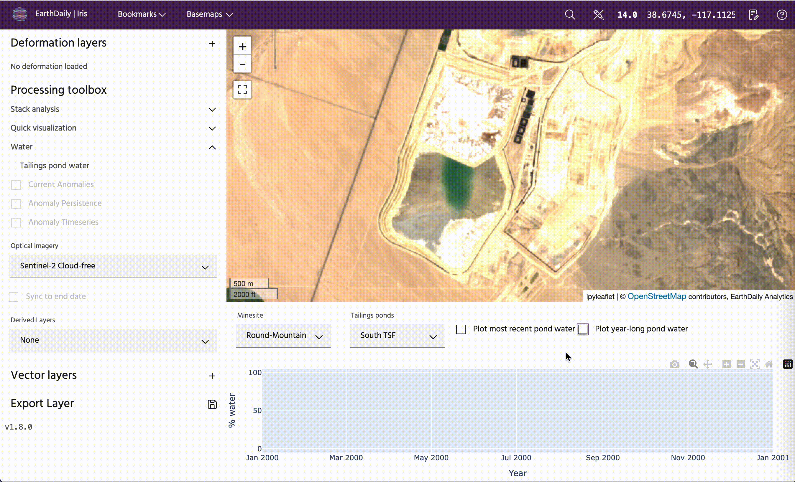
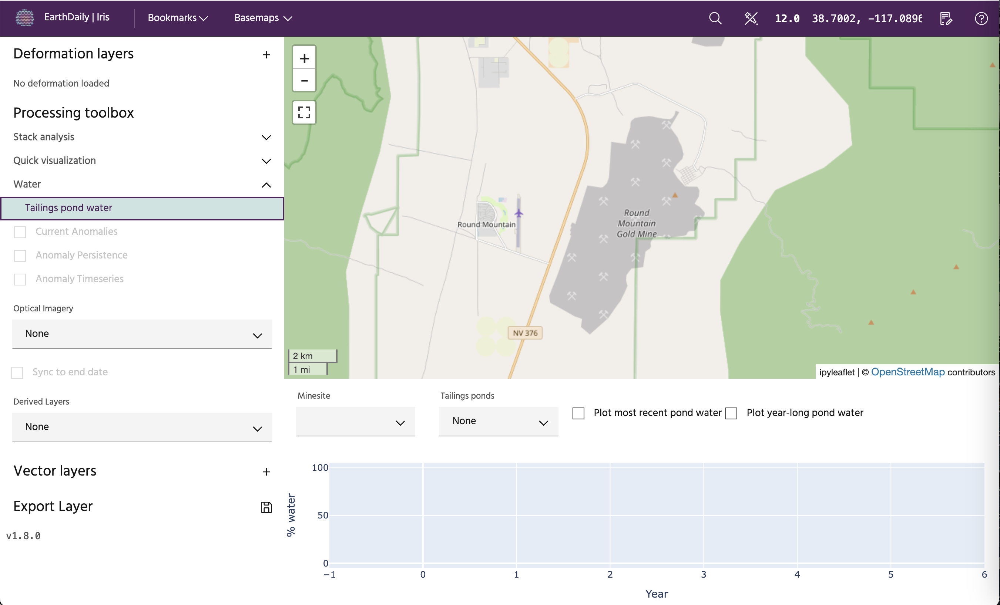
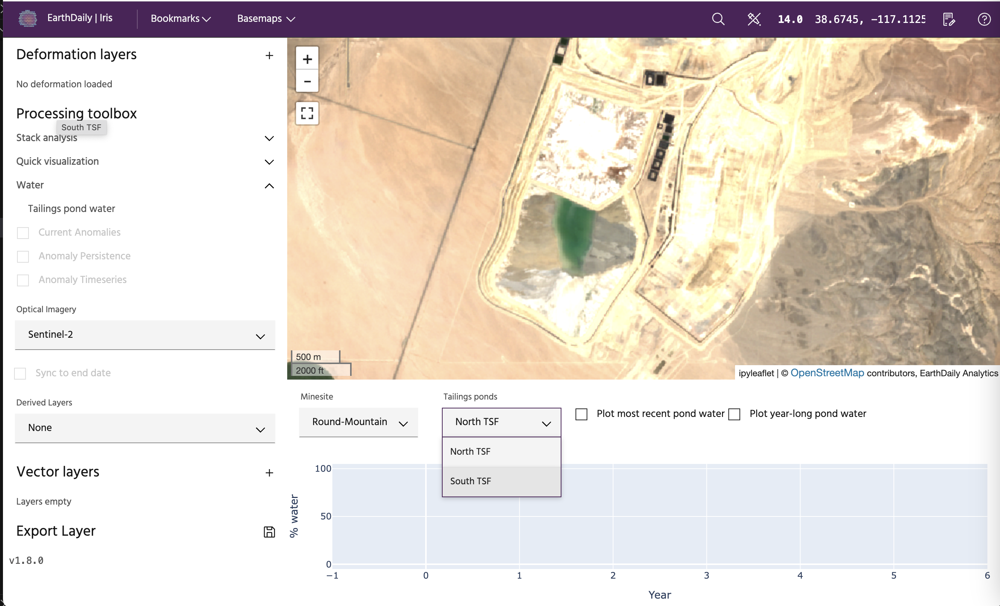
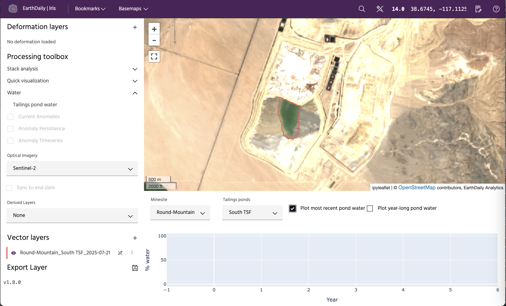
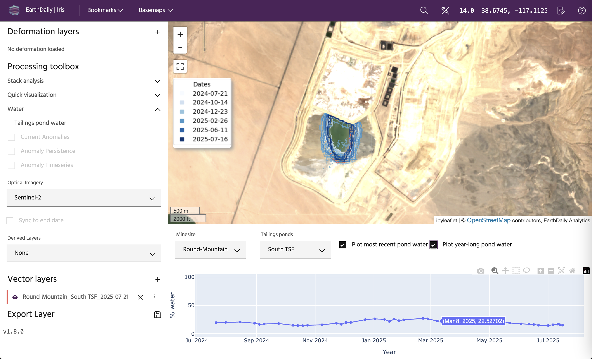

# Tailings pond viewer

The **Tailings pond viewer** is a tool to interact with measurements of tailings pond levels. This tool is useful for understanding how much water is currently stored within a tailings pond, as well as how this has changed over time, which can be useful for understanding the health of the pond, meeting regulations, and understanding production levels.

<!-- prettier-ignore-start -->
!!! tip
    Water monitoring is only available for customers with an appropriate license. Contact support@earthdaily.com to discuss monitoring pond water at your sites!
<!-- prettier-ignore-end -->

## Usage

### Accessing tailings pond water

To access the tailings pond viewer, on the lefthand side, under **Water**, select **Tailings pond water**. If you have InSAR layers open at this time, you will be asked to confirm you would like to switch modes before proceeding.

From here, you can select on your minesite of interest, and then select which pond you would like to monitor. When you select the minesite, you will be taken there on the map.

### Plotting most recent water

To see the most recent water on the map, click the **Plot most recent pond water** button. This will plot the most recent water derived from cloud-free imagery. This will also create a polygon under your vector layers with the date the measurement was taken that can be downloaded as a GeoJSON.

<!-- prettier-ignore-start -->
!!! note
    Since water monitoring requires cloud-free imagery, it is possible that the most recent measurements will have occurred a few weeks prior.
<!-- prettier-ignore-end -->

### Plotting year-long history

To plot the year-long history, select the **Plot year-long pond water**. This will plot the polygons from the past year on the map, and the percentage of the pond that was water on the plot below. To see specific dates and values, hover of points on the plot.

--8<-- "snippets/contact-footer.md"
