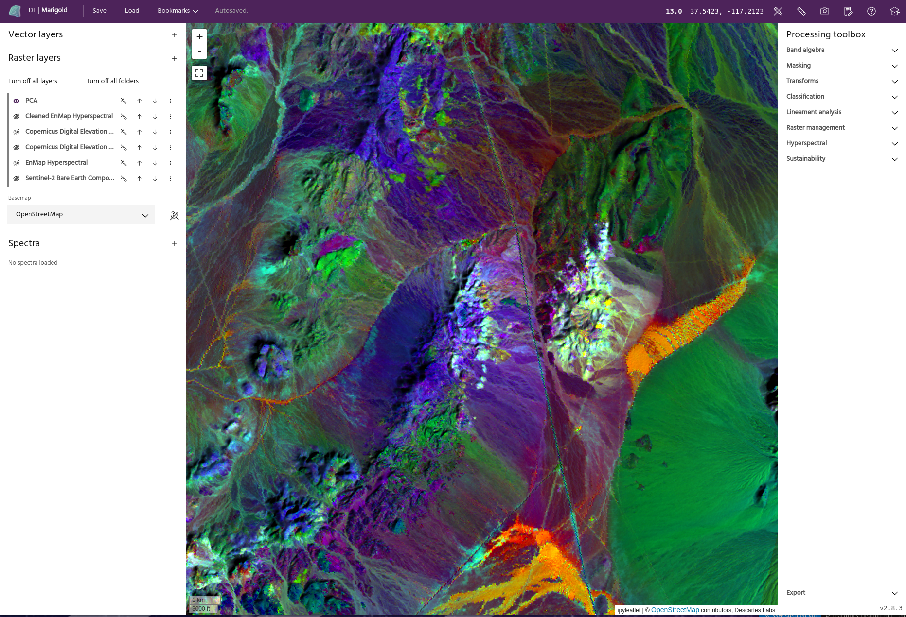

## What is Marigold?

Marigold is a geographic information system (GIS) user interface that is built
on top of the EarthOne platform and tailored to exploration geologists. By
simplifying the access and analysis of remote sensing data, Marigold transforms
mineral exploration workflows.

### **Working with Marigold**

Marigold simplifies your mineral exploration workflows, so you can hit the
ground running with geospatial data --- no coding necessary.

### Fast

The EarthDaily Advanced Mineral Exploration package reduces prep time for
mineral exploration by up to 85%. Marigold further improves your workflows by
making it easier to analyze data and share projects with colleagues.

### Streamlined

All the tools you need are all in a single, easy to use interface. No more
switching between applications or working with complex bits of code.

### Global

Our Bare Earth Composite gives users access to the clearest pixel everywhere on
Earth. Work with analysis-ready data to derive insights from the smallest to the
largest scale.

### **Getting started with Marigold**

### New to remote sensing?

If you're new to the world of satellite imagery, learn how remotely sensed data
provides valuable insights we can't capture on the ground.

### Looking to jump in?

Hit the ground running by accessing Marigold, adding new layers and mineral
targets, and running a spectral similarity algorithm to identify potentially
prospective areas.

### Ready to keep learning?

Follow along in some of our case studies to learn how to spot different types of
mineralization from start to finish.

--8<-- "snippets/contact-footer.md"
