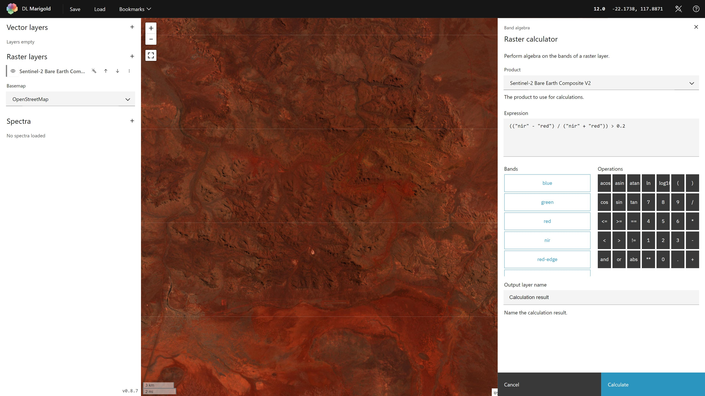

## Create a custom mask

Use the [Raster calculator] tool to create
a custom mask.

The expression below will output a new layer, with pixels defined as
True assigned a 1 and all other pixels assigned a 0. The
[Apply a mask] tool can use this new layer
to mask out pixels where the red band and green band values are both
greater than 0.2.

To help you understand what values to use in your expression, you can
**Calculate histograms** in your layer settings.

[apply a mask]: ../processes/apply-a-mask.md
[raster calculator]: ../processes/raster-calculator.md

--8<-- "snippets/contact-footer.md"
