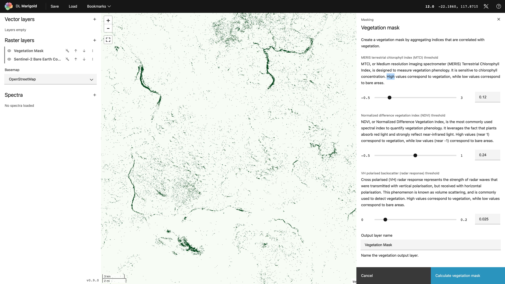
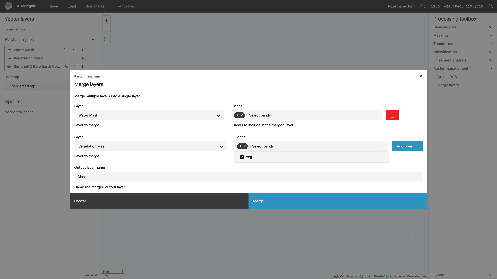
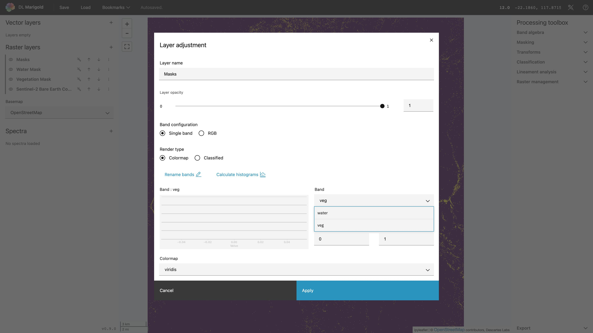
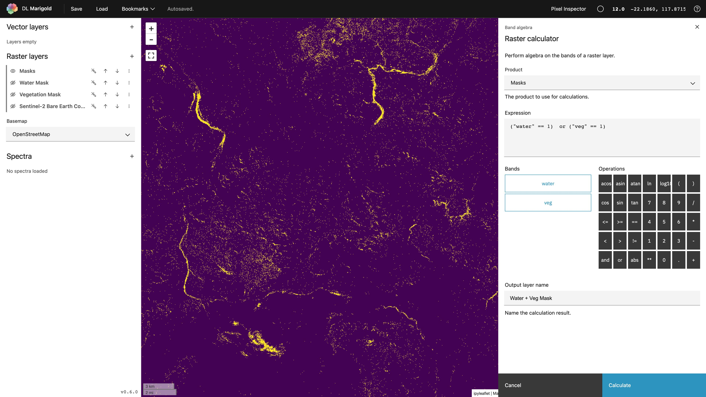
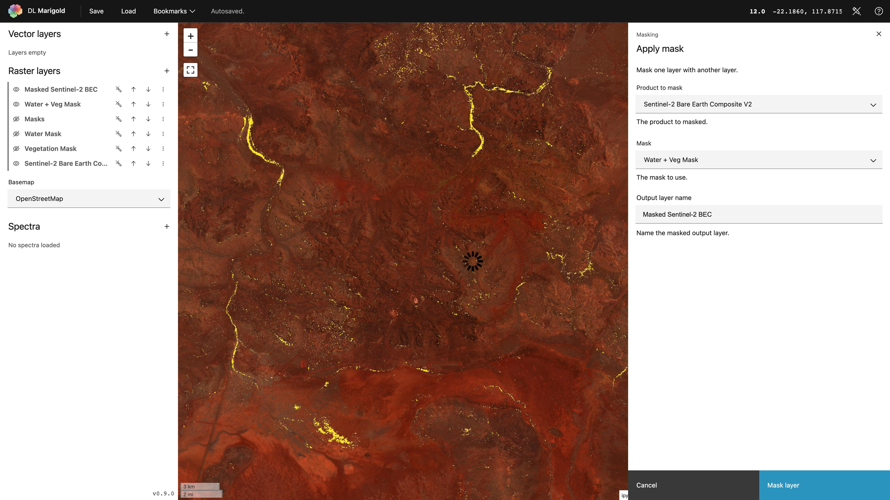

## Mask vegetation and water in your imagery

After creating a [Vegetation mask] and a [Water mask], you can combine them into
a single mask using the [Merge layers] tool and the [Raster calculator]. This
layer can then be applied to mask out vegetation and water in other layers using
the [Apply a mask] tool.

Create your masks.

**Merge** the two layers into a single multiband layer, so you can use the
processing tools on the combined set of bands.

Now you will have a new layer that contains two bands - one containing the water
mask and one containing the vegetation mask. You can visualize either band as a
single band image by adjusting the settings of the layer.

To combine the two bands into a single mask layer, select the newly created
layer in the [Raster calculator] and create an expression that combines the two
mask bands into a single layer. You'll want to select pixels where either the
vegetation mask band or the water mask band is True:
`(("veg" == 1) or ("water" == 1))`

Now you can apply the mask to another layer using [Apply a mask], or use the
classification mask for your analysis.

[apply a mask]: ../processes/apply-a-mask.md
[merge layers]: ../processes/merge-layers.md
[raster calculator]: ../processes/raster-calculator.md
[vegetation mask]: ../processes/vegetation-mask.md
[water mask]: ../processes/water-mask.md

--8<-- "snippets/contact-footer.md"
