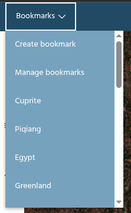
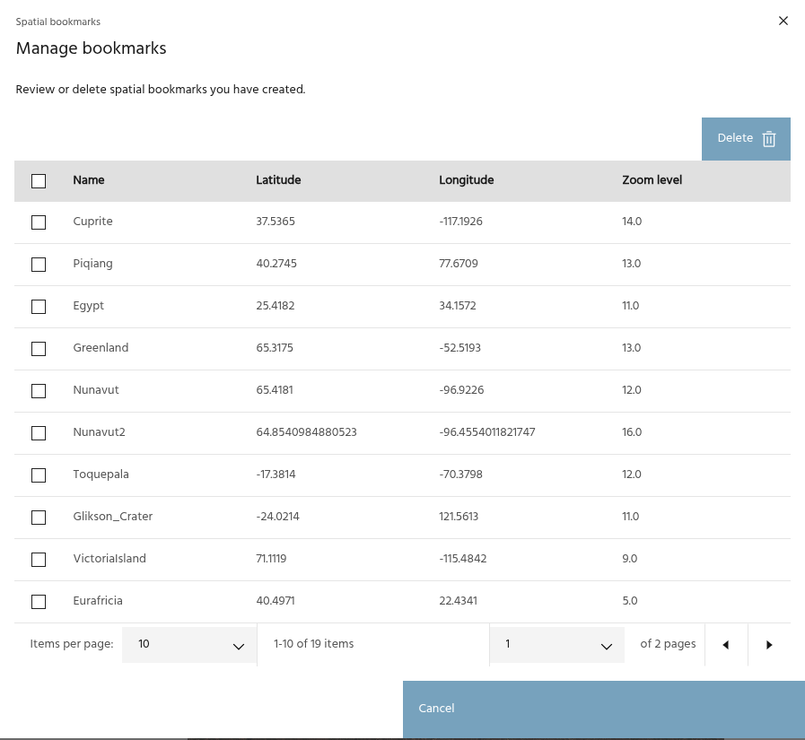
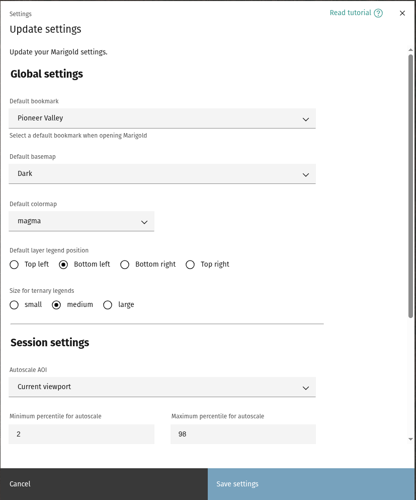
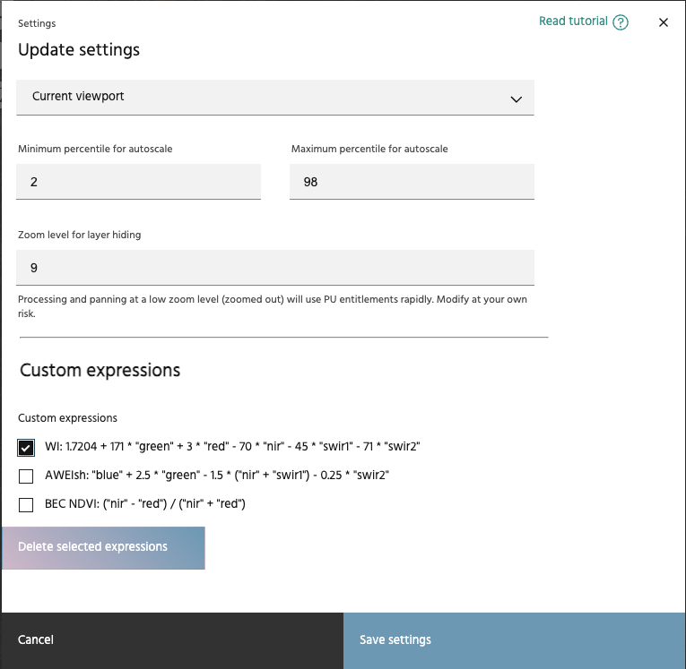
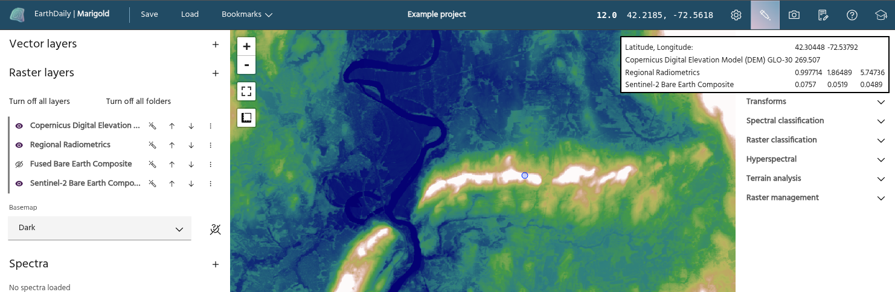
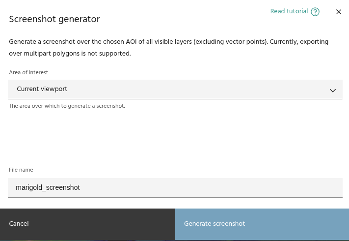

## The Marigold header bar

The header bar in Marigold contains several tools for managing your project,
such as saving and loading, manipulating the map, and links to further
information on Marigold itself.

### **Save and load a project**

Buttons for saving and loading projects. More information can be found
[here](save-and-load.md).

### **Bookmarks**

Bookmarks are a convenient way to store locations that you will return to often.
Each bookmark is defined by a latitude/longitude location and a zoom level.
Clicking on a bookmark will move the map to the defined center and zoom. Click
`Create a bookmark` to add the current map location as a bookmark, or click
`Manage bookmarks` to review and manage your current bookmarks.

### **Project name**

### **Zoom and center**

Controls the center latitude/longitude value and zoom level of the map.

<!-- prettier-ignore-start -->

!!! warning
    While Marigold allows you to zoom out to a continent-scale view, doing so can
    use a large amount of unexpected compute resources. By default, zooming past
    level 9 will automatically turn off all layers to avoid this, although they can
    be manually turned back on if you require a continent-scale display. The specific
    zoom level can be defined in your [settings](#user-settings).

<!-- prettier-ignore-end -->

### **User settings**

Several settings are available for users to modify to personalize their Marigold sessions.
The first group of settings will persist between sessions, while the others will control
behavior for the current session.

### Global settings

- Default bookmark: When loading Marigold, the [splash screen](splash.md) will default
  to this location.
- Default basemap: The default basemap to use on the map.
- Default colormap: The default colormap to use for single band layers.
- Legend position: relative position on the map display for [layer legends](raster-layers/index.md#add-a-legend).
- Ternary legend size: size of the legend for ternary (RGB) layers.

<!-- prettier-ignore-start -->

!!! note
    Legends already on the map will need to be toggled off and on again to see the changes.

<!-- prettier-ignore-end -->

### Session settings

- Zoom level: level at which layers will automatically be hidden to lower costs.
- Autoscale defaults: default percentiles to use when [autoscaling](raster-layers/index.md#autoscale)
  layers, and what AOI to pull data from. If **Current viewport** is chosen, it will be the window on
  your screen when clicking the autoscale button. If a vector is chosen, it will be this vector
  whenever you click the autoscale button.

Click `Save settings` to save the settings to your profile

### Custom expressions

- Custom expressions created in the [Raster Calculator](processes/raster-calculator.md) tool can be managed in Settings. To delete expressions you no longer wish to have, select the expression(s), then click the **Delete selected expressions** button.

### **Pixel inspector**

The pixel inspector will extract the pixel values for all currently visualized
layers. Click the icon to start an inspector session, and click on the map to
extract a point. Layers will appear in the same order as they are in the raster
layer list. Clicking the map in another location will move the inspection point
and recompute the values shown in the box.

<!-- prettier-ignore-start -->

!!! note
    Only values for the currently visualized bands (either one or three, depending
    on if the layer is a single band or RGB display) will be computed with this
    tool. For detailed inspection of all of a layer's bands at single points, use
    the [spectral query](spectra/spectra-query.md) tool.

<!-- prettier-ignore-end -->

<!-- prettier-ignore-start -->

!!! Tip
    The pixel inspector will appear above tool dialogs so you can inspect values
    while running an analysis. This can be very useful for tools like the
    [raster calculator](processes/raster-calculator.md), where you may want to
    identify specific pixel values.

<!-- prettier-ignore-end -->

### **Screenshot tool**

Use this tool to take a screenshot of the map over the selected AOI. All visible
raster and vector layers will be captured and output as a `.png` file on your
computer

<!-- prettier-ignore-start -->

!!! warning
    This tool is provided for taking quick, repeatable screenshots of layers
    suitable for documentation, not for further data analysis. To output data layers
    at full resolution for use in other GIS packages, use the layer
    [export](raster-layers/layer-export.md) functions.

<!-- prettier-ignore-end -->

### **Changelog**

Click this icon to bring up the release notes for the most recent Marigold
version.

### **Help**

The help icon links to this documentation.

### **Onboarding videos**

This icon links to a series of Marigold onboarding videos.

--8<-- "snippets/contact-footer.md"
