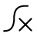

#  Intro to Marigold

An overview of the Marigold application and the basic data objects.

[Loading Marigold]\
[Header bar functions]\
[Raster layers]\
[Vector layers]\
[Spectra]\
[Saving and loading projects]

---

#  Example workflows

Comfortable using GIS systems? Jump right into Marigold with some examples!

[Mask vegetation and water in your imagery]\
[Create a custom mask from a vector or raster layer]\
[Create a false color RGB from spectral bands]

---

# Processing in Marigold

Marigold makes it simple to process your data. Some of those ways include:

##  Band algebra

[Band ratio]\
[Raster calculator]\
[Mineral indices]\
[Rapid mapping outputs]

##  Masking

[Vegetation mask]\
[Water mask]\
[Batch mask]\
[Apply a mask]

##  Transforms

[Principal components analysis]\
[Decorrelation stretch]\
[Minimum noise fraction]

##  Spectral Classification

[Spectral angle mapper]\
[Spectral correlation mapper]\
[Matched filter]\
[k-means clustering]

##  Raster Classification

[Assign class labels]\
[Prospectivity analysis]\
[Mineral map]\
[Vectorize classified layer]

##  Hyperspectral

[HSI image explorer]\
[Compositional mapping]\
[UMAP]\
[Mineral index analogs]

##  Terrain analysis

[Create a hillshade]\
[Canny edge detection]\
[Valley bottom flatness]

##  Raster management

[Data statistical analysis]\
[View BEC metadata]\
[Create RGB]\
[Merge layers]\
[Update computed layers]\
[Morphological operations]

---

#  Remote sensing methodology

[Learn more about remote sensing!]

<!-- prettier-ignore-start -->

!!! Tip
    Find a band ratio that's not in Marigold? Calculate it with the
    [Raster calculator]!

<!-- prettier-ignore-end -->

---

#  Case studies

Explore more advanced usage through a real exploration workflow.

[Case study 1] - Cuprite (low sulphidation epithermal)\
[Case study 2] - Salares Norte (high sulphidation epithermal)

[apply a mask]: processes/apply-a-mask.md
[assign class labels]: processes/class-labels.md
[band ratio]: processes/band-ratio.md
[batch mask]: processes/batch-mask.md
[canny edge detection]: processes/canny.md
[case study 1]: ../case-studies/case-study-1.md
[case study 2]: ../case-studies/case-study-2.md
[compositional mapping]: processes/comp-map-basic.md
[create a custom mask from a vector or raster layer]: example-workflows/create-a-custom-mask.md
[create a false color rgb from spectral bands]: example-workflows/ternary-plot.md
[create a hillshade]: processes/hillshade.md
[create rgb]: processes/create-rgb.md
[data statistical analysis]: processes/data-stats.md
[decorrelation stretch]: processes/dcs.md
[hsi image explorer]: processes/hsi-image.md
[header bar functions]: header.md
[k-means clustering]: processes/k-means.md
[learn more about remote sensing!]: ../remote-sensing-methodology/remote-sensing-methodology.md
[loading marigold]: splash.md
[mask vegetation and water in your imagery]: example-workflows/mask-veg-and-water.md
[matched filter]: processes/mf.md
[merge layers]: processes/merge-layers.md
[mineral index analogs]: processes/min-idx-analogs.md
[mineral indices]: processes/mineral-indices.md
[mineral map]: processes/mineral-map.md
[minimum noise fraction]: processes/mnf.md
[morphological operations]: processes/morphology.md
[principal components analysis]: processes/pca.md
[prospectivity analysis]: processes/prospectivity.md
[rapid mapping outputs]: processes/rapid-mapping-outputs.md
[raster calculator]: processes/raster-calculator.md
[raster layers]: raster-layers/index.md
[saving and loading projects]: save-and-load.md
[spectra]: spectra/index.md
[spectral angle mapper]: processes/sam.md
[spectral correlation mapper]: processes/scm.md
[umap]: processes/umap.md
[update computed layers]: processes/update-layers.md
[vector layers]: vector-layers/index.md
[vectorize classified layer]: processes/vectorize.md
[vegetation mask]: processes/vegetation-mask.md
[valley bottom flatness]: processes/mrvbf.md
[view bec metadata]: processes/bec-meta.md
[water mask]: processes/water-mask.md

--8<-- "snippets/contact-footer.md"
